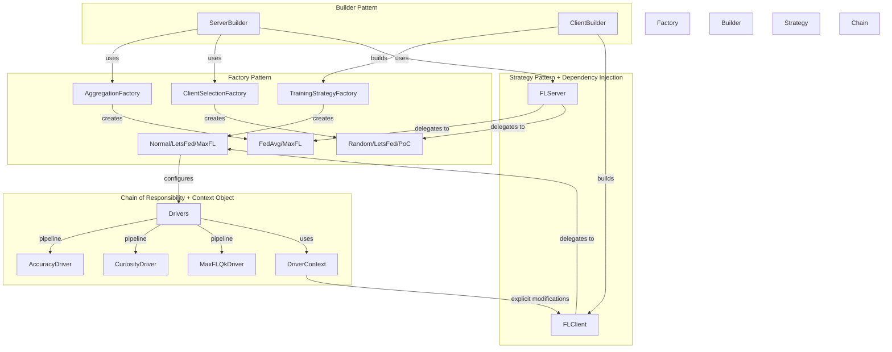
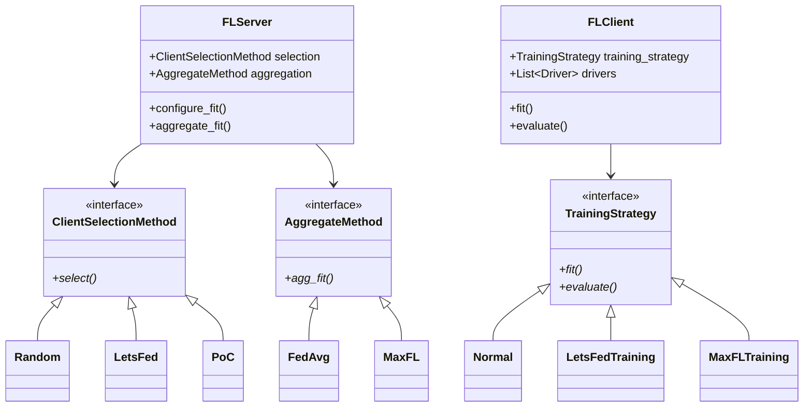
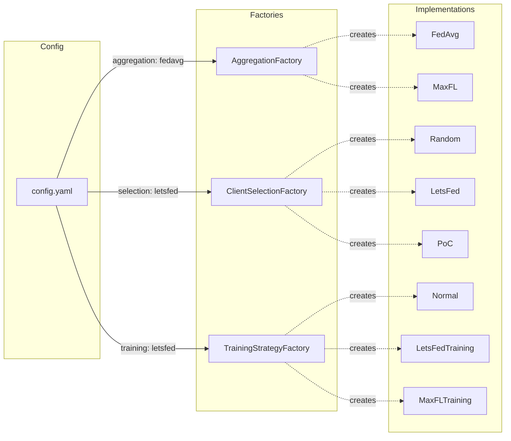
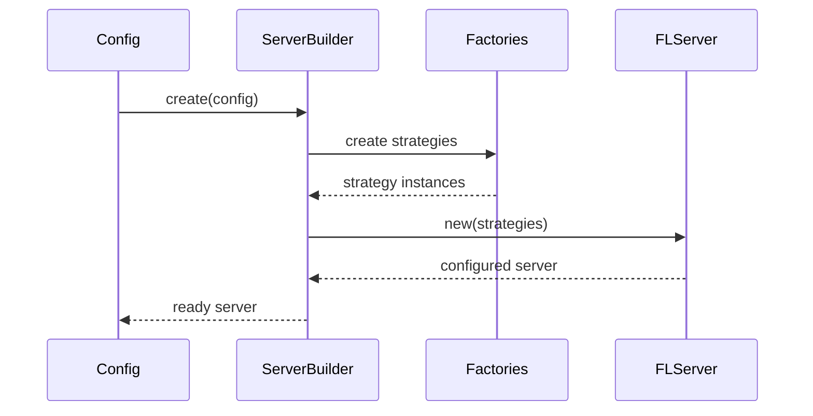
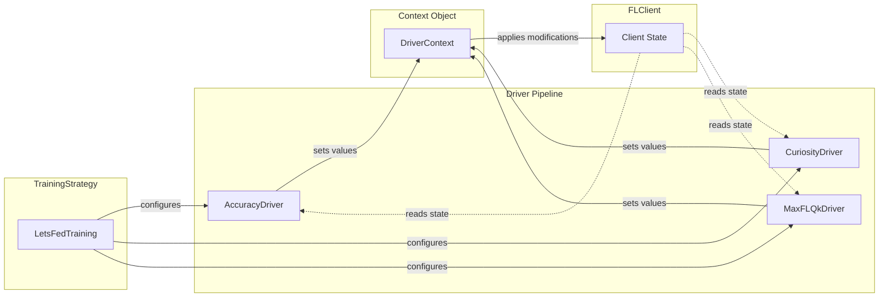
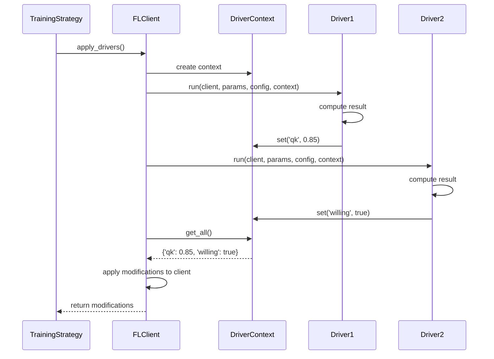
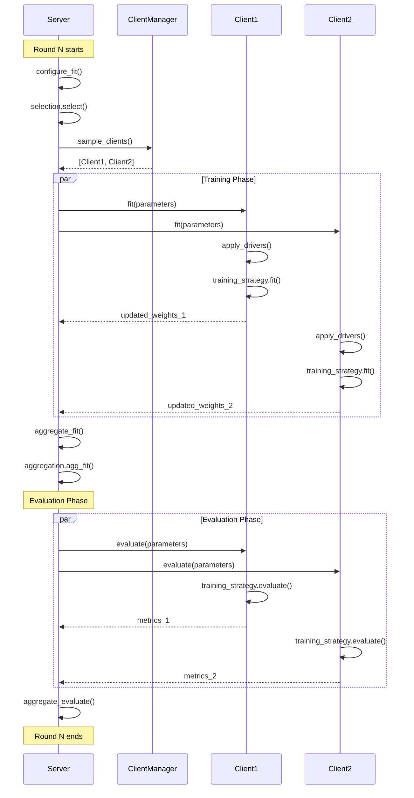
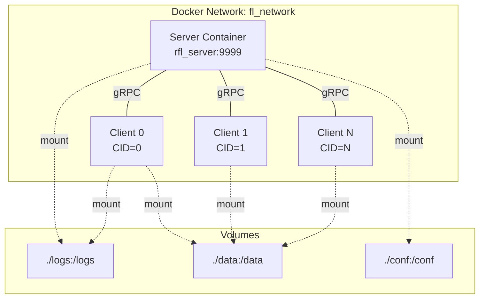

# 🚀 Let's Federate - Effective Communication Strategy for Dynamic Client Participation - ICMLA Conference

[](https://python.org)
[](https://flower.dev/)
[](https://docker.com)
[](.)
[](https://doi.org/10.1109/ICMLA61862.2024.00055)


## 📑 Table of Contents

- [Abstract](#abstract)
- [Citation](#citation)
- [Overview](#-overview)
- [Key Features](#-key-features)
- [Project Structure](#-project-structure)
- [Architecture & Design Patterns](#️-architecture--design-patterns)
  - [Design Patterns Overview](#design-patterns-overview)
  - [Strategy Pattern + Dependency Injection](#1-strategy-pattern--dependency-injection)
  - [Factory Pattern](#2-factory-pattern)
  - [Builder Pattern](#3-builder-pattern)
  - [Chain of Responsibility (Drivers)](#4-chain-of-responsibility-drivers)
  - [Context Object Pattern (DriverContext)](#5-context-object-pattern-drivercontext)
  - [Federated Learning Flow](#federated-learning-flow)
- [Available Strategies](#-available-strategies)
- [Extending the Framework](#-extending-the-framework)
- [Logging and Analysis](#-logging-and-analysis)
- [Docker Configuration](#-docker-configuration)
- [Configuration Reference](#️-configuration-reference)
- [Research & Publications](#-research--publications)
- [Development](#️-development)
- [Contributing](#-contributing)
- [Additional Resources](#-additional-resources)
- [Contact](#-contact)

---

## Abstract

**Abstract:**
Federated Learning (FL) has emerged as a privacy-preserving powerful tool in decentralized Machine Learning (ML) environments. However, real-world scenarios often face bandwidth limitations that can be overwhelmed when all clients simultaneously perform training and communicate with the server in a federated system. Consequently, selection mechanisms are critical for identifying optimal subsets of clients to participate in the federation. Traditional selection methods, however, typically do not allow clients the autonomy to decide whether or not to contribute to the federation. Therefore, this paper proposes LetsFed, a client selection framework that respects client independence throughout the training process. The LetsFed framework differentiates between participating and non-participating clients, employing targeted selection mechanisms to address system challenges effectively. Empirical results demonstrate that LestFed can outperform, in dynamic client participation environments, literature solutions by up to 40%, reducing unnecessary data transmission by as much as 29%, while also enhancing the efficacy of the selection process.

Cite
```
@INPROCEEDINGS{10903243,
  author={Jarczewski, Rafael O. and Cerqueira, Eduardo and Bittencourt, Luiz F. and Loureiro, Antonio A. F. and Villas, Leandro A. and de Souza, Allan M.},
  booktitle={2024 International Conference on Machine Learning and Applications (ICMLA)},
  title={Let's Federate - Effective Communication Strategy for Dynamic Client Participation},
  year={2024},
  volume={},
  number={},
  pages={361-368},
  keywords={Training;Analytical models;Federated learning;Bandwidth;Robustness;Data communication;Servers;Game theory;Faces;Convergence;federated learning;client selection;dynamic client participation},
  doi={10.1109/ICMLA61862.2024.00055}
}
```

---

## 🎯 Overview

A modular and extensible **Federated Learning research framework** built on [Flower](https://flower.dev/), designed for experimenting with dynamic client participation scenarios. The framework implements multiple aggregation, selection, and training strategies following software engineering best practices with modern design patterns.

## ✨ Key Features

- **🏗️ Modular Architecture**: Built with Strategy Pattern, Factory Pattern, Builder Pattern, Chain of Responsibility, and Context Object Pattern
- **🔌 Extensible Design**: Plugin-based driver system with DriverContext for composable and testable client behaviors
- **🎛️ Multiple Strategy Support**:
  - **Aggregation**: FedAvg, MaxFL
  - **Client Selection**: Random, DEEV, PoC, Round Robin, LetsFed
  - **Training**: Normal, LetsFed, MaxFL, FedPer, QFFL
- **🐳 Containerized Deployment**: Docker and Docker Compose with GPU support
- **⚙️ YAML Configuration**: Type-safe configuration management with OmegaConf
- **📊 Comprehensive Logging**: Automatic metrics tracking for analysis
- **🎯 Type Safety**: Full type hints throughout the codebase
- **🧪 Testable Design**: DriverContext pattern enables easy unit testing without complex mocks

## 📁 Project Structure

```
LetsFed/
├── 🖥️  server/                        # Federated Learning Server
│   ├── strategies/
│   │   ├── fl_server.py              # Main server implementation (Strategy Pattern)
│   │   ├── factory.py                # ServerBuilder (Builder Pattern)
│   │   ├── aggregate_method/         # Aggregation strategies (Factory Pattern)
│   │   │   ├── base.py               # Base aggregation interface
│   │   │   ├── factory.py            # AggregationFactory
│   │   │   └── types/
│   │   │       ├── fedavg.py         # FedAvg aggregation
│   │   │       └── maxfl.py          # MaxFL aggregation
│   │   └── client_selection_method/  # Selection strategies (Factory Pattern)
│   │       ├── base.py               # Base selection interface
│   │       ├── factory.py            # ClientSelectionFactory
│   │       └── types/
│   │           ├── random.py         # Random selection
│   │           ├── deev.py           # DEEV selection
│   │           ├── poc.py            # Power of Choice
│   │           ├── round_robin.py    # Round Robin
│   │           └── letsfed.py        # LetsFed selection
│   ├── strategies_manager.py         # Server entrypoint
│   ├── Dockerfile                    # Server container (CPU)
│   └── Dockerfile.gpu                # Server container (GPU)
│
├── 📱 client/                         # Federated Learning Client
│   ├── strategies/
│   │   ├── fl_client.py              # Main client implementation (Strategy Pattern)
│   │   ├── factory.py                # ClientBuilder (Builder Pattern)
│   │   ├── training/                 # Training strategies (Factory Pattern)
│   │   │   ├── base.py               # Base training interface
│   │   │   ├── factory.py            # TrainingStrategyFactory
│   │   │   └── types/
│   │   │       ├── normal.py         # Standard FedAvg training
│   │   │       ├── letsfed.py        # LetsFed training
│   │   │       ├── maxfl.py          # MaxFL training
│   │   │       ├── fedper.py         # FedPer training
│   │   │       └── qffl.py           # QFFL training
│   │   └── drivers/                  # Modular behaviors (Chain of Responsibility + Context Object)
│   │       ├── driver.py             # Base driver interface
│   │       ├── context.py            # DriverContext for explicit side effects
│   │       ├── accuracy.py           # Accuracy-based decision driver
│   │       ├── curiosity.py          # Curiosity-driven participation
│   │       ├── maxfl_qk.py           # MaxFL quality metric
│   │       └── maxfl_pre_training.py # MaxFL initialization
│   ├── strategies_manager.py         # Client entrypoint
│   ├── Dockerfile                    # Client container (CPU)
│   └── Dockerfile.gpu                # Client container (GPU)
│
├── ⚙️  conf/                          # Configuration Management
│   ├── config.yaml                   # Main configuration file
│   ├── loader.py                     # Config loader with validation
│   └── structs.py                    # Type-safe config dataclasses
│
├── 📊 dataset_manager/                # Dataset Handling
│   ├── dataset_manager.py            # Dataset partitioning logic
│
├── 🧠 model/                          # Model Management
│   └── model_manager.py              # Model factory (CNN, DNN)
│
├── 🛠️  utils/                         # Utilities
│   ├── logger.py                     # Metrics logging system
│   ├── docker_compose_manager.py     # Dynamic compose generator
│   └── utils.py                      # Helper functions
││
├── 📋 requirements-client.txt         # Client dependencies
├── 📋 requirements-server.txt         # Server dependencies
├── 🐳 docker-compose.yml              # Container orchestration (CPU)
├── 🐳 docker-compose.gpu.yml          # Container orchestration (GPU)
├── 🔨 build.sh                        # Build script
└── 🧪 test/                           # Testing and analysis
    └── teste.ipynb                   # Results analysis notebook
```

## 🏗️ Architecture & Design Patterns

The framework implements a sophisticated architecture using multiple design patterns to ensure modularity, extensibility, and maintainability.

### Design Patterns Overview



### 1. Strategy Pattern + Dependency Injection

The core classes (`FLServer` and `FLClient`) are **generic implementations** that delegate behavior to injected strategies:



**Key Points:**
- `FLServer` and `FLClient` are **single, generic classes** (not interfaces)
- Different behaviors are achieved through **strategy composition**
- Strategies are created by **Factory Pattern** and **injected via Builder Pattern**

### 2. Factory Pattern

Used for creating different strategy implementations:



### 3. Builder Pattern

Simplifies construction of `FLServer` and `FLClient` with all dependencies:



### 4. Chain of Responsibility (Drivers)

Training strategies can compose behaviors through a **pipeline of drivers**:



**Example:**
- **LetsFedTraining** uses `[AccuracyDriver, CuriosityDriver]`
- **MaxFLTraining** uses `[MaxFLQkDriver]`
- **LetsFedTraining** can also use `MaxFLQkDriver` for additional metrics!

**Benefits:**
- ✅ **Reusability**: Share drivers across strategies
- ✅ **Modularity**: Each driver has a single responsibility
- ✅ **Composability**: Mix and match drivers freely
- ✅ **Testability**: Easy to test without complex mocks
- ✅ **Explicit Side Effects**: Clear what each driver modifies

### 5. Context Object Pattern (DriverContext)

The framework implements the **Context Object Pattern** to improve driver testability and make side effects explicit:



#### Key Components

**DriverContext Class:**
```python
@dataclass
class DriverContext:
    """Context for storing driver results"""
    modifications: dict[str, ContextValue]

    def set(self, key: str, value: ContextValue) -> None:
        """Store a modification"""

    def get(self, key: str, default: ContextValue = None) -> ContextValue:
        """Retrieve a value"""

    def has(self, key: str) -> bool:
        """Check if key exists"""

    def get_all(self) -> dict[str, ContextValue]:
        """Get all modifications"""
```

**Driver Interface (Updated):**
```python
class Driver(ABC):
    @abstractmethod
    def run(
        self,
        client: FLClient,
        parameters: NDArrays,
        config: Config,
        context: DriverContext  # New parameter
    ) -> None:
        """
        Run driver and store results in context.

        Example:
            context.set('qk', computed_qk)
            context.set('willing', True)
        """
        ...
```

**FLClient.apply_drivers() (Updated):**
```python
def apply_drivers(self, parameters: NDArrays, config: Config) -> dict:
    """Apply all drivers using DriverContext"""
    context = DriverContext()

    # Run all drivers, collecting results in context
    for driver in self.drivers:
        driver.run(self, parameters, config, context)

    # Apply modifications from context to client
    modifications = context.get_all()
    for key, value in modifications.items():
        setattr(self, key, value)

    return modifications  # For logging/debugging
```

### Federated Learning Flow



## 📊 Available Strategies

### Server-Side Strategies

#### Aggregation Methods

| Strategy | Description | Use Case |
|----------|-------------|----------|
| **FedAvg** | Weighted average of client models | Standard federated learning |
| **MaxFL** | Utility-maximizing aggregation | Resource-constrained environments |

**Configuration:**
```yaml
server:
  aggregation_method:
    name: fedavg  # or maxfl
```

#### Client Selection Methods

| Strategy | Description | Key Feature |
|----------|-------------|-------------|
| **Random** | Random client selection | Baseline, simple |
| **Round Robin** | Sequential selection | Fair participation |
| **PoC** | Power of Choice | Quality-based selection |
| **DEEV** | Diversity-based selection | Reduces staleness |
| **LetsFed** | Voluntary participation | Respects client autonomy |

**Configuration:**
```yaml
server:
  selection_method:
    name: letsfed
    perc_of_clients: 0.3      # Select 30% of clients
```

### Client-Side Strategies

#### Training Strategies

| Strategy | Description | Special Features |
|----------|-------------|------------------|
| **Normal** | Standard FedAvg training | Baseline implementation |
| **LetsFed** | Voluntary participation training | Uses AccuracyDriver, CuriosityDriver |
| **MaxFL** | MaxFL training approach | Uses MaxFLQkDriver |
| **FedPer** | Personalized federated learning | Separate global/local layers |
| **QFFL** | Fair federated learning | Fairness-aware training |

**Configuration:**
```yaml
client:
  training_strategy:
    name: letsfed             # Options: normal, letsfed, maxfl, fedper, qffl
    # LetsFed parameters (if name=letsfed)
    # threshold: 1.0
```

#### Driver System (Modular Behaviors)

Drivers are **composable components** that add specific behaviors to training strategies using the **DriverContext pattern**:

| Driver | Purpose | Sets in Context |
|--------|---------|-----------------|
| **AccuracyDriver** | Decides if client wants to participate | `willing` (bool) |
| **CuriosityDriver** | Manages exploration/exploitation states | `curiosity` (bool), `state` (int), `rounds_intention` (int) |
| **MaxFLQkDriver** | Calculates client quality metric | `qk` (float) |
| **MaxFLPreTrainingDriver** | Computes local fit loss via pre-training | `l_fit_loss` (float) |

**Example: Combining Drivers**

```python
class LetsFedTraining(TrainingStrategy):
    def _get_drivers(self):
        return [
            AccuracyDriver(),      # Decide participation → sets 'willing'
            CuriosityDriver(),     # Manage exploration → sets 'curiosity', 'state'
            MaxFLQkDriver(),       # Add quality metric → sets 'qk' (reused from MaxFL!)
        ]
```

This demonstrates the power of the **Chain of Responsibility pattern**: drivers from different strategies can be freely combined!

## 🔧 Extending the Framework

The framework is designed for easy extensibility. Here's how to add new components:

### Adding a New Training Strategy

1. **Create the implementation** in `client/strategies/training/types/`:

```python
from ..base import TrainingStrategy
from ...drivers.driver import Driver

class MyCustomTraining(TrainingStrategy):
    def init(self, client):
        # Initialize client-specific parameters
        client.add_drivers(self._get_drivers())

    def _get_drivers(self) -> list[Driver]:
        # Return list of drivers to use
        return [AccuracyDriver(), MyCustomDriver()]

    def fit(self, client, parameters, config):
        # Implement training logic
        client.model.set_weights(parameters)
        client.apply_drivers(parameters, config)
        # ... training code ...
        return updated_weights, num_examples, metrics

    def evaluate(self, client, parameters, config):
        # Implement evaluation logic
        # ...
        return loss, num_examples, metrics
```

2. **Register in factory** (`client/strategies/training/factory.py`):

```python
class TrainingStrategyFactory:
    @staticmethod
    def create(config: Environment) -> TrainingStrategy:
        strategies = {
            "normal": NormalClient,
            "letsfed": LetsFedClient,
            "my_custom": MyCustomTraining,  # Add here
        }
        return strategies[config.client.training_strategy.name]()
```

3. **Use in configuration**:

```yaml
client:
  training_strategy:
    name: my_custom
```

### Adding a New Driver

1. **Create the driver** in `client/strategies/drivers/`:

```python
from .context import DriverContext
from .driver import Driver
from flwr.common import Config, NDArrays

class MyCustomDriver(Driver):
    """
    Custom driver for computing specific metrics.

    Modifies:
        - my_metric: Description of what this computes (type)
    """

    def run(
        self,
        client: FLClient,
        parameters: NDArrays,
        config: Config,
        context: DriverContext
    ) -> None:
        """
        Compute metric and store in context.

        Args:
            client: FLClient instance (for reading state)
            parameters: Model parameters
            config: Configuration dict
            context: DriverContext for storing results
        """
        # Implement driver logic (read from client)
        metric = self._calculate_metric(client)

        # Store result in context (don't modify client directly)
        context.set('my_metric', metric)

    def _calculate_metric(self, client) -> float:
        # Your computation logic here
        return some_value
```

2. **Use in any training strategy**:

```python
def _get_drivers(self):
    return [MyCustomDriver(), AccuracyDriver()]
```

### Adding a New Selection Method

1. **Create implementation** in `server/strategies/client_selection_method/types/`:

```python
from ..base import ClientSelectionMethod

class MyCustomSelection(ClientSelectionMethod):
    def select(self, server, client_manager, num_clients):
        # Implement selection logic
        # ...
        return selected_clients
```

2. **Register in factory** and update config as shown above.

### Adding a New Aggregation Method

Similar process in `server/strategies/aggregate_method/types/`.

### Architecture Benefits

```mermaid
graph TB
    subgraph "Easy to Extend"
        NT[New Training Strategy]
        ND[New Driver]
        NS[New Selection Method]
        NA[New Aggregation Method]
    end

    subgraph "No Changes Needed"
        FC[FLClient]
        FS[FLServer]
        CF[Config System]
        DK[Docker Setup]
    end

    NT -.->|registers in| Factory1[TrainingStrategyFactory]
    ND -.->|used by| NT
    NS -.->|registers in| Factory2[ClientSelectionFactory]
    NA -.->|registers in| Factory3[AggregationFactory]

    Factory1 -->|no change| FC
    Factory2 -->|no change| FS
    Factory3 -->|no change| FS

    style "Easy to Extend" fill:#c8e6c9
    style "No Changes Needed" fill:#fff9c4
```

**Key Principle**: You extend behavior by **adding new classes**, not by **modifying existing ones** (Open/Closed Principle).

## 📈 Logging and Analysis

### Automatic Metrics Collection

The framework automatically logs metrics to the `logs/` directory:

```
logs/
├── c-data-0.csv        # Client 0 training/evaluation metrics
├── c-data-1.csv        # Client 1 training/evaluation metrics
├── ...
├── c-data-N.csv        # Client N training/evaluation metrics
└── server-data.csv     # Server-side aggregated metrics
```

### Logged Metrics

#### Client Metrics
- Round number
- Training accuracy/loss (`g_fit_acc`, `g_fit_loss`)
- Evaluation accuracy/loss (`g_eval_acc`, `g_eval_loss`)
- Selection status (`selected`)
- Participation state (`participating_state`, `desired_state`)
- Strategy-specific metrics (e.g., `qk` for MaxFL, `willing` for LetsFed)

#### Server Metrics
- Aggregated loss/accuracy per round
- Number of clients selected
- Selection method used
- Aggregation method used

### Analysis

Use the provided Jupyter notebook for visualization and analysis:

```bash
jupyter notebook test/teste.ipynb
```

The notebook includes:
- Training convergence plots
- Client participation patterns
- Comparison between strategies
- Statistical analysis

## 🐳 Docker Configuration

### Container Architecture



### Scaling Clients

Modify the number of clients in `docker-compose.yml` or use the manager:

```bash
python utils/docker_compose_manager.py --n-clients 50
docker-compose up
```

## ⚙️ Configuration Reference

### Complete Configuration Example

```yaml
# General settings
rounds: 10                    # Number of federated learning rounds
n_clients: 30                 # Total number of clients
init_clients: 1.0             # Fraction of clients to initialize
gpu: false                    # Enable GPU acceleration
log_path: logs                # Path for log files

# Server configuration
server:
  ip: 0.0.0.0
  port: 9999

  # Aggregation strategy
  aggregation_method:
    name: fedavg              # Options: fedavg, maxfl
    # MaxFL parameters (if name=maxfl)
    # epsilon: 10
    # learning_rate: 0.01

  # Client selection strategy
  selection_method:
    name: letsfed             # Options: random, deev, poc, round_robin, letsfed
    perc_of_clients: 0.3      # Percentage of clients to select per round
    # DEEV parameters (if name=deev)
    # decay: 0.95
    # LetsFed parameters (if name=letsfed)
    # participating_method: random
    # non_participating_method: poc

# Client configuration
client:
  epochs: 5                   # Local training epochs
  learning_rate: 0.0001       # Learning rate

  # Training strategy
  training_strategy:
    name: letsfed             # Options: normal, letsfed, maxfl, fedper, qffl
    # LetsFed parameters (if name=letsfed)
    # threshold: 1.0

  participating: true         # Initial participation state

# Dataset configuration
dataset:
  dataset: fashion_mnist      # Options: fashion_mnist, cifar10, mnist
  path: logs                  # Dataset storage path
  batch_size: 32              # Batch size for training

# Model configuration
model:
  model: cnn                  # Options: cnn, dnn
  # Model-specific parameters...
```


## 🎓 Research & Publications

This framework was developed as part of research on Federated Learning with dynamic client participation.

### Citation

If you use this framework in your research, please cite:

```bibtex
@INPROCEEDINGS{10903243,
  author={Jarczewski, Rafael O. and Cerqueira, Eduardo and Bittencourt, Luiz F. and Loureiro, Antonio A. F. and Villas, Leandro A. and de Souza, Allan M.},
  booktitle={2024 International Conference on Machine Learning and Applications (ICMLA)},
  title={Let's Federate - Effective Communication Strategy for Dynamic Client Participation},
  year={2024},
  pages={361-368},
  doi={10.1109/ICMLA61862.2024.00055}
}
```

## 🛠️ Development

### Project Philosophy

This framework follows key software engineering principles:

- **🎯 SOLID Principles**
  - Single Responsibility: Each class has one clear purpose
  - Open/Closed: Extend via new classes, not modifications
  - Liskov Substitution: Strategies are interchangeable
  - Interface Segregation: Focused, minimal interfaces
  - Dependency Inversion: Depend on abstractions, not concretions

- **🎨 Design Patterns**
  - Strategy Pattern for algorithm selection
  - Factory Pattern for object creation
  - Builder Pattern for complex construction
  - Chain of Responsibility for driver pipeline
  - Context Object Pattern for explicit side effects and testability

- **📦 Modular Design**
  - Clear separation of concerns
  - Composable components
  - Minimal coupling, high cohesion


## 🔒 Security Considerations

This is a **research framework** and should not be used in production without proper security review:

- No authentication/authorization implemented
- Network communication is not encrypted by default
- Data is not encrypted at rest
- No input validation for malicious data

For production use, consider:
- Adding TLS/SSL for communication
- Implementing client authentication
- Encrypting datasets
- Adding differential privacy mechanisms

## 🤝 Contributing

Contributions are welcome! To contribute:

1. **Fork the repository**
2. **Create a feature branch**: `git checkout -b feature/amazing-feature`
3. **Follow the coding style**: Use `ruff` for formatting
4. **Add tests** if applicable
5. **Update documentation**: Keep README and docstrings current
6. **Commit changes**: `git commit -m 'Add amazing feature'`
7. **Push to branch**: `git push origin feature/amazing-feature`
8. **Open a Pull Request**

### Contribution Guidelines

- Follow existing design patterns
- Maintain type hints throughout
- Write clear docstrings
- Keep commits atomic and well-described
- Update relevant documentation

## 📚 Additional Resources

### Project Documentation
- 📄 **[Driver Pattern Documentation](docs/DRIVER_PATTERN.md)** - Detailed DriverContext pattern explanation
- 💡 **[Driver Usage Examples](examples/driver_context_usage.py)** - Code examples and tests

### Federated Learning
- 🌸 **[Flower Documentation](https://flower.dev/docs/)** - FL framework used in this project
- 📖 **[Federated Learning Book](https://www.federated-learning.com/)** - Comprehensive guide to FL concepts
- 📄 **[FedAvg Paper](https://arxiv.org/abs/1602.05629)** - Original federated averaging paper (McMahan et al., 2017)

### Design Patterns
- 🎨 **[Refactoring Guru](https://refactoring.guru/design-patterns)** - Comprehensive pattern catalog with examples
- 🐍 **[Python Design Patterns](https://python-patterns.guide/)** - Python-specific pattern implementations
- 🔄 **[Context Object Pattern](https://www.dofactory.com/net/context-object-design-pattern)** - Pattern reference and explanation

### Docker & DevOps
- 🐳 **[Docker Best Practices](https://docs.docker.com/develop/dev-best-practices/)** - Official Docker guidelines
- 📦 **[Docker Compose](https://docs.docker.com/compose/)** - Multi-container orchestration guide


## 📞 Contact

- **Author**: Rafael O. Jarczewski
- **Institution**: [Add institution]
- **Email**: [Add email]
- **GitHub Issues**: For bug reports and feature requests

---

**⚠️ Note**: This is a research framework under active development. Some features may be experimental or incomplete. See issues for known limitations and planned improvements.

**🚀 Happy Federating!**
