# 🚀 Let's Federate - Effective Communication Strategy for Dynamic Client Participation - ICMLA Conference

[](https://python.org)
[](https://flower.dev/)
[](https://docker.com)
[](.)
[](https://doi.org/10.1109/ICMLA61862.2024.00055)


## 📑 Table of Contents

- [Abstract](#abstract)
- [Citation](#citation)
- [Overview](#-overview)
- [Key Features](#-key-features)
- [Project Structure](#-project-structure)
- [Architecture & Design Patterns](#️-architecture--design-patterns)
  - [Design Patterns Overview](#design-patterns-overview)
  - [Strategy Pattern + Dependency Injection](#1-strategy-pattern--dependency-injection)
  - [Factory Pattern](#2-factory-pattern)
  - [Builder Pattern](#3-builder-pattern)
  - [Chain of Responsibility (Drivers)](#4-chain-of-responsibility-drivers)
  - [Context Object Pattern (DriverContext)](#5-context-object-pattern-drivercontext)
  - [Federated Learning Flow](#federated-learning-flow)
- [Available Strategies](#-available-strategies)
  - [Server-Side Strategies](#server-side-strategies)
  - [Client-Side Strategies](#client-side-strategies)
  - [Parameters Sharing Strategies](#parameters-sharing-strategies)
- [Metrics System](#-metrics-system)
- [Extending the Framework](#-extending-the-framework)
- [Logging and Analysis](#-logging-and-analysis)
- [Docker Configuration](#-docker-configuration)
- [Configuration Reference](#️-configuration-reference)
- [Research & Publications](#-research--publications)
- [Development](#️-development)
- [Contributing](#-contributing)
- [Additional Resources](#-additional-resources)
- [Contact](#-contact)

---

## Abstract

**Abstract:**
Federated Learning (FL) has emerged as a privacy-preserving powerful tool in decentralized Machine Learning (ML) environments. However, real-world scenarios often face bandwidth limitations that can be overwhelmed when all clients simultaneously perform training and communicate with the server in a federated system. Consequently, selection mechanisms are critical for identifying optimal subsets of clients to participate in the federation. Traditional selection methods, however, typically do not allow clients the autonomy to decide whether or not to contribute to the federation. Therefore, this paper proposes LetsFed, a client selection framework that respects client independence throughout the training process. The LetsFed framework differentiates between participating and non-participating clients, employing targeted selection mechanisms to address system challenges effectively. Empirical results demonstrate that LestFed can outperform, in dynamic client participation environments, literature solutions by up to 40%, reducing unnecessary data transmission by as much as 29%, while also enhancing the efficacy of the selection process.

Cite
```
@INPROCEEDINGS{10903243,
  author={Jarczewski, Rafael O. and Cerqueira, Eduardo and Bittencourt, Luiz F. and Loureiro, Antonio A. F. and Villas, Leandro A. and de Souza, Allan M.},
  booktitle={2024 International Conference on Machine Learning and Applications (ICMLA)},
  title={Let's Federate - Effective Communication Strategy for Dynamic Client Participation},
  year={2024},
  volume={},
  number={},
  pages={361-368},
  keywords={Training;Analytical models;Federated learning;Bandwidth;Robustness;Data communication;Servers;Game theory;Faces;Convergence;federated learning;client selection;dynamic client participation},
  doi={10.1109/ICMLA61862.2024.00055}
}
```

---

## 🎯 Overview

A modular and extensible **Federated Learning research framework** built on [Flower](https://flower.dev/), designed for experimenting with dynamic client participation scenarios. The framework implements multiple aggregation, selection, and training strategies following software engineering best practices with modern design patterns.

## ✨ Key Features

- **🏗️ Modular Architecture**: Built with Strategy Pattern, Factory Pattern, Injection Pattern, Chain of Responsibility, and Context Object Pattern
- **🔌 Extensible Design**: Plugin-based driver system with DriverContext for composable and testable behaviors
  - Drivers managed by strategies
  - DriverContext transfers results without polluting client/server state
  - Strategy state encapsulated in constructors (`__init__`)
- **🎛️ Multiple Strategy Support**:
  - **Aggregation**: FedAvg, MaxFL (with optional server-side model)
  - **Client Selection**: Random, DEEV, PoC, Round Robin, LetsFed
  - **Training**: Normal, LetsFed, MaxFL, FedPer, QFFL
  - **Parameters Sharing**: Normal (all parameters), LayerWise (first K layers)
- **🐳 Containerized Deployment**: Orchestrated via `run_experiments.py` and `docker_compose_manager.py`
- **⚙️ Modular Configuration**: Each module has its own `structs.py` with dataclass configs
  - Factories receive module-specific config dataclasses
- **📊 Comprehensive Logging**: Automatic metrics tracking for analysis
- **🎯 Type Safety**: Full type hints throughout the codebase
- **🧪 Testable Design**: DriverContext pattern enables easy unit testing without complex mocks
- **🔒 Flexible Personalization**: LayerWise strategy enables model personalization while reducing communication

## 📁 Project Structure

```
LetsFed/
├── 🖥️  server/                        # Federated Learning Server
│   ├── strategies/
│   │   ├── fl_server.py              # Main server (uses ClientManager for CID/ClientProxy mapping)
│   │   ├── server_builder.py         # ServerBuilder (Dependency Injection via Builder)
│   │   ├── structs.py                # Server-specific config dataclasses
│   │   ├── aggregate_method/         # Aggregation strategies (Factory Pattern)
│   │   │   ├── base.py               # Base aggregation interface
│   │   │   ├── factory.py            # AggregationFactory
│   │   │   ├── structs.py            # Aggregation config dataclasses
│   │   │   └── types/
│   │   │       ├── fedavg.py         # FedAvg aggregation
│   │   │       └── maxfl.py          # MaxFL aggregation (server has own model)
│   │   ├── client_selection_method/  # Selection strategies (Factory Pattern)
│   │   │   ├── base.py               # Base selection interface
│   │   │   ├── factory.py            # ClientSelectionFactory
│   │   │   ├── structs.py            # Selection config dataclasses
│   │   │   └── types/
│   │   │       ├── random.py         # Random selection
│   │   │       ├── deev.py           # DEEV selection
│   │   │       ├── poc.py            # Power of Choice
│   │   │       ├── round_robin.py    # Round Robin
│   │   │       └── letsfed.py        # LetsFed selection
│   │   └── parameters_strategy/      # Parameters sharing strategies (Factory Pattern)
│   │       ├── base.py               # Base parameters strategy interface
│   │       ├── factory.py            # ParametersStrategyFactory
│   │       ├── structs.py            # Parameters strategy config dataclasses
│   │       └── types/
│   │           ├── normal.py         # Normal strategy (shares all parameters)
│   │           └── layerwise.py      # LayerWise strategy (shares first K layers)
│   ├── strategies_manager.py         # Server entrypoint
│   ├── Dockerfile                    # Server container (CPU)
│   └── Dockerfile.gpu                # Server container (GPU)
│
├── 📱 client/                         # Federated Learning Client
│   ├── strategies/
│   │   ├── fl_client.py              # Main client (participation decided in evaluate())
│   │   ├── client_builder.py         # ClientBuilder (Dependency Injection via Builder)
│   │   ├── structs.py                # Client-specific config dataclasses
│   │   ├── training/                 # Training strategies (Factory Pattern)
│   │   │   ├── base.py               # Base training (manages drivers, __init__ state)
│   │   │   ├── factory.py            # TrainingStrategyFactory (receives module config)
│   │   │   ├── structs.py            # Training config dataclasses
│   │   │   └── types/
│   │   │       ├── normal.py         # Standard FedAvg training
│   │   │       ├── letsfed.py        # LetsFed training
│   │   │       ├── maxfl.py          # MaxFL training
│   │   │       ├── fedper.py         # FedPer training
│   │   │       └── qffl.py           # QFFL training
│   │   ├── parameters_strategy/      # Parameters sharing strategies (Factory Pattern)
│   │   │   ├── base.py               # Base parameters strategy interface
│   │   │   ├── factory.py            # ParametersStrategyFactory
│   │   │   ├── structs.py            # Parameters strategy config dataclasses
│   │   │   └── types/
│   │   │       ├── normal.py         # Normal strategy (shares all parameters)
│   │   │       └── layerwise.py      # LayerWise strategy (shares first K layers)
│   │   └── drivers/                  # Modular behaviors (Chain of Responsibility + Context Object)
│   │       ├── driver.py             # Base driver interface (run receives DriverContext)
│   │       ├── context.py            # DriverContext for explicit side effects
│   │       ├── accuracy.py           # Accuracy-based decision driver
│   │       ├── curiosity.py          # Curiosity-driven participation
│   │       └── maxfl_qk.py           # MaxFL quality metric (embeds pre-training logic)
│   ├── strategies_manager.py         # Client entrypoint
│   ├── Dockerfile                    # Client container (CPU)
│   └── Dockerfile.gpu                # Client container (GPU)
│
├── ⚙️  conf/                          # Central Configuration
│   ├── config.yaml                   # Main configuration file
│   ├── loader.py                     # Config loader with validation
│   └── structs.py                    # Top-level config dataclasses
│
├── 📊 dataset_manager/                # Dataset Handling
│   ├── dataset_manager.py            # Dataset partitioning logic
│
├── 🧠 model/                          # Model Management
│   └── model_manager.py              # Model factory (CNN, DNN)
│
├── � metrics/                        # Metrics Calculation System
│   ├── base.py                       # Abstract Metric base class
│   ├── factory.py                    # MetricFactory for creating metrics
│   ├── manager.py                    # MetricsManager for metric pipeline
│   ├── structs.py                    # Metrics configuration dataclasses
│   ├── types/                        # Metric implementations (Factory Pattern)
│   │   ├── __init__.py               # Exports metric classes
│   │   ├── structs.py                # Individual metric config dataclasses
│   │   ├── accuracy.py               # Accuracy metric
│   │   ├── precision.py              # Precision metric
│   │   ├── recall.py                 # Recall metric
│   │   ├── f1_score.py               # F1-Score metric
│   │   ├── fbeta_score.py            # F-Beta Score metric
│   │   └── auc.py                    # AUC-ROC metric
│   ├── README.md                     # Metrics module documentation
│   └── YAML_CONFIG_EXAMPLES.yaml     # Example configurations
│
├── �🛠️  utils/                         # Utilities
│   ├── logger.py                     # Metrics logging system
│   ├── docker_compose_manager.py     # Dynamic compose generator
│   └── utils.py                      # Helper functions
│
├── 🚀 run_experiments.py              # Experiment orchestration script
├── 📋 requirements-client.txt         # Client dependencies
├── 📋 requirements-server.txt         # Server dependencies
├── 🐳 docker-compose.yml              # Container orchestration
├── 🔨 build.sh                        # Build script
├── 🧹 cleanup.sh                      # Cleanup Docker containers/networks
└── 🧪 test/                           # Testing and analysis
    └── teste.ipynb                   # Results analysis notebook
```

## 🏗️ Architecture & Design Patterns

The framework implements a sophisticated architecture using multiple design patterns to ensure modularity, extensibility, and maintainability.

### Design Patterns Overview

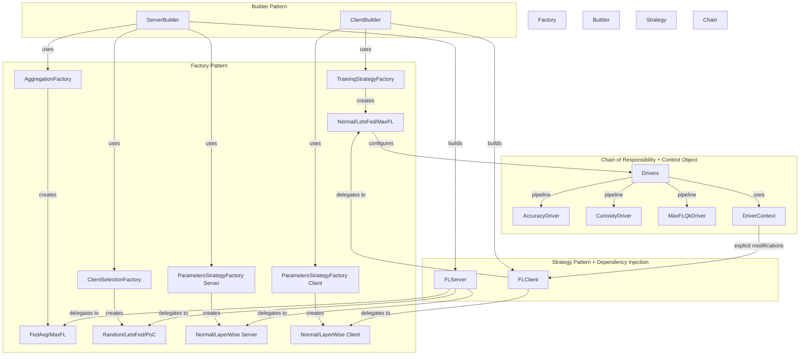
        SB -->|uses| AF
        SB -->|uses| CSF
        CB -->|uses| TSF
    end

    subgraph "Strategy Pattern + Dependency Injection"
        FLS[FLServer]
        FLC[FLClient]
        SB -->|builds| FLS
        CB -->|builds| FLC
        FLS -->|delegates to| AGG
        FLS -->|delegates to| SEL
        FLC -->|delegates to| TRN
    end

    subgraph "Chain of Responsibility + Context Object"
        TRN -->|configures| DRV[Drivers]
        DRV -->|pipeline| D1[AccuracyDriver]
        DRV -->|pipeline| D2[CuriosityDriver]
        DRV -->|pipeline| D3[MaxFLQkDriver]
        DRV -->|uses| CTX[DriverContext]
        CTX -->|explicit modifications| FLC
    end

    style Factory Pattern fill:#e1f5ff
    style Builder Pattern fill:#fff4e1
    style Strategy Pattern + Dependency Injection fill:#e8f5e9
    style Chain of Responsibility + Context Object fill:#f3e5f5
```

### 1. Strategy Pattern + Dependency Injection

The core classes (`FLServer` and `FLClient`) are **generic implementations** that delegate behavior to injected strategies. Server and client are created via **Builder classes**, which inject strategies created by their respective factories.

**Key Architectural Informations:**
- **Strategy state encapsulation**: Strategies have `__init__` constructors and store their special attributes internally
- **Driver and DriverContext management in strategies**: Methods `add_drivers()` and `apply_drivers()` strategy classes. `apply_drivers()` creates a `DriverContext`, applies drivers sequentially, then adds values to **strategy attributes**
- **Client participation decision**: Clients decide participation in the `evaluate()` method after receiving aggregated weights, setting their `participant_state` for the next round
- **Server-side client management**: Server's `configure_fit()` uses `ClientManager` to list connected clients before selection, requiring CID-to-ClientProxy mapping
- **Server model support**: Server can have its own model used by certain aggregation methods (e.g., MaxFL)

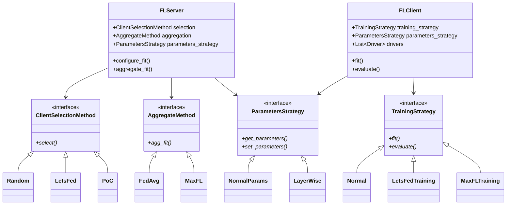

**Key Points:**
- `FLServer` and `FLClient` are **single, generic classes** (not interfaces)
- Different behaviors are achieved through **strategy composition**
- Strategies are created by **Factory Pattern** and **injected via Builder Pattern**

### 2. Factory Pattern

Used for creating different strategy implementations. **Important**: Factories receive **module-specific config dataclasses**. Each module has its own `structs.py` with configuration dataclasses.

**Factory Signature Change:**
```python
# OLD: Factory.create(config: Environment)
# NEW: Factory.create(config: ModuleSpecificConfig)

# Example:
class TrainingStrategyFactory:
    @staticmethod
    def create(config: TrainingConfig) -> TrainingStrategy:  # Module-specific config
        ...
```

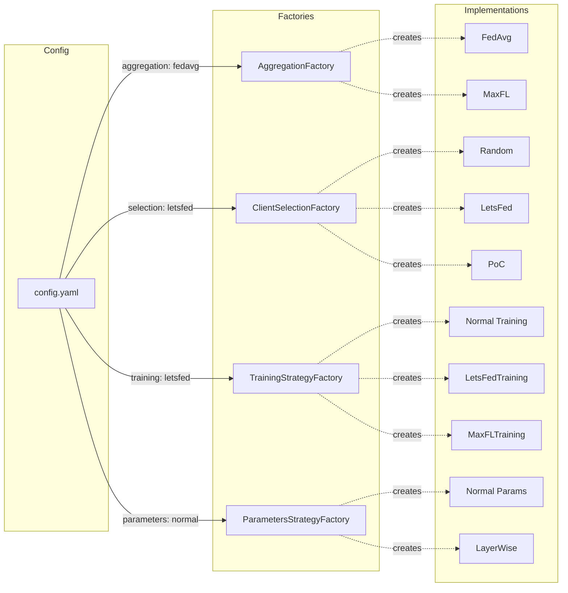

### 3. Builder/Injection Pattern

Simplifies construction of `FLServer` and `FLClient` with all dependencies. **Server and client use Builder pattern** (dependency injection).

**Builder files:**
- `server/strategies/server_builder.py` - Builds FLServer with injected strategies
- `client/strategies/client_builder.py` - Builds FLClient with injected training strategy

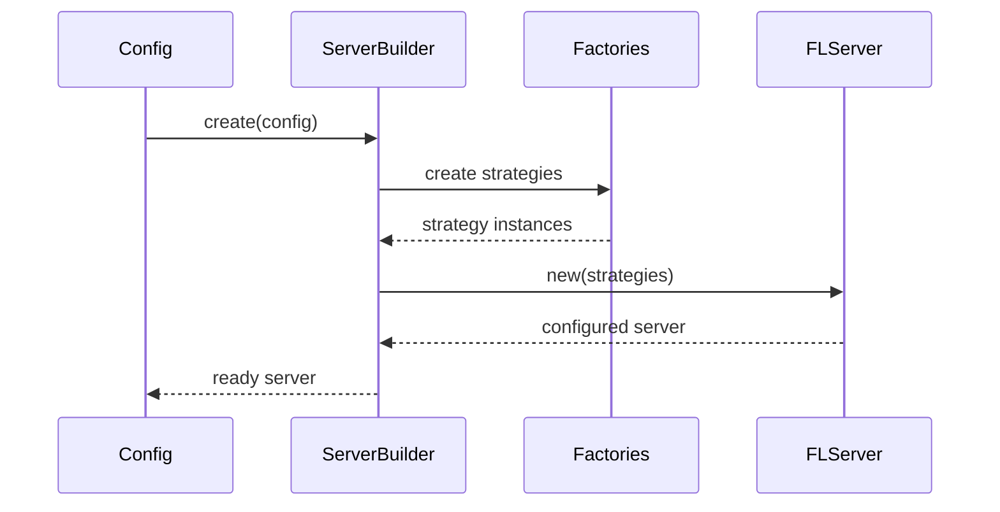

### 4. Chain of Responsibility (Drivers)

Training strategies compose behaviors through a **pipeline of drivers** managed by the strategy itself.

**Key Implementation Details:**
- **Driver method signature**: `run(client, parameters, config, context: DriverContext) -> None`
- **DriverContext flow**: Created by strategy's `apply_drivers()`, passed to each driver sequentially, then results extracted and stored in **strategy attributes**
- **Strategy responsibility**: Strategies manage their own drivers via `add_drivers()` and `apply_drivers()` methods

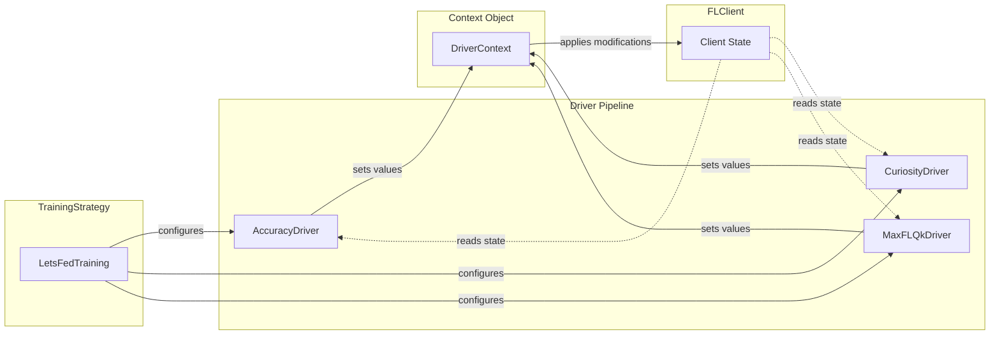

**Example:**
- **LetsFedTraining** uses `[AccuracyDriver, CuriosityDriver]`
- **MaxFLTraining** uses `[MaxFLQkDriver]`
- **LetsFedTraining** can also use `MaxFLQkDriver` for additional metrics!

**Benefits:**
- ✅ **Reusability**: Share drivers across strategies
- ✅ **Modularity**: Each driver has a single responsibility
- ✅ **Composability**: Mix and match drivers freely
- ✅ **Testability**: Easy to test without complex mocks
- ✅ **Explicit Side Effects**: Clear what each driver modifies

### 5. Context Object Pattern (DriverContext)

The framework implements the **Context Object Pattern** to improve driver testability and make side effects explicit:

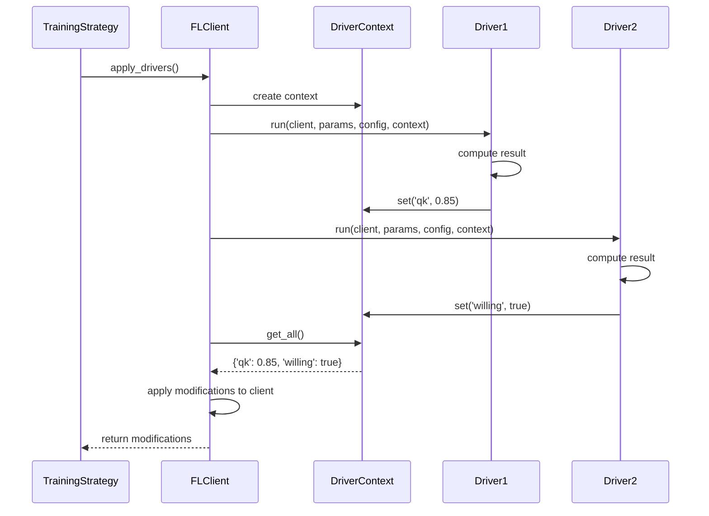

#### Key Components

**DriverContext Class:**
```python
@dataclass
class DriverContext:
    """Context for storing driver results"""
    modifications: dict[str, ContextValue]

    def set(self, key: str, value: ContextValue) -> None:
        """Store a modification"""

    def get(self, key: str, default: ContextValue = None) -> ContextValue:
        """Retrieve a value"""

    def has(self, key: str) -> bool:
        """Check if key exists"""

    def get_all(self) -> dict[str, ContextValue]:
        """Get all modifications"""
```

**Driver Interface (Updated):**
```python
class Driver(ABC):
    @abstractmethod
    def run(
        self,
        client: FLClient,
        parameters: NDArrays,
        config: Config,
        context: DriverContext  # Context for storing results
    ) -> None:
        """
        Run driver and store results in context.

        Drivers read from client but write to context, not client directly.

        Example:
            context.set('qk', computed_qk)
            context.set('willing', True)
        """
        ...
```

**Strategy.apply_drivers() (Updated):**
```python
def apply_drivers(self, client: FLClient, parameters: NDArrays, config: Config) -> dict:
    """Apply all drivers using DriverContext, store results in strategy attributes"""
    context = DriverContext()

    # Run all drivers, collecting results in context
    for driver in self.drivers:
        driver.run(client, parameters, config, context)

    # Apply modifications from context to STRATEGY (not client)
    modifications = context.get_all()
    for key, value in modifications.items():
        setattr(self, key, value)  # Strategy encapsulates its state

    return modifications  # For logging/debugging
```

**Example: Combining Drivers**

```python
class LetsFedTraining(TrainingStrategy):
    def __init__(self, config: TrainingConfig):
        """Strategy now has __init__ and stores its own state"""
        self.config = config
        self.willing = False  # Strategy attribute, not client attribute
        self.curiosity = False
        # ... other strategy-specific attributes

    def _get_drivers(self):
        return [
            AccuracyDriver(),      # Decide participation → sets 'willing' in strategy
            CuriosityDriver(),     # Manage exploration → sets 'curiosity', 'state' in strategy
            MaxFLQkDriver(),       # Add quality metric → sets 'qk' in strategy (reused from MaxFL!)
        ]

    def apply_drivers(self, client, parameters, config):
        """Drivers write to strategy attributes via DriverContext"""
        context = DriverContext()
        for driver in self.drivers:
            driver.run(client, parameters, config, context)

        # Store in strategy (self), not client
        for key, value in context.get_all().items():
            setattr(self, key, value)
```

This demonstrates the power of the **Chain of Responsibility pattern**: drivers from different strategies can be freely combined, and strategy state is properly encapsulated!

### Federated Learning Flow

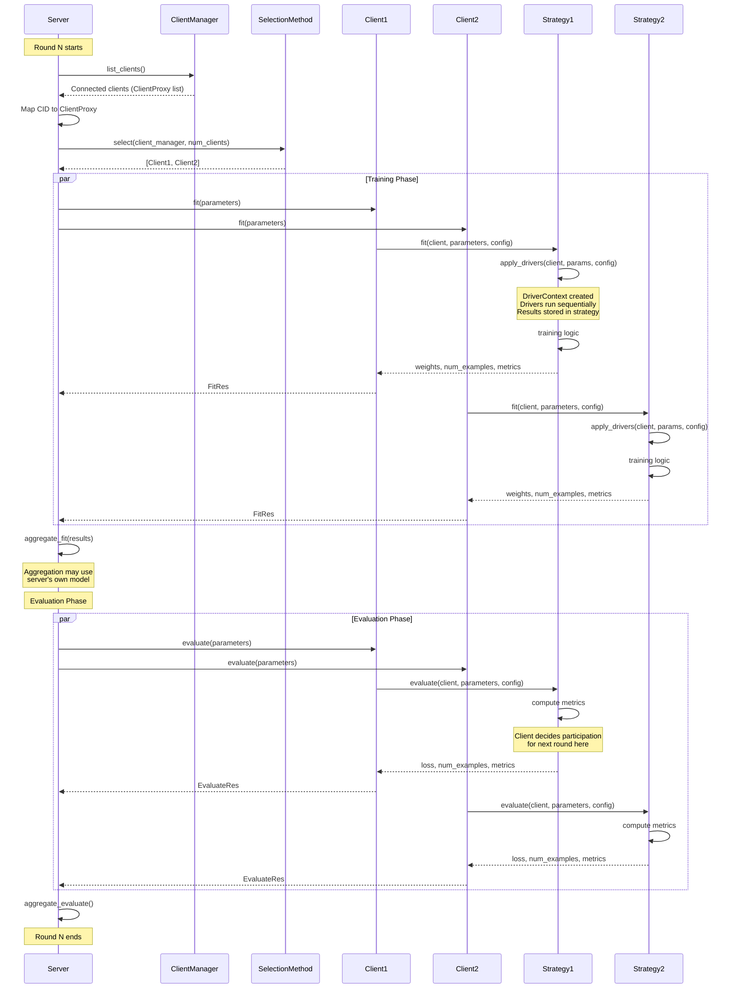

## 📊 Available Strategies

### Server-Side Strategies

#### Aggregation Methods

| Strategy | Description | Use Case |
|----------|-------------|----------|
| **FedAvg** | Weighted average of client models | Standard federated learning |
| **MaxFL** | Utility-maximizing aggregation | Resource-constrained environments |

**Configuration:**
```yaml
server:
  aggregation_method:
    name: fedavg  # or maxfl
```

#### Client Selection Methods

| Strategy | Description | Key Feature |
|----------|-------------|-------------|
| **Random** | Random client selection | Baseline, simple |
| **Round Robin** | Sequential selection | Fair participation |
| **PoC** | Power of Choice | Quality-based selection |
| **DEEV** | Diversity-based selection | Reduces staleness |
| **LetsFed** | Voluntary participation | Respects client autonomy |

**Configuration:**
```yaml
server:
  selection_method:
    name: letsfed
    perc_of_clients: 0.3      # Select 30% of clients
```

### Client-Side Strategies

#### Training Strategies

| Strategy | Description | Special Features |
|----------|-------------|------------------|
| **Normal** | Standard FedAvg training | Baseline implementation |
| **LetsFed** | Voluntary participation training | Uses AccuracyDriver, CuriosityDriver |
| **MaxFL** | MaxFL training approach | Uses MaxFLQkDriver |
| **FedPer** | Personalized federated learning | Separate global/local layers |
| **QFFL** | Fair federated learning | Fairness-aware training |

**Configuration:**
```yaml
client:
  training_strategy:
    name: letsfed             # Options: normal, letsfed, maxfl, fedper, qffl
    # LetsFed parameters (if name=letsfed)
    # threshold: 1.0
```

### Parameters Sharing Strategies

The framework includes a **modular parameters strategy system** that controls **how model parameters are shared** between server and clients. This enables different approaches for model personalization, communication efficiency, and privacy.

#### Server-Side Parameters Strategy

Controls which parameters are sent to clients and how aggregated parameters are applied to the global model.

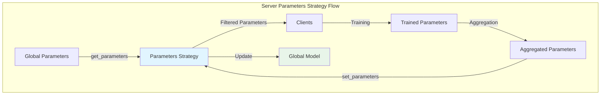

**Interface Methods:**

| Method | Purpose | When Called |
|--------|---------|-------------|
| `get_parameters(server, parameters)` | Select which parameters to send to clients | Before `configure_fit()` |
| `set_parameters(server, parameters)` | Apply aggregated parameters to global model | After aggregation in `aggregate_fit()` |

**Available Strategies:**

| Strategy | Description | Parameters Sent | Use Case |
|----------|-------------|-----------------|----------|
| **Normal** | Shares all model parameters | All layers (100%) | Traditional FL, full synchronization |
| **LayerWise** | Shares only first K layers | First K layers only | Model personalization, reduced communication |

**Configuration:**
```yaml
server:
  parameters_strategy:
    name: normal              # Options: normal, layerwise
    params: {}

  # LayerWise example:
  # parameters_strategy:
  #   name: layerwise
  #   params:
  #     num_shared_layers: 5  # Share only first 5 layers
```

#### Client-Side Parameters Strategy

Controls which parameters are received from the server and sent back after training.

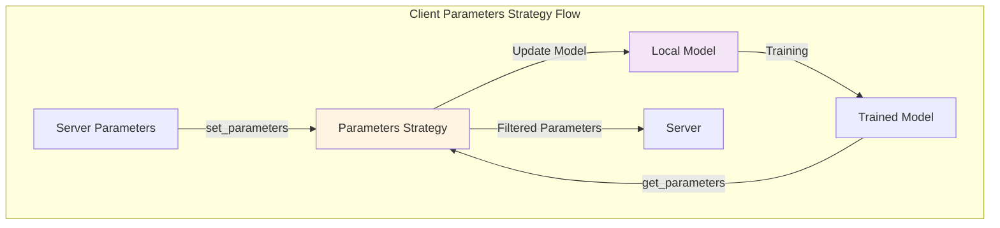

**Interface Methods:**

| Method | Purpose | When Called |
|--------|---------|-------------|
| `get_parameters(client)` | Select which parameters to send to server | In `fit()` method after training |
| `set_parameters(client, parameters)` | Apply received parameters to local model | Before training in `fit()` |

**Available Strategies:**

| Strategy | Description | Behavior |
|----------|-------------|----------|
| **Normal** | Updates entire model | Receives all parameters, sends all parameters |
| **LayerWise** | Updates only first K layers | Receives K layers, keeps rest unchanged, sends K layers |

**Configuration:**
```yaml
client:
  parameters_strategy:
    name: normal              # Options: normal, layerwise
    params: {}

  # LayerWise example:
  # parameters_strategy:
  #   name: layerwise
  #   params:
  #     num_shared_layers: 5  # Must match server configuration
```

#### Complete Flow: LayerWise Strategy

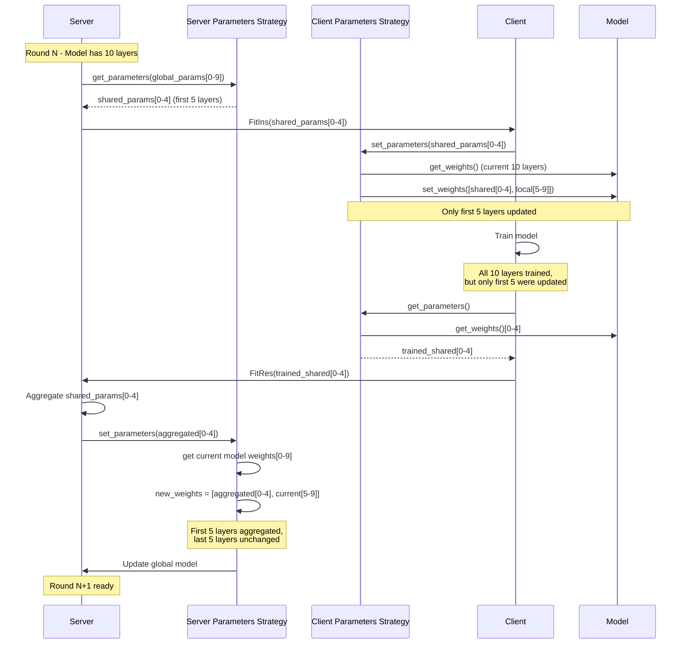

#### Benefits of LayerWise Strategy

| Benefit | Description |
|---------|-------------|
| **🔽 Reduced Communication** | Only K/N parameters transmitted (e.g., 50% for K=5, N=10) |
| **🎯 Model Personalization** | Last layers adapt to local client data |
| **🔒 Privacy Enhancement** | Personal layers never leave client |
| **⚡ Faster Convergence** | Shared layers learn global patterns, personal layers specialize |
| **💾 Bandwidth Efficiency** | Critical for resource-constrained environments |

#### Implementation Example

**LayerWise Server Strategy:**
```python
class LayerWiseParametersStrategy(ParametersStrategy):
    def get_parameters(self, server: "FLServer", parameters: NDArrays) -> NDArrays:
        """Send only first K layers to clients."""
        return parameters[:self.num_shared_layers]

    def set_parameters(self, server: "FLServer", parameters: NDArrays) -> None:
        """Update only first K layers in global model."""
        current_weights = server.model.get_weights()
        new_weights = list(parameters) + current_weights[len(parameters):]
        server.model.set_weights(new_weights)
```

**LayerWise Client Strategy:**
```python
class LayerWiseParametersStrategy(ParametersStrategy):
    def get_parameters(self, client: "FLClient") -> NDArrays:
        """Send only first K layers to server."""
        all_params = client.model.get_weights()
        return all_params[:self.num_shared_layers]

    def set_parameters(self, client: "FLClient", parameters: NDArrays) -> None:
        """Update only first K layers in local model."""
        current_params = client.model.get_weights()
        new_params = list(parameters) + current_params[len(parameters):]
        client.model.set_weights(new_params)
```

## 📈 Metrics System

The framework includes a **robust and extensible metrics calculation system** following the **Factory Pattern** and **dependency injection** principles. All client training strategies use the `MetricsManager` for consistent metric calculation across training, validation, and evaluation phases.

### Architecture

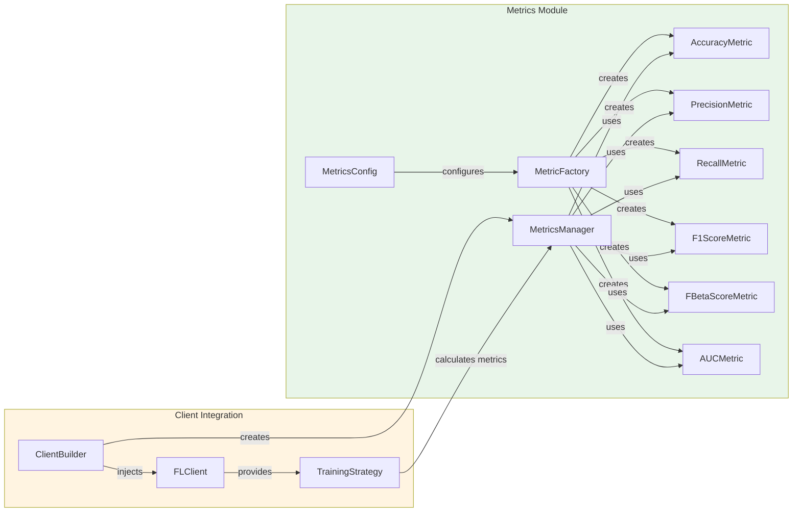

### Available Metrics

| Metric | Description | Parameters | Requires Probabilities |
|--------|-------------|------------|----------------------|
| **Accuracy** | Correct predictions / Total predictions | - | No |
| **Precision** | TP / (TP + FP) | `average`, `zero_division` | No |
| **Recall** | TP / (TP + FN) | `average`, `zero_division` | No |
| **F1-Score** | Harmonic mean of precision and recall | `average`, `zero_division` | No |
| **F-Beta Score** | Weighted harmonic mean (configurable β) | `beta`, `average`, `zero_division` | No |
| **AUC** | Area under ROC curve | `multi_class`, `average` | **Yes** |

### Configuration

Metrics can be configured via YAML or use defaults:

#### Default Metrics (Auto-configured)

If no metrics configuration is provided, the following defaults are used:

```yaml
# Automatically applied if client.metrics is not specified
client:
  metrics:  # Optional - uses defaults if omitted
    accuracy:
      name: accuracy
    precision:
      name: precision
      average: macro
      zero_division: 0
    recall:
      name: recall
      average: macro
      zero_division: 0
    f1_score:
      name: f1_score
      average: macro
      zero_division: 0
    auc:
      name: auc
      multi_class: ovr
      average: macro
```

#### Custom Metrics Configuration

**Example 1: Weighted averaging for imbalanced datasets**
```yaml
client:
  metrics:
    precision:
      name: precision
      average: weighted  # Weight by class support
      zero_division: 0
    recall:
      name: recall
      average: weighted
      zero_division: 0
    f1_score:
      name: f1_score
      average: weighted
      zero_division: 0
    auc:
      name: auc
      average: weighted
```

**Example 2: F2-Score (emphasizes recall)**
```yaml
client:
  metrics:
    accuracy:
      name: accuracy
    fbeta_score:
      name: fbeta_score
      beta: 2.0          # Recall weighted 2x more than precision
      average: macro
      zero_division: 0
```

**Example 3: Micro averaging (aggregate contributions)**
```yaml
client:
  metrics:
    precision:
      name: precision
      average: micro
    recall:
      name: recall
      average: micro
    f1_score:
      name: f1_score
      average: micro
    - name: f1_score
      average: micro
```

### Averaging Strategies

For multi-class metrics (Precision, Recall, F1, F-Beta):

| Strategy | Description | Use Case |
|----------|-------------|----------|
| **macro** | Unweighted mean (treats all classes equally) | Balanced datasets, all classes equally important |
| **weighted** | Weighted by class support | Imbalanced datasets |
| **micro** | Aggregate contributions (global calculation) | Overall performance across all samples |

### Integration with Training Strategies

All training strategies (`normal.py`, `letsfed.py`, `maxfl.py`, `fedper.py`, `qffl.py`) use the injected `MetricsManager`:


### Key Features

- ✅ **Consistent Calculation**: All strategies use the same metric pipeline
- ✅ **Configurable via YAML**: Easy to customize without code changes
- ✅ **Extensible**: Add new metrics by implementing the `Metric` base class
- ✅ **Dependency Injection**: `MetricsManager` injected via `ClientBuilder`
- ✅ **Type-Safe**: Full type hints with dataclass configurations
- ✅ **Factory Pattern**: Metrics created via `MetricFactory`
- ✅ **Error Handling**: Graceful handling of edge cases (zero division, missing data)


## 🔧 Extending the Framework

The framework is designed for easy extensibility. Here's how to add new components:

### Adding a New Training Strategy

1. **Create the implementation** in `client/strategies/training/types/`:

```python
from ..base import TrainingStrategy
from ...drivers.driver import Driver
from ...drivers.context import DriverContext

class MyCustomTraining(TrainingStrategy):
    def __init__(self, config: TrainingConfig):
        """Strategies now have __init__ and store their own state"""
        self.config = config
        self.my_custom_metric = 0.0  # Strategy attribute
        self.drivers = self._get_drivers()

    def _get_drivers(self) -> list[Driver]:
        """Return list of drivers to use"""
        return [AccuracyDriver(), MyCustomDriver()]

    def apply_drivers(self, client, parameters, config):
        """Apply drivers and store results in strategy (not client)"""
        context = DriverContext()
        for driver in self.drivers:
            driver.run(client, parameters, config, context)

        # Store in strategy attributes
        for key, value in context.get_all().items():
            setattr(self, key, value)

    def fit(self, client, parameters, config):
        """Implement training logic"""
        client.model.set_weights(parameters)
        self.apply_drivers(client, parameters, config)
        # ... training code using self.my_custom_metric ...
        return updated_weights, num_examples, metrics

    def evaluate(self, client, parameters, config):
        """Implement evaluation logic - client decides participation here"""
        # ... evaluation code ...
        # Client sets its participation state for next round
        return loss, num_examples, metrics
```

2. **Register in factory** (`client/strategies/training/factory.py`):

```python
class TrainingStrategyFactory:
    @staticmethod
    def create(config: TrainingConfig) -> TrainingStrategy:  # Module-specific config!
        strategies = {
            "normal": NormalTraining,
            "letsfed": LetsFedTraining,
            "my_custom": MyCustomTraining,  # Add here
        }
        strategy_class = strategies[config.name]
        return strategy_class(config)  # Pass config to __init__
```

3. **Add config dataclass** in `client/strategies/training/structs.py`:

```python
@dataclass
class MyCustomTrainingConfig:
    name: str
    my_parameter: float
    # ... other parameters
```

4. **Use in configuration**:

```yaml
client:
  training_strategy:
    name: my_custom
    my_parameter: 1.5
```

### Adding a New Driver

1. **Create the driver** in `client/strategies/drivers/`:

```python
from .context import DriverContext
from .driver import Driver
from flwr.common import Config, NDArrays

class MyCustomDriver(Driver):
    """
    Custom driver for computing specific metrics.

    Modifies:
        - my_metric: Description of what this computes (type)
    """

    def run(
        self,
        client: FLClient,
        parameters: NDArrays,
        config: Config,
        context: DriverContext
    ) -> None:
        """
        Compute metric and store in context.

        Args:
            client: FLClient instance (for reading state)
            parameters: Model parameters
            config: Configuration dict
            context: DriverContext for storing results
        """
        # Implement driver logic (read from client)
        metric = self._calculate_metric(client)

        # Store result in context (don't modify client directly)
        context.set('my_metric', metric)

    def _calculate_metric(self, client) -> float:
        # Your computation logic here
        return some_value
```

2. **Use in any training strategy**:

```python
def _get_drivers(self):
    return [MyCustomDriver(), AccuracyDriver()]
```

### Adding a New Selection Method

1. **Create implementation** in `server/strategies/client_selection_method/types/`:

```python
from ..base import ClientSelectionMethod

class MyCustomSelection(ClientSelectionMethod):
    def select(self, server, client_manager, num_clients):
        # Implement selection logic
        # ...
        return selected_clients
```

2. **Register in factory** and update config as shown above.

### Adding a New Aggregation Method

Similar process in `server/strategies/aggregate_method/types/`.

### Architecture Benefits

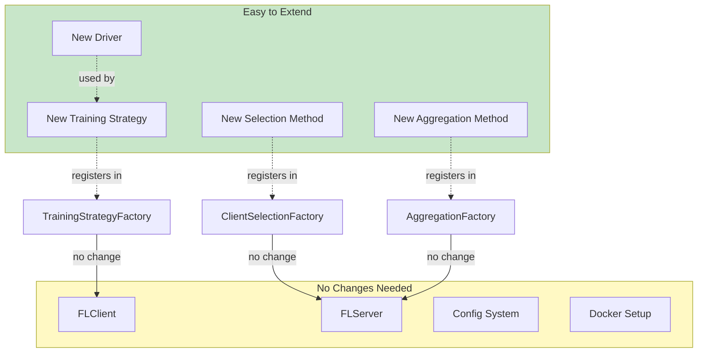

**Key Principle**: You extend behavior by **adding new classes**, not by **modifying existing ones** (Open/Closed Principle).

## 📊 Logging and Analysis

### Automatic Metrics Collection

The framework automatically logs metrics to the `logs/` directory:

```
logs/
├── c-data-0.csv        # Client 0 training/evaluation metrics
├── c-data-1.csv        # Client 1 training/evaluation metrics
├── ...
├── c-data-N.csv        # Client N training/evaluation metrics
└── server-data.csv     # Server-side aggregated metrics
```

### Logged Metrics

#### Client Metrics
- Round number
- Training accuracy/loss (`g_fit_acc`, `g_fit_loss`)
- Evaluation accuracy/loss (`g_eval_acc`, `g_eval_loss`)
- Selection status (`selected`)
- Participation state (`participating_state`, `desired_state`)
- Strategy-specific metrics (e.g., `qk` for MaxFL, `willing` for LetsFed)

#### Server Metrics
- Aggregated loss/accuracy per round
- Number of clients selected
- Selection method used
- Aggregation method used

### Analysis

Use the provided Jupyter notebook for visualization and analysis:

```bash
jupyter notebook test/teste.ipynb
```

The notebook includes:
- Training convergence plots
- Client participation patterns
- Comparison between strategies
- Statistical analysis

## 🐳 Docker Configuration

### Container Architecture

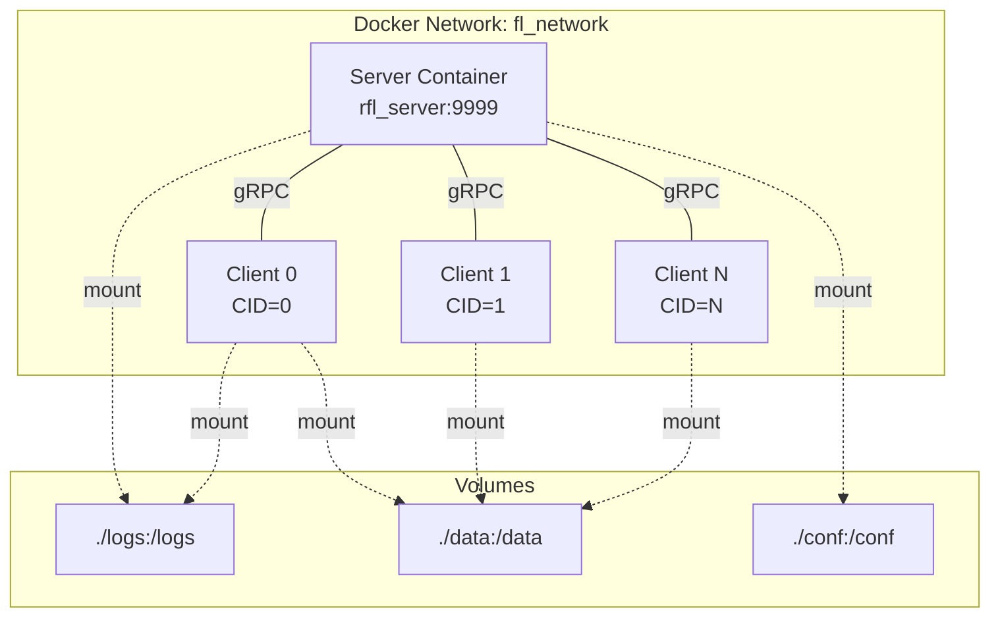

### Scaling Clients

The framework uses `run_experiments.py` for experiment orchestration with updated `docker_compose_manager.py`:

```bash
# Run experiment with orchestration script
python run_experiments.py

# Or use docker-compose manager directly to run
docker compose up server
docker compose up client
```

### Cleanup

Stop and remove all containers, networks, and orphaned containers:

```bash
# Basic cleanup (keeps volumes)
./cleanup.sh

# Full cleanup (also removes volumes)
./cleanup.sh --volumes

# Or use docker compose directly
docker compose down --remove-orphans

# With volumes
docker compose down --remove-orphans --volumes
```

The `cleanup.sh` script provides:
- ✅ Stops all running containers
- ✅ Removes containers and networks
- ✅ Removes orphaned containers
- ✅ Optional volume removal (`--volumes` flag)
- ✅ Colored output with status messages
- ✅ Warnings about remaining containers

## ⚙️ Configuration Reference

### Modular Configuration System

Each module has its own `structs.py` with dataclass configurations:
- `conf/structs.py` - Top-level environment config
- `server/strategies/structs.py` - Server-specific config
- `server/strategies/aggregate_method/structs.py` - Aggregation method configs
- `server/strategies/client_selection_method/structs.py` - Selection method configs
- `client/strategies/structs.py` - Client-specific config
- `client/strategies/training/structs.py` - Training strategy configs


### Complete Configuration Example

```yaml
# General settings
rounds: 10                    # Number of federated learning rounds
n_clients: 30                 # Total number of clients
init_clients: 1.0             # Fraction of clients to initialize
gpu: false                    # Enable GPU acceleration
log_path: logs                # Path for log files

# Server configuration
server:
  ip: 0.0.0.0
  port: 9999

  # Aggregation strategy
  aggregation_method:
    name: fedavg              # Options: fedavg, maxfl
    # MaxFL parameters (if name=maxfl)
    # epsilon: 10
    # learning_rate: 0.01

  # Client selection strategy
  selection_method:
    name: letsfed             # Options: random, deev, poc, round_robin, letsfed
    perc_of_clients: 0.3      # Percentage of clients to select per round
    # DEEV parameters (if name=deev)
    # decay: 0.95
    # LetsFed parameters (if name=letsfed)
    # participating_method: random
    # non_participating_method: poc

# Client configuration
client:
  epochs: 5                   # Local training epochs
  learning_rate: 0.0001       # Learning rate

  # Training strategy
  training_strategy:
    name: letsfed             # Options: normal, letsfed, maxfl, fedper, qffl
    # LetsFed parameters (if name=letsfed)
    # threshold: 1.0

  participating: true         # Initial participation state

# Dataset configuration
dataset:
  dataset: fashion_mnist      # Options: fashion_mnist, cifar10, mnist
  path: logs                  # Dataset storage path
  batch_size: 32              # Batch size for training

# Model configuration
model:
  model: cnn                  # Options: cnn, dnn
  # Model-specific parameters...
```

## 🛠️ Development

### Project Philosophy

This framework follows key software engineering principles:

- **🎯 SOLID Principles**
  - Single Responsibility: Each class has one clear purpose
  - Open/Closed: Extend via new classes, not modifications
  - Liskov Substitution: Strategies are interchangeable
  - Interface Segregation: Focused, minimal interfaces
  - Dependency Inversion: Depend on abstractions, not concretions

- **🎨 Design Patterns**
  - Strategy Pattern for algorithm selection
  - Factory Pattern for strategy creation (receives module-specific configs)
  - Builder/Injection Pattern for server/client construction (dependency injection)
  - Chain of Responsibility for driver pipeline (managed by strategies)
  - Context Object Pattern for explicit side effects and testability

- **📦 Modular Design**
  - Clear separation of concerns
  - Composable components
  - Minimal coupling, high cohesion


## 🎓 Research & Publications

This framework was developed as part of research on Federated Learning with dynamic client participation.

### Citation

If you use this framework in your research, please cite:

```bibtex
@INPROCEEDINGS{10903243,
  author={Jarczewski, Rafael O. and Cerqueira, Eduardo and Bittencourt, Luiz F. and Loureiro, Antonio A. F. and Villas, Leandro A. and de Souza, Allan M.},
  booktitle={2024 International Conference on Machine Learning and Applications (ICMLA)},
  title={Let's Federate - Effective Communication Strategy for Dynamic Client Participation},
  year={2024},
  pages={361-368},
  doi={10.1109/ICMLA61862.2024.00055}
}
```

## 🔒 Security Considerations

This is a **research framework** and should not be used in production without proper security review:

- No authentication/authorization implemented
- Network communication is not encrypted by default
- Data is not encrypted at rest
- No input validation for malicious data

For production use, consider:
- Adding TLS/SSL for communication
- Implementing client authentication
- Encrypting datasets
- Adding differential privacy mechanisms

## 🤝 Contributing

Contributions are welcome! To contribute:

1. **Fork the repository**
2. **Create a feature branch**: `git checkout -b feature/amazing-feature`
3. **Follow the coding style**: Use `ruff` for formatting
4. **Add tests** if applicable
5. **Update documentation**: Keep README and docstrings current
6. **Commit changes**: `git commit -m 'Add amazing feature'`
7. **Push to branch**: `git push origin feature/amazing-feature`
8. **Open a Pull Request**

### Contribution Guidelines

- Follow existing design patterns
- Maintain type hints throughout
- Write clear docstrings
- Keep commits atomic and well-described
- Update relevant documentation

## 📚 Additional Resources

### Project Documentation
- 📄 **[Driver Pattern Documentation](docs/DRIVER_PATTERN.md)** - Detailed DriverContext pattern explanation
- 💡 **[Driver Usage Examples](examples/driver_context_usage.py)** - Code examples and tests

### Federated Learning
- 🌸 **[Flower Documentation](https://flower.dev/docs/)** - FL framework used in this project
- 📖 **[Federated Learning Book](https://www.federated-learning.com/)** - Comprehensive guide to FL concepts
- 📄 **[FedAvg Paper](https://arxiv.org/abs/1602.05629)** - Original federated averaging paper (McMahan et al., 2017)

### Design Patterns
- 🎨 **[Refactoring Guru](https://refactoring.guru/design-patterns)** - Comprehensive pattern catalog with examples
- 🐍 **[Python Design Patterns](https://python-patterns.guide/)** - Python-specific pattern implementations
- 🔄 **[Context Object Pattern](https://www.dofactory.com/net/context-object-design-pattern)** - Pattern reference and explanation

### Docker & DevOps
- 🐳 **[Docker Best Practices](https://docs.docker.com/develop/dev-best-practices/)** - Official Docker guidelines
- 📦 **[Docker Compose](https://docs.docker.com/compose/)** - Multi-container orchestration guide


## 📞 Contact

- **Author**: Rafael O. Jarczewski
- **Institution**: [Add institution]
- **Email**: [Add email]
- **GitHub Issues**: For bug reports and feature requests

---

**⚠️ Note**: This is a research framework under active development. Some features may be experimental or incomplete. See issues for known limitations and planned improvements.

**🚀 Happy Federating!**
