# Dynamic Client Participation Strategies in Federated Learning: A Comprehensive Comparative Analysis and Improvements to the LetsFed Framework

<div align="center">

**[Igor Henrique Buranello dos Santos]**

*Computer Engineering*

*[UNICAMP - Universidade Estadual de Campinas - SP]*

*[i171953@dac.unicamp.br]*

---

## Abstract

Federated Learning (FL) has emerged as a powerful paradigm for training machine learning models across distributed devices while preserving data privacy. However, real-world deployments face significant challenges including communication efficiency, client heterogeneity, non-IID data distributions, and dynamic client participation. This work presents a comprehensive study of client selection and aggregation strategies in federated learning, with particular focus on the LetsFed framework, which enables clients to autonomously decide their participation in the federation. We implement and evaluate multiple strategies including Random selection, Round Robin, Power of Choice (PoC), and various configurations of LetsFed with different decision metrics and thresholds. Furthermore, we propose novel improvements to the LetsFed framework: (1) replacing accuracy with F1-score as the client decision metric to better handle imbalanced data scenarios, (2) adjusting participation thresholds to increase client engagement, and (3) introducing an interest-weighted aggregation strategy that considers non-participating clients to make the global model more attractive to disengaged clients. Experiments conducted on the Fashion-MNIST dataset with Dirichlet-distributed non-IID partitions across 5 clients over 30 rounds demonstrate the trade-offs between model performance, fairness, and convergence across different strategies. Our results show that the proposed improvements to LetsFed achieve competitive performance while maintaining the benefits of dynamic client participation and reduced communication overhead.

**Keywords:** Federated Learning, Client Selection, Dynamic Participation, LetsFed, Non-IID Data, Communication Efficiency, Model Aggregation

</div>

---

## 1. Introduction

### 1.1 Context and Motivation

The exponential growth of data generated by mobile devices, IoT (*Internet of Things*) sensors, and distributed systems has created a scenario where large volumes of information are dispersed across multiple decentralized sources. Traditionally, training Machine Learning (ML) models requires centralizing this data on servers, which raises serious concerns related to privacy, security, communication costs, and regulatory compliance, especially considering legislation such as GDPR (*General Data Protection Regulation*) in Europe and LGPD (*Lei Geral de Proteção de Dados*) in Brazil.

In this context, **Federated Learning** (FL) emerged as a revolutionary paradigm that enables collaborative training of ML models without the need for direct sharing of raw data. Initially proposed by McMahan et al. [1] in 2017 with the FedAvg (*Federated Averaging*) algorithm, FL allows multiple clients (devices, organizations, or nodes) to locally train a shared model, sending only parameter updates (gradients or weights) to a central server, which aggregates these contributions to form an improved global model.

The importance of Federated Learning today transcends the simple technical aspect. In an increasingly connected world that is conscious about data privacy, FL offers an elegant solution to various practical problems:

1. **Privacy by Design**: Data never leaves the user's device, significantly reducing risks of leaks and attacks.

2. **Communication Efficiency**: Transmitting model updates is generally much more efficient than transmitting large volumes of raw data.

3. **Leveraging Distributed Data**: Allows utilizing data that, for legal, technical, or commercial reasons, cannot be centralized.

4. **Personalization**: Facilitates the creation of models that can be customized (personalized) to the local characteristics of each client. **Arivazhagan et al. [12]** addressed the personalization challenge in their seminal work **FedPer** (Federated Learning with Personalization Layers), which proposes viewing deep learning models as "base + personalization layers." The base layers capture shared knowledge across all clients and are trained collaboratively via federated averaging, while the personalization layers remain local to each client and adapt to individual data distributions.

### 1.2 Challenges in Federated Learning

Despite its benefits, Federated Learning presents a series of complex challenges that have been the subject of intense research in the scientific community:

#### 1.2.1 Statistical Heterogeneity and Non-IID Data

One of the most fundamental challenges in FL is dealing with **statistical heterogeneity** of data across clients. In real-world scenarios, each client's local data rarely follows an identical and independent distribution (IID - *Independent and Identically Distributed*). Instead, data is typically **Non-IID**, presenting:

- **Class imbalance**: Different clients may have very distinct proportions of each class.
- **Concept drift**: The underlying concept of the data may vary between clients.
- **Feature skew**: Data characteristics may differ significantly.
- **Quantity skew**: The volume of data may vary drastically between clients.

McMahan et al. [1] demonstrated that FedAvg can have significantly impaired convergence in extreme Non-IID scenarios, leading to global models that do not generalize well for all participants. This problem is particularly relevant because, in real applications, heterogeneity is the norm, not the exception.

#### 1.2.2 Communication Costs

Communication between clients and server represents a critical bottleneck in FL systems. Lin et al. [2] identified that:

- Available bandwidth in mobile networks is limited and variable.
- The energy cost of wireless communication can be significant.
- Communication latency directly impacts total training time.
- In scenarios with millions of clients, aggregating updates becomes computationally intensive.

**Gradient compression** techniques [2] have been proposed to mitigate these problems, including quantization, sparsification, and efficient encoding. Lin et al. demonstrated that up to 99.9% of gradient exchange can be redundant, achieving compression ratios from 270× to 600× without losing accuracy. However, these techniques often introduce trade-offs between communication efficiency and model accuracy.

#### 1.2.3 Stragglers and Fault Tolerance

In real distributed systems, not all clients respond within the expected time. Some may:

- Have unstable or slow network connections.
- Possess limited computational resources.
- Disconnect during training.
- Fail completely.

Wu et al. [3] proposed SAFA, a semi-asynchronous protocol for Federated Learning that addresses the problems of low round efficiency and poor convergence rate in extreme conditions (e.g., clients dropping offline frequently). This introduces additional challenges related to model consistency and incorporation of stale updates.

#### 1.2.4 Privacy and Security

Although FL already offers a layer of protection by not sharing raw data, research has demonstrated that sensitive information can still be inferred from model updates. Wei et al. [4] proposed the application of **Differential Privacy** in the context of FL, adding calibrated noise to updates to ensure formal privacy protections.

Additionally, FL is subject to adversarial attacks such as:

- **Poisoning attacks**: Malicious clients can send corrupted updates.
- **Inference attacks**: Attempts to reconstruct training data from gradients.
- **Model inversion attacks**: Extraction of sensitive information from the trained model.

#### 1.2.5 Client Selection

In scenarios with a large number of potential clients, selecting which ones will participate in each training round becomes a critical decision. Inadequate selection strategies can lead to:

- **Model bias**: If certain types of clients are systematically under-represented.
- **Slow convergence**: If clients with relevant data are not selected.
- **Resource waste**: If clients with redundant contributions are repeatedly chosen.
- **Unfairness**: If the distribution of selections is unequal among participants.

Recent research has explored sophisticated approaches to client selection that go beyond random sampling. **Cho et al. [9]** introduced the **Power of Choice (PoC)** framework, demonstrating that biasing client selection towards clients with higher local loss can significantly accelerate convergence—achieving up to 3× faster convergence and 10% higher test accuracy compared to random selection. Their convergence analysis reveals that the selection skew ρ directly impacts the convergence rate, with larger ρ values yielding faster convergence at the potential cost of solution bias.

**Cho et al. [10]** further extended this line of research with **MaxFL**, which introduces the concept of **Global Model Appeal (GM-Appeal)**—the fraction of clients that find the global model satisfactory according to their individual requirements. MaxFL demonstrates that maximizing GM-Appeal leads to 22-40% test accuracy improvement for training clients and 18-50% improvement for unseen clients, highlighting the importance of client satisfaction in maintaining an adequate pool of participants.

**Li et al. [11]** proposed **q-Fair Federated Learning (q-FFL)**, inspired by fair resource allocation in wireless networks. q-FFL introduces a novel optimization objective that encourages more uniform accuracy distribution across devices by reweighting client contributions based on their loss values. The approach achieves a 45% average reduction in accuracy variance while maintaining the same overall average accuracy.

Works such as de Souza et al. [6] on adaptive client selection with personalization and FedSCCS [7] on hierarchical clustering address different aspects of this problem from complementary perspectives.

#### 1.2.6 Dynamic Participation

A particularly interesting challenge, and the main focus of this work, is **dynamic client participation**. In real systems, clients may have varying interest in participating in the federation, depending on:

- Whether the global model improves or worsens their local performance.
- Communication and computation costs involved.
- Resource availability at the moment.
- Economic or other incentives.

The **LetsFed** framework [8], proposed by Jarczewski et al., specifically addresses this scenario, allowing clients to autonomously decide their participation based on interest metrics. This approach recognizes an important reality: the aggregated global model is not always beneficial for all clients, especially in extreme Non-IID scenarios.

### 1.3 Motivation for Improvements to LetsFed

The LetsFed framework represents a significant advancement by recognizing client autonomy in participation decisions. However, we identified opportunities for improvement:

1. **Decision Metric**: The original LetsFed uses accuracy as the metric to decide participation. In scenarios with imbalanced data, accuracy can be misleading - a model that simply predicts the majority class may have high accuracy but low practical value.

2. **Participation Threshold**: The original threshold of 1.0 (participate only if the global model is strictly better) may be too restrictive. After aggregation, it is natural for the global model's performance to be slightly inferior to the local model specific to the client's data.

3. **Treatment of Non-Participating Clients**: The original LetsFed ignores clients who choose not to participate in aggregation, potentially losing valuable information and not offering mechanisms to "win back" these clients.

4. **Lack of Model Personalization**: The original LetsFed allows clients to train with their local models, but this can lead to overfitting if clients remain non-participants for too long. A layerwise parameters strategy could enable model personalization while maintaining benefits from the global model.

### 1.4 Objectives and Contributions

This undergraduate thesis has the following main objectives:

1. **Implement a modular and extensible framework** for experimentation with different Federated Learning strategies, following software engineering best practices.

2. **Comparatively evaluate** multiple client selection strategies (Random, Round Robin, PoC, LetsFed) in terms of performance, fairness, and convergence.

3. **Propose and implement improvements** to the LetsFed framework:
   - Replacing accuracy with F1-Score as the decision metric.
   - Adjusting the participation threshold to more flexible values (0.90, 0.85).
   - Creating an aggregation strategy that considers non-participating clients with weighting based on their interest metrics.
   - Proposing a layerwise parameters strategy for model personalization (theoretical proposal, not experimentally validated).

4. **Conduct extensive experiments** to validate the proposed improvements and characterize the trade-offs between different configurations.

### 1.5 Document Structure

This work is organized as follows:

- **Section 2 - Related Work**: Detailed literature review of the main works in the Federated Learning area, with focus on client selection, communication compression, privacy, and heterogeneity treatment.

- **Section 3 - Project Development**: Complete description of the architecture and implementation of the developed framework, including design patterns, modules, and execution flow.

- **Section 4 - Proposed Improvements to LetsFed**: Details of the original contributions of this work, including the new F1-Score-based decision metric, the interest-weighted aggregation strategy, and a theoretical proposal for layerwise model personalization.

- **Section 5 - Experimental Analysis**: Presentation and discussion of experimental results, including convergence analysis, fairness, per-client performance, and comparisons between strategies.

- **Section 6 - Conclusions and Future Work**: Synthesis of contributions, identified limitations, and directions for future research.

---

## 2. Related Work

This section presents a comprehensive and in-depth review of the main works in the Federated Learning literature that form the theoretical and practical foundation for this research. We organize the discussion into thematic subsections covering the fundamental aspects of FL, from foundational algorithms to specific challenges addressed in this work, providing detailed technical analysis of methodologies, algorithms, and experimental results from each referenced paper.

### 2.1 Foundations of Federated Learning

#### 2.1.1 FedAvg: The Foundational Algorithm

The seminal work by McMahan et al. [1], titled "Communication-Efficient Learning of Deep Networks from Decentralized Data," introduced the Federated Learning paradigm and proposed the FedAvg (*Federated Averaging*) algorithm. This work established the fundamental framework that most subsequent research builds upon and defined the core characteristics of FL systems.

**Problem Context and Motivation:**

McMahan et al. identified that modern mobile devices have access to a wealth of data suitable for learning models - language models can improve speech recognition and text entry, and image models can automatically select good photos. However, this rich data is often privacy-sensitive, large in quantity, or both, which may preclude logging to the data center. The authors advocated for an alternative approach that leaves the training data distributed on mobile devices and learns a shared model by aggregating locally-computed updates.

The authors defined the ideal problems for federated learning as having these properties:
1. Training on real-world data from mobile devices provides a distinct advantage over training on proxy data generally available in data centers
2. This data is privacy-sensitive or large in size compared to model size, making it preferable not to log to data centers
3. For supervised tasks, labels on the data can be inferred naturally from user interaction

**Federated Optimization Formalization:**

McMahan et al. formalized the federated optimization problem, distinguishing it from traditional distributed optimization through several key properties:

- **Non-IID Data**: The training data on a given client is typically based on the usage of the mobile device by a particular user, and hence any particular user's local dataset will not be representative of the population distribution.

- **Unbalanced Data**: Some users will make much heavier use of the service or app than others, leading to varying amounts of local training data.

- **Massively Distributed**: The number of clients participating in an optimization is expected to be much larger than the average number of examples per client.

- **Limited Communication**: Mobile devices are frequently offline or on slow or expensive connections.

The optimization problem is formalized as minimizing a global objective function:

$$\min_{w} F(w) = \sum_{k=1}^{K} \frac{n_k}{n} F_k(w) \quad \text{where} \quad F_k(w) = \frac{1}{n_k} \sum_{i \in P_k} f_i(w)$$

where $F_k(w)$ is the local objective function for client $k$, $n_k = |P_k|$ is the number of samples at client $k$, $n = \sum_k n_k$ is the total number of samples, and $P_k$ is the set of indexes of data points on client $k$.

**The FedAvg Algorithm:**

FedAvg operates in rounds controlled by three key parameters:
- **C**: The fraction of clients that perform computation on each round
- **E**: The number of training passes each client makes over its local dataset on each round
- **B**: The local minibatch size used for client updates

The algorithm pseudo-code:

```
Server executes:
  initialize w₀
  for each round t = 1, 2, ... do
    m ← max(C · K, 1)
    Sₜ ← (random set of m clients)
    for each client k ∈ Sₜ in parallel do
      wₜ₊₁ᵏ ← ClientUpdate(k, wₜ)
    wₜ₊₁ ← Σₖ∈Sₜ (nₖ/Σⱼ nⱼ) wₜ₊₁ᵏ

ClientUpdate(k, w):
  B ← (split Pₖ into batches of size B)
  for each local epoch i from 1 to E do
    for batch b ∈ B do
      w ← w − η∇ℓ(w; b)
  return w to server
```

**Key Insight on Model Averaging:**

The authors investigated why averaging neural network parameters works in practice. For general non-convex objectives, averaging models in parameter space could produce an arbitrarily bad model. However, they found that when starting two models from the same random initialization and training each independently on different subsets of data, naive parameter averaging works surprisingly well. The averaged model achieves significantly lower loss on the full training set than the best model achieved by training on either of the small datasets independently. This insight is crucial because a shared starting model $w_t$ is used for each round of FedAvg.

**Experimental Results:**

The authors conducted extensive experiments on:
- **MNIST digit recognition**: Using a 2-layer MLP with 200 units each (199,210 parameters) and a CNN with two 5x5 convolution layers (1,663,370 parameters)
- **Shakespeare language modeling**: Character-level LSTM with 2 layers of 256 hidden units (866,578 parameters)

Key findings:
- FedAvg can reduce the number of communication rounds by 10-100× compared to synchronized SGD
- With B=∞ (full-batch local training), there is only a small advantage in increasing the client fraction C
- Using smaller batch size B=10 shows significant improvement with C≥0.1
- Adding more local SGD updates per round produces dramatic decrease in communication costs

**Identified Limitations:**

The original FedAvg paper identified critical challenges:
- Performance degradation with highly Non-IID data
- Sensitivity to the number of local epochs E
- Need for careful hyperparameter tuning across heterogeneous clients
- The algorithm was tested primarily on IID and moderately Non-IID scenarios

These limitations have motivated extensive follow-up research, including the work presented in this thesis.

#### 2.1.2 The Weight Divergence Problem and Non-IID Challenges

The heterogeneity of data distribution across clients is one of the most significant challenges in FL. When clients train on Non-IID data, their local models can diverge significantly from each other, leading to:

- **Poor convergence of the global model**: Local updates may point in conflicting directions
- **High variance in aggregated updates**: Different clients optimize for different local optima
- **Global model performing worse than local models**: After aggregation, the model may not serve any client well

This last point is particularly relevant to the LetsFed framework [8], as it provides the theoretical justification for allowing clients to opt out of participation when the global model does not benefit them. In extreme Non-IID scenarios (such as the pathological partition where each client only has examples of 2 digits), the divergence between local models becomes substantial, requiring more communication rounds to achieve target accuracy.

McMahan et al. [1] created pathological Non-IID partitions by sorting MNIST data by digit label, dividing it into 200 shards of size 300, and assigning each of 100 clients 2 shards. This setup, where most clients only have examples of two digits, enabled exploration of how algorithms break on highly Non-IID data.

### 2.2 Communication Efficiency in Federated Learning

#### 2.2.1 Deep Gradient Compression (DGC)

Lin et al. [2] presented foundational work on communication-efficient distributed learning, titled "Deep Gradient Compression: Reducing the Communication Bandwidth for Distributed Training." This work addresses a critical bottleneck: large-scale distributed training requires significant communication bandwidth for gradient exchange that limits the scalability of multi-node training, and requires expensive high-bandwidth network infrastructure.

**The Communication Bottleneck:**

The authors identified that gradient exchange is costly and dwarfs the savings of computation time, especially for recurrent neural networks (RNNs) where the computation-to-communication ratio is low. The situation gets even worse with distributed training on mobile devices (federated learning), which suffers from higher latency, lower throughput, and intermittent poor connections.

**Core Finding:**

The key insight of their work is striking: **99.9% of the gradient exchange in distributed SGD is redundant**. This finding enabled the development of Deep Gradient Compression (DGC) to dramatically reduce communication bandwidth.

**Gradient Sparsification Algorithm:**

DGC reduces communication bandwidth by sending only the important gradients (sparse update), using gradient magnitude as a simple heuristic for importance. Only gradients larger than a threshold are transmitted. To avoid losing information, the remaining gradients are accumulated locally. Eventually, these accumulated gradients become large enough to be transmitted.

The insight is that local gradient accumulation is equivalent to increasing the batch size over time. After T iterations of accumulation, the effective update becomes:

$$w_t^{(i)} + T = w_t^{(i)} - \eta T \cdot \frac{1}{NbT} \sum_{\tau=0}^{T-1} \sum_{k=1}^{N} \sum_{x \in B_{k,t+\tau}} \nabla^{(i)} f(x, w_{t+\tau})$$

**Four Techniques for Preserving Accuracy:**

To ensure no loss of accuracy during compression, DGC employs four methods:

1. **Momentum Correction**: Standard momentum SGD follows $u_t = mu_{t-1} + \sum_{k=1}^{N} \nabla_{k,t}$, $w_{t+1} = w_t - \eta u_t$. Without correction, the accumulated discounting factor disappears in sparse updates, harming convergence. Momentum correction locally accumulates the velocity $u_{k,t}$ instead of the real gradient, restoring proper optimization dynamics.

2. **Local Gradient Clipping**: Gradient clipping is widely adopted to avoid the exploding gradient problem. Because gradients are accumulated over iterations on each node independently, clipping is performed locally before adding the current gradient to previous accumulation, scaling the threshold by $N^{-1/2}$.

3. **Momentum Factor Masking**: To alleviate staleness from delayed updates, the same mask is applied to both accumulated gradients and momentum factors: $v_{k,t} \leftarrow v_{k,t} \odot \neg Mask$, $u_{k,t} \leftarrow u_{k,t} \odot \neg Mask$. This stops the momentum for delayed gradients, preventing stale momentum from carrying weights in the wrong direction.

4. **Warm-up Training**: In early training stages, the network changes rapidly and gradients are more diverse. Sparsifying gradients limits the range of model variation. Instead of linearly ramping up the learning rate, DGC exponentially increases gradient sparsity from a relatively small value (75% → 93.75% → 98.4375% → 99.6% → 99.9%) to help training adapt to gradients of larger sparsity.

**Empirical Results:**

DGC was validated on multiple tasks:

| Task | Model | Original Gradient Size | Compressed Size | Compression Ratio |
|------|-------|----------------------|-----------------|-------------------|
| Image Classification | ResNet-50 | 97MB | 0.35MB | ~270× |
| Speech Recognition | DeepSpeech | 488MB | 0.74MB | ~600× |
| Language Modeling | LSTM | - | - | ~462× |

On CIFAR-10 with ResNet-110:
- With 4 GPUs (batch size 128): Baseline accuracy 93.75%, DGC accuracy 93.87% (+0.12%)
- With 32 GPUs (batch size 1024): Baseline accuracy 93.10%, DGC accuracy 93.18% (+0.08%)

The results demonstrated that deep gradient compression enables large-scale distributed training on inexpensive commodity 1Gbps Ethernet infrastructure.

**Relevance to This Work:**

These techniques are highly relevant because they address the same fundamental concern as LetsFed: reducing unnecessary communication. While DGC reduces the size of each communication through compression, LetsFed reduces the number of participating clients who need to communicate, offering a complementary approach. The combination of both strategies could provide even greater communication savings.

### 2.3 Handling Stragglers and Asynchronous Updates

#### 2.3.1 SAFA: Semi-Asynchronous Federated Averaging

Wu et al. [3] addressed the challenge of **straggler clients** in their work "SAFA: a Semi-Asynchronous Protocol for Fast Federated Learning with Low Overhead." The paper proposes a protocol that addresses problems such as low round efficiency and poor convergence rate in extreme conditions.

**Fundamental Challenges in Federated Environments:**

The authors identified several obstacles specific to machine learning in federated settings:

1. **Unbalanced and Biased Data Distribution**: End devices may own variable amounts of on-device data and the distribution may differ between devices.

2. **Massive Distribution**: A huge fleet of disparate devices at the edge as participants is common.

3. **Unreliability**: Both devices and their connections to the cloud are unreliable. End devices could opt out occasionally or go offline unexpectedly. Communication could be expensive.

**Limitations of Synchronous Protocols:**

The authors identified four key limitations of synchronous FL protocols like FedAvg:

1. **Unreliable Fraction of Effective Participants**: The number of clients that manage to commit results is very uncertain given the unreliable nature of end devices.

2. **Low Round Efficiency**: FedAvg must wait for all selected clients to finish, among which there may be stragglers while crashed ones may never respond. Global learning progress is suspended until a timeout threshold is reached.

3. **Under-utilization of Clients**: With random selection, many capable clients are likely to remain idle even if they are ready and willing to participate.

4. **Progress Waste**: Selected clients may not finish local training in time, and their progress is wasted because they will be forced to overwrite their local model with the global model next time.

**The SAFA Protocol Design:**

SAFA introduces three novel components:

**1. Lag-Tolerant Model Distribution:**

Instead of requiring all clients to synchronize with the latest global model, SAFA classifies clients into three states:
- **Up-to-date**: Clients that completed previous round of local training
- **Deprecated**: Clients whose local model version is too stale (lags by more than lag tolerance τ)
- **Tolerable**: Clients not on latest model but not too old either

Only up-to-date and deprecated clients are forced to synchronize; tolerable clients can continue working on their previous local results. This is formalized as:

$$w_k(t) = \begin{cases} w(t-1) & \text{if } k \in \bigcup_{v=t-1} M_v \text{ or } k \in \bigcup_{v<t-\tau} M_v \\ w_k(t-1) & \text{if } k \in \bigcup_{t-\tau \leq v < t-1} M_v \end{cases}$$

**2. Post-Training Client Selection:**

Rather than selecting clients before training (which leads to waiting for designated clients), SAFA lets the server collect local updates after training. The server can execute aggregation once it has received a C-fraction of updates, effectively decoupling the server from selected clients.

The Effective Update Ratio (EUR) is defined as:
$$EUR = \frac{|P - P \cap K|}{|M|}$$

where P is the set of picked clients and K is the set of crashed clients.

For SAFA with "selection-after-training":
$$EUR = \begin{cases} 1-R & \text{if } C \geq 1-R \\ C & \text{if } C < 1-R \end{cases}$$

This significantly improves EUR compared to "selection-ahead-of-training" schemes.

**3. Discriminative Aggregation:**

SAFA uses a cache structure to store entries of latest local models from picked clients. Updates from undrafted clients bypass the current aggregation but are stored for potential future use, avoiding futile local work.

**Hyper-parameter Analysis:**

The lag tolerance τ controls the tradeoff between communication overhead and convergence rate:
- Too small: Heavy downlink transmission as deprecated client portion increases
- Too large: Convergence of global model could be unsteady

**Relevance to LetsFed:**

SAFA and LetsFed both recognize that not all clients may contribute in every round - SAFA due to practical constraints (stragglers, crashes), LetsFed by client choice (interest-based participation). Both frameworks differentiate between clients based on their participation status and apply targeted strategies accordingly.

### 2.4 Privacy in Federated Learning

#### 2.4.1 Differential Privacy in FL

Wei et al. [4] explored the application of **Differential Privacy (DP)** to Federated Learning in their work "Federated Learning with Differential Privacy: Algorithms and Performance Analysis." This paper addresses a critical concern: while FL keeps raw data on devices, private information can still be divulged by analyzing the differences of uploaded parameters from clients.

**Privacy Threats in FL:**

Even without sharing raw data, model updates can leak information through:
- **Membership Inference**: Determining if a specific data point was used in training
- **Model Inversion**: Reconstructing training data from model parameters
- **Gradient Attacks**: Extracting sensitive features from gradient updates

The authors assume uplink channels are more secure than downlink broadcasting channels (clients can be assigned different channels dynamically, while downlink channels are broadcasting). They assume at most L exposures (L ≤ T) of uploaded parameters from each client in uplink and T exposures of aggregated parameters in downlink.

**NbAFL: Noising before Model Aggregation FL:**

The proposed framework adds artificial noises to parameters at the client side before aggregating. This provides (ε, δ)-DP guarantees.

**Definition of (ε, δ)-DP:**

A randomized mechanism M : X → R satisfies (ε, δ)-DP if for all measurable sets S ⊆ R and any two adjacent databases $D_i$, $D'_i$ ∈ X:

$$Pr[M(D_i) \in S] \leq e^{\epsilon} Pr[M(D'_i) \in S] + \delta$$

For Gaussian mechanism, the noise scale σ ≥ c∆s/ε where $c \geq \sqrt{2 \ln(1.25/\delta)}$ for ε ∈ (0,1), and ∆s is the sensitivity of function s.

**Key Theoretical Results:**

The authors proved three key properties of NbAFL:

1. **Privacy-Convergence Tradeoff**: There is a tradeoff between convergence performance and privacy protection levels - better convergence performance leads to lower protection level.

2. **Client Scaling**: Given a fixed privacy protection level, increasing the number N of overall clients participating in FL can improve convergence performance.

3. **Optimal Communication Rounds**: There is an optimal number of maximum aggregation times (communication rounds) in terms of convergence performance for a given protection level.

**K-Random Scheduling Strategy:**

The paper proposes K-random scheduling where K clients (1 < K < N) are randomly selected from N overall clients to participate in each aggregation. The convergence bound reveals there is an optimal K that achieves best convergence performance at a fixed privacy level.

**Mathematical Framework:**

The convergence bound developed shows the relationship between:
- Privacy parameters (ε, δ)
- Number of clients N
- Selected clients K per round
- Number of aggregation rounds T

While our current work does not implement DP, this analysis is crucial for real-world FL deployments where privacy guarantees may be required by regulation or policy.

### 2.5 Federated Learning with Language Models

#### 2.5.1 Efficient Fine-Tuning for Anomaly Detection

Talasso et al. [5] explored the intersection of Federated Learning with Language Models in their work "Fine-Tuning Eficiente de Modelos de Linguagem Para Detectar Anomalias em Logs Privados usando Aprendizado Federado" (Efficient Fine-Tuning of Language Models for Detecting Anomalies in Private Logs using Federated Learning).

**Problem Context:**

The rapid growth of distributed systems in computer networks has heightened concerns about vulnerabilities, failures, and malicious attacks. System log analysis is a promising approach for anomaly detection but faces significant challenges:
- Lack of flexibility and computational efficiency
- Adaptability for distributed scenarios with resource constraints
- Data privacy issues preventing centralized training

**Key Challenges with LLMs in FL:**

1. **Computational Challenges:**
   - LLMs require significant computational resources unavailable on edge devices
   - Memory constraints limit model sizes
   - Training time for large models is prohibitive

2. **Communication Challenges:**
   - Model sizes in billions of parameters make even compressed updates substantial
   - Frequent model synchronization becomes impractical

3. **Privacy Constraints:**
   - Log data often contains sensitive information (IPs, user IDs)
   - Compliance requirements restrict data sharing

**Proposed Approach:**

The solution combines three key strategies:

1. **Small Language Models (SLMs)**: Using the SmolLM family with 135M, 360M, and 1.7B parameters instead of full LLMs. These pre-trained models reduce training costs while maintaining semantic understanding.

2. **Parameter-Efficient Fine-Tuning (PEFT) with LoRA**: Low-Rank Adaptation inserts low-rank matrices into transformer layers, allowing adaptation without updating all pre-trained weights:

$$W = W_0 + w = W_0 + AB$$

where $W_0 \in \mathbb{R}^{d \times k}$ is the frozen original weight matrix, $A \in \mathbb{R}^{d \times r}$ and $B \in \mathbb{R}^{r \times k}$ are low-rank matrices with $r \ll d$ and $r \ll k$.

3. **Federated Learning**: FedAvg-based training where only the LoRA adapters are communicated:

$$w_{t+1} = \sum_{i \in C} \frac{n_i}{n} w_t^i$$

**Log Preprocessing:**

The approach uses a standardized preprocessing pipeline:
- Window-based segmentation (by session, fixed count, or time interval)
- Special delimiter ";-;" between messages
- Regex replacement of numbers with "\<*\>" to remove sensitive information and reduce confusion

**Anomaly Detection Mechanism:**

Detection is based on prediction error increase. The model learns to represent normal log behavior, and anomalies are detected when prediction accuracy falls below threshold β for top-K predictions.

**Empirical Results:**

On the HDFS dataset with 50 rounds, 50 clients, 10% selection per round:

| Model | Rank | Max F1 | Communication Reduction |
|-------|------|--------|------------------------|
| SmolLM-135M | 2 | >0.98 | ~4000× |
| SmolLM-360M | 8 | >0.98 | - |
| SmolLM-1.7B | 32 | >0.98 | - |

Key findings:
- Full fine-tuning shows training instability compared to LoRA
- Smaller models benefit more from larger LoRA ranks
- Larger models require fewer adaptations (lower rank sufficient)
- Up to 4000× reduction in transmitted message size

**Relevance to This Work:**

This work strongly motivates communication-efficient FL approaches like LetsFed. As model sizes grow, reducing unnecessary communication becomes increasingly critical. The combination of:
- Client-side participation decisions (LetsFed)
- Parameter-efficient fine-tuning (LoRA)
- Gradient compression (DGC)

could provide multiplicative communication savings for large-scale FL deployments.

### 2.6 Client Selection Strategies

#### 2.6.1 ACSP-FL: Adaptive Client Selection with Personalization

de Souza et al. [6] proposed **ACSP-FL** (Adaptive Client Selection with Personalization for Communication Efficient Federated Learning), published in *Ad Hoc Networks* (2024). This work addresses the critical challenge of communication overhead in FL through adaptive selection and personalization.

**Problem Definition:**

FL requires high communication between devices and a central server, imposing challenges including communication bottlenecks and network scalability. The authors identified key variables influencing FL communication overhead:

1. The size of the shared model
2. The number of communication rounds to achieve convergence
3. The number of clients selected per communication round
4. The proportion of shared model (full or partial)

**The Research Question:**

*"How to reduce communication overhead without degrading the efficiency of the trained model?"*

**ACSP-FL Architecture:**

ACSP-FL consists of three phases per round:

**1. Personalization Phase:**
The server sends model layers defined by function φ(·) to clients. Clients combine received layers with their local model for personalization. The model is divided into:
- Global piece $w_g$: Collaboratively trained layers
- Local piece $w_l^i$: Personalized layers trained only on local data
- Complete model: $w_i = [w_g, w_l^i]$

**2. Evaluation Phase:**
Clients evaluate the personalized model on test data and report performance metrics to server.

**3. Selection Phase:**
Server applies filtering function π(·) to select clients for next round:

$$\pi(a_i, A) = \begin{cases} i & \text{if } a_i \leq mean_A \\ \emptyset & \text{otherwise} \end{cases}$$

The set of selected clients: $S = \bigcup_{i \in C} \pi(a_i, A)$

This selects clients with performance below average, as they have more room for improvement.

**Adaptive Decay Mechanism:**

ACSP-FL dynamically reduces the number of selected clients as the model converges using a decay function:

$$|S'| = |S| \cdot (1 - \alpha)$$

where α controls decay rate. This reduces communication after the model has largely converged.

**Partial Model Sharing:**

Only selected layers are transmitted, reducing both uplink and downlink communication. This approach is particularly effective when combined with personalization.

**Experimental Results:**

On Human Activity Recognition datasets:
- **Communication Reduction**: Up to 95% compared to literature approaches
- **Convergence**: Good convergence even in non-IID scenarios
- **Processing Overhead**: Minimized computation costs

Comparison with baselines:
| Method | Communication Reduction | Convergence Quality |
|--------|------------------------|-------------------|
| FedAvg | Baseline | Moderate |
| POC | ~30% | Good |
| DEEV | ~50% | Good |
| ACSP-FL | Up to 95% | Good |

**Connection to LetsFed:**

ACSP-FL and LetsFed represent complementary perspectives:
- **ACSP-FL**: Server-side selection with personalization support
- **LetsFed**: Client-side participation decisions

Our work combines both perspectives by using LetsFed's client-side decisions with configurable server-side selection methods. The partial model sharing in ACSP-FL also motivates our theoretical proposal for layerwise parameters strategy in Section 4.5.

#### 2.6.2 FedSCCS: Hierarchical Clustering for FL

Talasso et al. [7] proposed **FedSCCS** (Federated Spectral Clustering with Client Selection), published at IEEE ICC 2024. This framework addresses client heterogeneity through **hierarchical clustering**, creating multiple local models for different client groups.

**Problem Context:**

FL grapples with challenges from both:
- **System Heterogeneity**: Devices with diverse processing and communication technologies
- **Statistical Heterogeneity**: Devices with disparate data distributions

Using a single global model can lead to convergence issues and inability to manage widely divergent clients.

**FedSCCS Approach:**

The framework organizes clients into clusters based on model similarity and manages each cluster independently:

$$w_k(t+1) = \sum_{i \in C_k} \frac{n_i}{N_k} w_i(t)$$

where $C_k$ is the set of clients in cluster k and $N_k$ is total samples in cluster k.

**Model Similarity using CKA:**

FedSCCS uses Centered Kernel Alignment (CKA) to compute similarity between models:

$$CKA(K_1, K_2) = \frac{HSIC(K_1, K_2)}{\sqrt{HSIC(K_1, K_1) \cdot HSIC(K_2, K_2)}}$$

where HSIC is the Hilbert-Schmidt Independence Criterion:

$$HSIC(K_1, K_2) = \frac{1}{(n-1)^2} tr(K_1 H K_2 H)$$

The kernel matrices are computed from layer activations: $K = k(a_l^i, a_l^i)$ using linear kernels.

**Hierarchical Clustering with Ward's Method:**

FedSCCS uses Ward's hierarchical clustering on the similarity matrix S with Euclidean pairwise distance:

$$d_{i,j} = \sqrt{\sum_{q=1}^{|C|} (s_{q,i} - s_{q,j})^2}$$

The hierarchical structure allows flexibility between generalization (fewer clusters) and specialization (more clusters).

**Client Selection Strategies:**

FedSCCS supports multiple selection strategies within each cluster:
1. **All clients**: Every client in each cluster participates
2. **Random selection**: One random client per cluster
3. **Biased selection**: Clients with worst previous performance

**Experimental Results:**

On MotionSense HAR dataset with 24 participants:

| Method | Accuracy | Communication Cost |
|--------|----------|-------------------|
| FedAvg | Baseline | High |
| KCenter | Lower | Moderate |
| FedSim | Lower in high heterogeneity | Moderate |
| FedSCCS | Superior | Reduced (50%+) |

Key findings:
- CKA-based similarity outperforms gradient-based methods
- Hierarchical clustering enables flexible generalization-specialization tradeoff
- Multi-model management improves performance in heterogeneous scenarios

**Comparison with LetsFed:**

FedSCCS and LetsFed address heterogeneity differently:
- **FedSCCS**: Maintains multiple models, groups similar clients together
- **LetsFed**: Single global model, allows clients to opt out

Both recognize that one size does not fit all in FL. FedSCCS creates cluster-specific models while LetsFed lets clients self-select based on their needs.

### 2.7 Biased Client Selection and Convergence Analysis

#### 2.7.1 Power of Choice (PoC): Client Selection with Local Loss

Cho, Wang, and Joshi [9] presented a seminal work on **biased client selection** in their paper "Client Selection in Federated Learning: Convergence Analysis and Power-of-Choice Selection Strategies," published in 2020. This work provides the first convergence analysis of federated learning for biased client selection strategies, revealing fundamental insights about how selection bias affects convergence speed.

**Problem Motivation:**

The authors identified a key limitation in existing FL convergence analyses—they all assume unbiased client participation, where clients are selected at random or in proportion to their data sizes. However, preferentially selecting clients based on their training progress could sharply accelerate error convergence.

**Key Insight:**

The central discovery is that *biasing client selection towards clients with higher local loss achieves faster error convergence*. This insight is illustrated through a toy example: with two clients having local objectives F₁(w) and F₂(w), selecting the client with higher loss at each round converges faster to the global minimum than random selection.

**Convergence Analysis Framework:**

The authors introduce two critical metrics:

1. **Local-Global Objective Gap (Γ)**:
$$\Gamma = F^* - \sum_{k=1}^{K} p_k F_k^* = \sum_{k=1}^{K} p_k (F_k(w^*) - F_k(w_k^*)) \geq 0$$

This measures inherent data heterogeneity—a larger Γ implies higher data heterogeneity.

2. **Selection Skew (ρ)**: Reflects how much a client selection strategy favors clients with higher local-global objective gap. A larger ρ implies faster convergence at the rate O(1/Tρ).

**The Power-of-Choice Strategy:**

Based on these theoretical insights, PoC works as follows:
1. **Sample Candidate Set**: Sample d clients without replacement
2. **Estimate Local Losses**: Send current global model to candidates; they compute and return their local loss
3. **Select Highest Loss Clients**: From candidates, select m clients with largest loss values

**Experimental Results:**

| Metric | PoC vs Random Selection |
|--------|------------------------|
| Convergence Speed | Up to 3× faster |
| Test Accuracy | Up to 10% higher |
| Communication Efficiency | Comparable overhead |

**Trade-off Between Speed and Bias:**

The analysis reveals a fundamental trade-off: larger ρ (more biased selection) yields faster convergence but may introduce solution bias. In practice, experiments show this bias term often remains negligible.

**Relevance to This Work:**

PoC provides a theoretical foundation for understanding why loss-based client selection can improve FL performance. Our framework implements PoC as a selection strategy, allowing comparison with LetsFed's client-driven participation decisions.

#### 2.7.2 MaxFL: Maximizing Global Model Appeal

Cho, Jhunjhunwala, Li, Smith, and Joshi [10] introduced **MaxFL** in their 2023 paper "Maximizing Global Model Appeal in Federated Learning." This work addresses a fundamentally important aspect of FL: ensuring that the global model satisfies individual client requirements to maintain an adequate pool of willing participants.

**Definition (Global Model Appeal - GM-Appeal):**
A global model w is appealing to client k if fₖ(w) < ρₖ (where ρₖ is the client's requirement threshold). GM-Appeal is the fraction of clients whose requirements are satisfied:

$$\text{GM-Appeal} = \frac{1}{M} \sum_{k=1}^{M} \mathbb{I}\{f_k(w) < \rho_k\}$$

**Why GM-Appeal Matters:**

- Maintains a larger pool of clients for training
- Standard FL objectives do not consider whether clients' requirements are met
- Higher GM-Appeal improves test accuracy on both seen and unseen clients

**The MaxFL Objective:**

MaxFL proposes a sigmoid relaxation to maximize GM-Appeal:

$$\text{MaxFL: } \min_w \tilde{F}(w) = \frac{1}{M} \sum_{i=1}^{M} \sigma(F_i(w) - \rho_i)$$

**Adaptive Aggregation Weights:**

The gradient yields dynamic aggregation weights qₖ(w) = (1 - F̃ₖ(w))F̃ₖ(w) that:
- Give low weight to clients where Fₖ(w) ≪ ρₖ (already satisfied)
- Give low weight to clients where Fₖ(w) ≫ ρₖ (too far from satisfaction)
- Give highest weight to "borderline" clients where Fₖ(w) ≈ ρₖ

**Experimental Results:**

| Metric | MaxFL vs Baselines |
|--------|-------------------|
| Test Accuracy (Seen Clients) | 22-40% improvement |
| Test Accuracy (Unseen Clients) | 18-50% improvement |
| GM-Appeal | Significantly higher |

**Relationship to This Work:**

MaxFL's concept of GM-Appeal is closely related to LetsFed's dynamic participation. Our interest-weighted aggregation strategy draws inspiration from MaxFL's approach of prioritizing clients based on their relationship with the global model.

### 2.8 Fairness in Federated Learning

#### 2.8.1 q-Fair Federated Learning (q-FFL)

Li, Beirami, Sanjabi, and Smith [11] introduced **q-FFL** in their ICLR 2020 paper "Fair Resource Allocation in Federated Learning." This work addresses a critical concern: naively minimizing an aggregate loss function may disproportionately advantage or disadvantage some devices.

**Fairness Definition:**

Model w provides a more fair solution than model w̃ if the performance of w across devices is more uniform than the performance of w̃. The goal is to impose more uniformity while maintaining the same average accuracy.

**The q-FFL Objective:**

Drawing inspiration from α-fairness in wireless networks:

$$\min_w f_q(w) = \sum_{k=1}^{m} \frac{p_k}{q+1} F_k^{q+1}(w)$$

**Effect of Parameter q:**

- **q = 0**: Classical FL objective (no fairness consideration)
- **q > 0**: Devices with higher loss receive higher relative weight
- **q → ∞**: Minimax fairness (optimizing for the single worst device)

**The q-FedAvg Solver:**

Efficient solver with dynamic step-sizes and local updates for communication efficiency.

**Experimental Results:**

| Dataset | q | Variance Reduction | Average Accuracy |
|---------|---|-------------------|------------------|
| Synthetic | 1 | 35% | Maintained |
| Vehicle | 5 | 83% | Maintained |

Key finding: **45% average variance reduction** while maintaining overall accuracy.

**Relevance to This Work:**

q-FFL provides a complementary perspective to LetsFed:
- **q-FFL**: Server-side reweighting for fair performance distribution
- **LetsFed**: Client-side decisions based on individual benefit

Our framework implements q-FFL training strategy, enabling comparison with LetsFed's approach.

### 2.9 Model Personalization in Federated Learning

#### 2.9.1 FedPer: Federated Learning with Personalization Layers

Arivazhagan, Aggarwal, Singh, and Choudhary [12] proposed **FedPer** in their 2019 paper "Federated Learning with Personalization Layers." This work fundamentally reconceptualizes how deep neural networks should be trained in federated settings with statistically heterogeneous data.

**The Base + Personalization Layers Approach:**

FedPer views deep learning models as composed of two parts:

1. **Base Layers (W_B)**: Shared across all clients, trained via federated averaging
   - Capture general features and "wisdom of the crowd"

2. **Personalization Layers (W_Pⱼ)**: Unique to each client j, trained locally via SGD
   - Adapt to individual user data and preferences

**Learning Objective:**

Minimize the average personalized population risk:
$$L(W_B, W_{P_1}, ..., W_{P_N}) = \frac{1}{N} \sum_{j=1}^{N} E_{(x,y)\sim P_j}[l(y, f(x; W_B, W_{P_j}))]$$

**Key Design Decisions:**

- Base layers are both sent and received (collaborative learning)
- Personalization layers remain local (never transmitted)
- All parameters updated locally during SGD

**Experimental Results:**

*On non-identically partitioned CIFAR-10:*

| Configuration | FedAvg | FedPer | Improvement |
|--------------|--------|--------|-------------|
| k=4 (high non-IID) | ~40% | ~70% | +30 points |
| k=8 (moderate) | ~60% | ~78% | +18 points |
| k=10 (near IID) | ~73% | ~80% | +7 points |

Key findings:
- FedPer significantly outperforms FedAvg in convergence speed and final accuracy
- Greater improvement with higher data heterogeneity
- FedPer also reduces variance across clients (fairer performance)
- Having at least one personalization layer helps

**Relevance to This Work:**

FedPer provides the theoretical and practical foundation for our proposed layerwise parameters strategy. The insight that lower layers capture general features while upper layers capture task-specific features directly informs our theoretical proposal in Section 4.5.

### 2.10 The LetsFed Framework

#### 2.10.1 Original LetsFed Proposal

Jarczewski et al. [8] introduced **LetsFed** (*Let's Federate*) at IEEE ICMLA 2024, titled "Let's Federate - Effective Communication Strategy for Dynamic Client Participation." This framework fundamentally changes the dynamics of client participation in FL by respecting client independence throughout the training process.

**Motivation and Problem Statement:**

The authors recognized that traditional FL solutions assume all selected clients are willing to participate in training. However, this assumption does not hold in Dynamic Client Participation (DCP) environments. The key insight is that:

*"The global model can not benefit the client since the global model can perform worse than the client's local model on its local data, this client can decide not to join the training process."*

**Key Definitions:**

1. **Dynamic Client Participation (DCP)**: Clients determine whether the global model achieves superior performance compared to their local model. Based on this assessment, they decide whether to train with the global model.

2. **Participating Client**: Clients that use the global model for training and share updated parameters with the server.

3. **Non-Participating Client**: Clients that choose to use the local model for training instead of the global one, not sharing parameters during that communication round.

**Mathematical Formulation:**

The client set is represented as $C = C_\iota \cup C_\upsilon$ where:
- $C_\iota$: Participating clients (global model advantageous)
- $C_\upsilon$: Non-participating clients (global model disadvantageous)

Each client has a status based on the acceptance decision:

$$s_i := g(w_g, w_i), \quad \text{where} \quad g(w_g, w_i) = \frac{L(w_g)}{L(w_i)} < 1$$

The client groups are updated each round:

$$\Gamma(\Phi_t) = \begin{cases} C_\iota = C_\iota - S \cup \{c_i \in C \cap S | s_i = 1\} \\ C_\upsilon = C_\upsilon - S \cup \{c_i \in C \cap S | s_i = 0\} \end{cases}$$

**Dual Optimization Objective:**

LetsFed aims to:

1. Minimize global loss: $\min_{w_g} F(w_g) = \sum_{i=1}^{|C|} \frac{|d_i|}{|D|} L(w_g; x_i, y_i)$

2. Maximize participating clients: $\max_{w_g,C} |C_\iota| = \sum_{i=1}^{C} g(w_g, w_i)$

**Invitation Method (IM):**

LetsFed introduces an **Invitation Method** to bring non-participating clients back:

$$S = \rho(C_\iota) \cup \tau(C_\upsilon)$$

where:
- $\rho(C_\iota)$: Selection function for participating clients (uniform selection to ensure all contribute)
- $\tau(C_\upsilon)$: Invitation function for non-participating clients (adapted from ACSP-FL to select those who would benefit most from global model)

**Algorithm Overview:**

```
Server executes:
  initialize w₀
  C_ι ← M           // Unknown intentions, select all initially
  C_υ ← ∅
  for each round t ∈ {1,2,...T} do
    S ← ρ(C_ι) ∪ τ(C_υ)   // Select from each group
    for each cᵢ ∈ S in parallel do
      LocalTrain(wᵗg, cᵢ)
    wᵗ⁺¹g ← F(wᵗg)         // Update global model
    C_ι ← C_ι - S ∪ {cᵢ ∈ C ∩ S | sᵢ = 1}  // Update status
    C_υ ← C_υ - S ∪ {cᵢ ∈ C ∩ S | sᵢ = 0}

Client executes:
  function LocalTrain(wᵗg, cᵢ)
    if g(wⁱt, wᵗg) then    // Verify benefit of global model
      for each epoch ∈ {1,2,...τ} do
        for each (xᵢ,yᵢ) ∈ dᵢ do
          L(wᵗg; xᵢ, yᵢ)    // Compute loss for each batch
      wᵢ ← wᵗg
      return wᵢ, |dᵢ|
```

**Experimental Results:**

On MNIST with 100 clients, Dirichlet partitioning (α=0.1):

| Metric | LetsFed vs POC | LetsFed vs FedAvg | LetsFed vs DEEV |
|--------|---------------|------------------|-----------------|
| Accuracy Improvement | Up to 40% | Up to 35% | Up to 10% |
| DTW Reduction | Up to 50% | Up to 29% | Up to 11% |

Key findings:
- LetsFed achieves 10-40% superior performance compared to baselines in DCP environments
- Data Transmission Waste (DTW) reduced by 11-50%
- The Invitation Method effectively balances selection between participating and non-participating clients
- Flexible IM rate allows tradeoff adjustment between misselection risk and invitation probability

**Retention Rate Analysis:**

The paper analyzed the percentage of clients in $C_\iota$ (retention rate) over communication rounds. Higher retention indicates the global model is attractive to more clients.

#### 2.10.2 Identified Limitations and Improvement Opportunities

Through our analysis of LetsFed, we identified several areas for improvement:

**1. Accuracy as Decision Metric:**
- Accuracy can be misleading for imbalanced datasets
- A client with 90% of one class could have 90% accuracy by simply predicting the majority class
- F1-score provides a more balanced view of model quality by considering both precision and recall

**2. Strict Participation Threshold:**
- The θ = 1.0 threshold requires the global model to be strictly better than the local model
- After aggregation, it is natural for the global model's performance to drop slightly on any individual client's data
- This strict threshold may cause excessive client dropout, reducing collaboration benefits

**3. Treatment of Non-Participating Clients:**
- The original approach only aggregates from participating clients
- Non-participating clients' knowledge is effectively lost to the federation
- There is no explicit mechanism to "win back" persistently non-participating clients beyond the Invitation Method
- Interest-weighted aggregation could make the global model more attractive to non-participating clients

**4. Lack of Model Personalization:**
- LetsFed allows clients to train with their local models when not participating
- However, this can lead to overfitting if clients remain non-participants for extended periods
- A layerwise parameters strategy could enable model personalization while maintaining collaboration benefits

These limitations motivate our proposed improvements, detailed in Section 4.

### 2.11 Summary and Research Gap Analysis

The literature review reveals several complementary approaches to FL challenges:

**Table 2.1: Summary of Reviewed Works and Their Relationship to This Thesis**

| Work | Focus Area | Key Contribution | Relevance to This Work |
|------|-----------|------------------|----------------------|
| McMahan et al. [1] | Foundational FL | FedAvg algorithm, federated optimization formalization | Baseline aggregation method, Non-IID challenge identification |
| Lin et al. [2] | Communication Efficiency | Deep Gradient Compression (270-600× compression) | Complementary approach - reduces update size vs. LetsFed reduces participants |
| Wu et al. [3] | Stragglers/Reliability | SAFA semi-asynchronous protocol, lag tolerance | Both recognize variable participation; SAFA by constraints, LetsFed by choice |
| Wei et al. [4] | Privacy | Differential Privacy in FL, privacy-convergence tradeoff | Future extension consideration for LetsFed |
| Talasso et al. [5] | LLMs + FL | LoRA-based efficient fine-tuning (4000× communication reduction) | Motivates need for communication-efficient FL, validates partial parameter sharing |
| de Souza et al. [6] | Client Selection | ACSP-FL adaptive selection with personalization (95% comm. reduction) | Server-side selection baseline, partial model sharing inspiration |
| Talasso et al. [7] | Heterogeneity | FedSCCS hierarchical clustering with CKA similarity | Alternative approach: multiple models vs. LetsFed's opt-out mechanism |
| Jarczewski et al. [8] | Dynamic Participation | LetsFed framework, client autonomy in participation | Direct foundation of this work |

**Research Gap:**

While LetsFed provides a novel framework for dynamic client participation, our analysis identifies opportunities for improvement:

1. **Decision Metric Robustness**: Need for metrics robust to class imbalance (F1-score)
2. **Threshold Flexibility**: Need for configurable thresholds tolerating aggregation performance drops
3. **Non-Participating Client Utilization**: Need for mechanisms to leverage knowledge from non-participating clients
4. **Model Personalization**: Need for layerwise strategies enabling personalization within FL

These gaps motivate the improvements proposed in Section 4, which aim to enhance LetsFed while maintaining its core principle of respecting client autonomy.

The next section details the implementation of our experimental framework, which allows us to systematically evaluate these different approaches and our proposed improvements.

---

## 3. Project Development

This section provides a comprehensive description of the software framework developed for this research. The framework was designed following software engineering best practices, enabling modular experimentation with different Federated Learning strategies while maintaining code quality, extensibility, and reproducibility.

> **📦 Source Code Repository**
>
> The complete source code for the LetsFed Framework, including all implementations, configurations, and experimental scripts described in this work, is publicly available on GitHub:
>
> **Repository**: [https://github.com/rafaeloj/LetsFed/tree/feat/lets_fed_improvements](https://github.com/rafaeloj/LetsFed/tree/feat/lets_fed_improvements)
>
> Readers interested in exploring the implementation details, reproducing experiments, or extending the framework are encouraged to visit the repository for additional documentation, usage instructions, and code examples.

### 3.1 Overview

The **LetsFed Framework** is a modular and extensible Federated Learning research platform built on [Flower](https://flower.dev/), designed for experimenting with dynamic client participation scenarios. The framework implements multiple aggregation, selection, and training strategies following modern design patterns.

### 3.2 Key Features

- **🏗️ Modular Architecture**: Built with Strategy Pattern, Factory Pattern, Injection Pattern, Chain of Responsibility, and Context Object Pattern
- **🔌 Extensible Design**: Plugin-based driver system with DriverContext for composable and testable behaviors
  - Drivers managed by strategies
  - DriverContext transfers results without polluting client/server state
  - Strategy state encapsulated in constructors (`__init__`)
- **🎛️ Multiple Strategy Support**:
  - **Aggregation**: FedAvg, MaxFL, LetsFed (interest-weighted)
  - **Client Selection**: Random, DEEV, PoC, Round Robin, LetsFed
  - **Training**: Normal, LetsFed, MaxFL, FedPer, QFFL
  - **Parameters Sharing**: Normal (all parameters), LayerWise (first K layers)
- **🐳 Containerized Deployment**: Orchestrated via docker compose management
- **⚙️ Modular Configuration**: Each module has its own configuration dataclasses
- **📊 Comprehensive Logging**: Automatic metrics tracking for analysis
- **🎯 Type Safety**: Full type hints throughout the codebase

### 3.3 Project Structure

```
LetsFed/
├── 🖥️  server/                       # Federated Learning Server
│   ├── strategies/
│   │   ├── fl_server.py              # Main server (uses ClientManager for CID/ClientProxy mapping)
│   │   ├── server_builder.py         # ServerBuilder (Dependency Injection via Builder)
│   │   ├── structs.py                # Server-specific config dataclasses
│   │   ├── aggregate_method/         # Aggregation strategies (Factory Pattern)
│   │   │   ├── base.py               # Base aggregation interface
│   │   │   ├── factory.py            # AggregationFactory
│   │   │   ├── structs.py            # Aggregation config dataclasses
│   │   │   └── types/
│   │   │       ├── fedavg.py         # FedAvg aggregation
│   │   │       ├── maxfl.py          # MaxFL aggregation
│   │   │       └── letsfed.py        # LetsFed interest-weighted aggregation
│   │   ├── client_selection_method/  # Selection strategies (Factory Pattern)
│   │   │   ├── base.py               # Base selection interface
│   │   │   ├── factory.py            # ClientSelectionFactory
│   │   │   ├── structs.py            # Selection config dataclasses
│   │   │   └── types/
│   │   │       ├── random.py         # Random selection
│   │   │       ├── deev.py           # DEEV selection
│   │   │       ├── poc.py            # Power of Choice
│   │   │       ├── round_robin.py    # Round Robin
│   │   │       └── letsfed.py        # LetsFed selection
│   │   └── parameters_strategy/      # Parameters sharing strategies
│   │       ├── base.py               # Base parameters strategy interface
│   │       ├── factory.py            # ParametersStrategyFactory
│   │       └── types/
│   │           ├── normal.py         # Normal strategy (shares all parameters)
│   │           └── layerwise.py      # LayerWise strategy (shares first K layers)
│   ├── strategies_manager.py         # Server entrypoint
│   ├── Dockerfile                    # Server container (CPU)
│   └── Dockerfile.gpu                # Server container (GPU)
│
├── 📱 client/                         # Federated Learning Client
│   ├── strategies/
│   │   ├── fl_client.py              # Main client (participation decided in evaluate())
│   │   ├── client_builder.py         # ClientBuilder (Dependency Injection via Builder)
│   │   ├── structs.py                # Client-specific config dataclasses
│   │   ├── training/                 # Training strategies (Factory Pattern)
│   │   │   ├── base.py               # Base training (manages drivers)
│   │   │   ├── factory.py            # TrainingStrategyFactory
│   │   │   ├── structs.py            # Training config dataclasses
│   │   │   └── types/
│   │   │       ├── normal.py         # Standard FedAvg training
│   │   │       ├── letsfed.py        # LetsFed training
│   │   │       ├── maxfl.py          # MaxFL training
│   │   │       ├── fedper.py         # FedPer training
│   │   │       └── qffl.py           # QFFL training
│   │   ├── parameters_strategy/      # Parameters sharing strategies
│   │   │   └── types/
│   │   │       ├── normal.py         # Normal strategy
│   │   │       └── layerwise.py      # LayerWise strategy
│   │   └── drivers/                  # Modular behaviors (Chain of Responsibility)
│   │       ├── driver.py             # Base driver interface
│   │       ├── context.py            # DriverContext for explicit side effects
│   │       ├── accuracy.py           # Accuracy-based decision driver
│   │       ├── curiosity.py          # Curiosity-driven participation
│   │       └── maxfl_qk.py           # MaxFL quality metric
│   ├── strategies_manager.py         # Client entrypoint
│   ├── Dockerfile                    # Client container (CPU)
│   └── Dockerfile.gpu                # Client container (GPU)
│
├── ⚙️  conf/                          # Central Configuration
│   ├── config.yaml                   # Main configuration file
│   ├── loader.py                     # Config loader with validation
│   └── structs.py                    # Top-level config dataclasses
│
├── 📊 dataset_manager/                # Dataset Handling & TensorFlow DataLoaders
│   ├── dataset_manager.py            # Dataset partitioning logic (DSManager)
│   ├── dataloader.py                 # FederatedDataLoader with tf.data.Dataset
│   ├── transforms.py                 # TransformPipeline (normalization, reshaping)
│   └── structs.py                    # Dataset configuration dataclasses
│
├── 🧠 model/                          # Model Management
│   └── model_manager.py              # Model factory (CNN, DNN)
│
├── 📈 metrics/                        # Metrics Calculation System
│   ├── base.py                       # Abstract Metric base class
│   ├── factory.py                    # MetricFactory for creating metrics
│   ├── manager.py                    # MetricsManager for metric pipeline
│   ├── structs.py                    # Metrics configuration dataclasses
│   └── types/                        # Metric implementations
│       ├── accuracy.py               # Accuracy metric
│       ├── precision.py              # Precision metric
│       ├── recall.py                 # Recall metric
│       ├── f1_score.py               # F1-Score metric
│       ├── fbeta_score.py            # F-Beta Score metric
│       └── auc.py                    # AUC-ROC metric
│
├── 🛠️  utils/                         # Utilities
│   ├── logger.py                     # Metrics logging system
│   ├── docker_compose_manager.py     # Dynamic compose generator
│   └── utils.py                      # Helper functions
│
├── 🚀 run_experiments.py              # Experiment orchestration script
├── 📋 requirements-client.txt         # Client dependencies
├── 📋 requirements-server.txt         # Server dependencies
├── 🐳 docker-compose.yml              # Container orchestration
├── 🔨 build.sh                        # Build script
├── 🧹 cleanup.sh                      # Cleanup Docker containers/networks
└── 🧪 test/                           # Testing and analysis
    └── federated_learning_analysis.ipynb  # Results analysis notebook
```

### 3.4 Architecture & Design Patterns

The framework implements a sophisticated architecture using multiple design patterns to ensure modularity, extensibility, and maintainability.

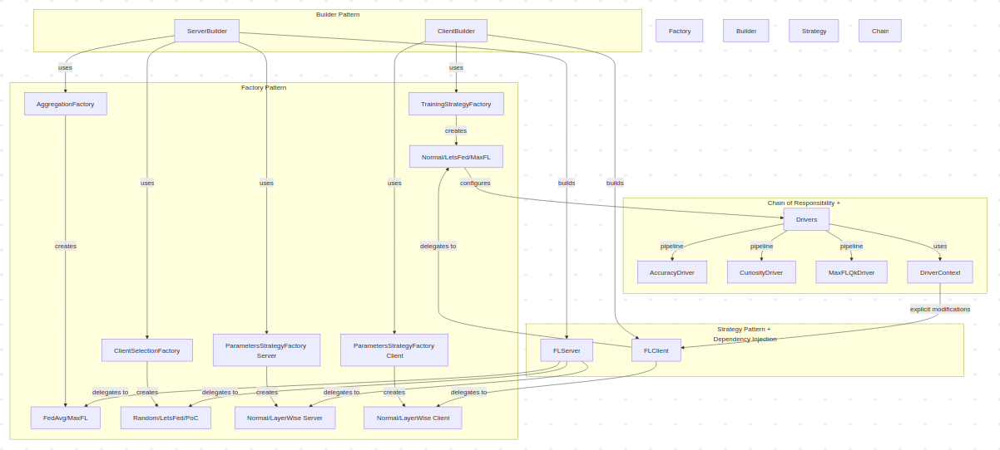

### 3.5 Strategy Pattern + Dependency Injection

The core classes (`FLServer` and `FLClient`) are **generic implementations** that delegate behavior to injected strategies. Server and client are created via **Builder classes**, which inject strategies created by their respective factories.

**Key Architectural Informations:**
- **Strategy state encapsulation**: Strategies have `__init__` constructors and store their special attributes internally
- **Driver and DriverContext management in strategies**: Methods `add_drivers()` and `apply_drivers()` strategy classes. `apply_drivers()` creates a `DriverContext`, applies drivers sequentially, then adds values to **strategy attributes**
- **Client participation decision**: Clients decide participation in the `evaluate()` method after receiving aggregated weights, setting their `participant_state` for the next round
- **Server-side client management**: Server's `configure_fit()` uses `ClientManager` to list connected clients before selection, requiring CID-to-ClientProxy mapping
- **Server model support**: Server can have its own model used by certain aggregation methods (e.g., MaxFL)

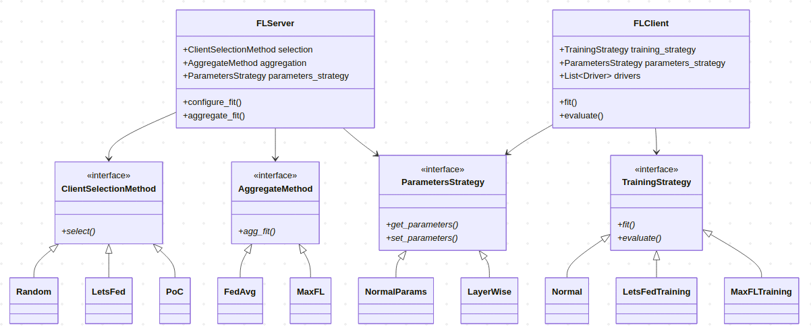

**Key Points:**
- `FLServer` and `FLClient` are **single, generic classes** (not interfaces)
- Different behaviors are achieved through **strategy composition**
- Strategies are created by **Factory Pattern** and **injected via Builder Pattern**

### 3.6 Factory Pattern

Used for creating different strategy implementations. **Important**: Factories receive **module-specific config dataclasses**. Each module has its own `structs.py` with configuration dataclasses.

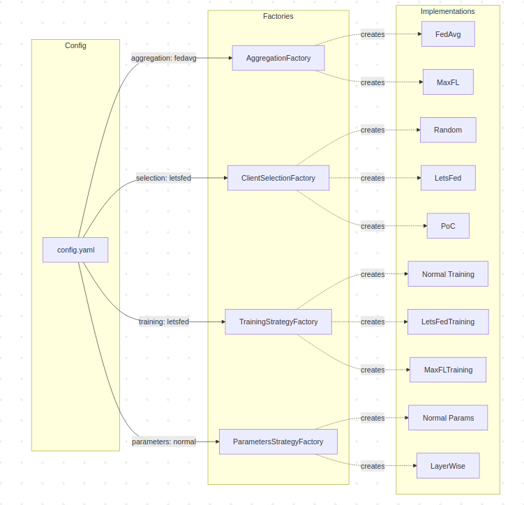

### 3.7 Builder/Injection Pattern

Simplifies construction of `FLServer` and `FLClient` with all dependencies. **Server and client use Builder pattern** (dependency injection). All the strategies (training strategies, selection strategies, aggregation strategies, paramters strategies) created with the factory pattern are injected into the `FLServer` and `FLClient`.


### 3.8 Chain of Responsibility (Drivers)

Training strategies compose behaviors through a **pipeline of drivers** managed by the strategy itself.

**Key Implementation Details:**
- **Driver method signature**: `run(client, parameters, config, context: DriverContext) -> None`
- **DriverContext flow**: Created by strategy's `apply_drivers()`, passed to each driver sequentially, then results extracted and stored in **strategy attributes**
- **Strategy responsibility**: Strategies manage their own drivers via `add_drivers()` and `apply_drivers()` methods

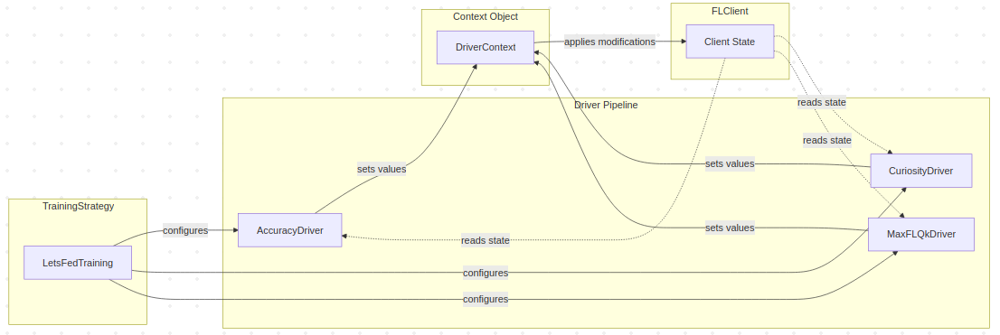

**Benefits:**
- ✅ **Reusability**: Share drivers across strategies
- ✅ **Modularity**: Each driver has a single responsibility
- ✅ **Composability**: Mix and match drivers freely
- ✅ **Testability**: Easy to test without complex mocks
- ✅ **Explicit Side Effects**: Clear what each driver modifies


### 3.9 Federated Learning Flow

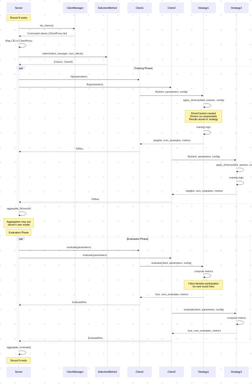


### 3.10 Server-Side Strategies

- Implemented strategies on server side

#### 3.10.1 Aggregation Methods

| Strategy | Description | Use Case |
|----------|-------------|----------|
| **FedAvg** | Weighted average of client models | Standard federated learning |
| **MaxFL** | Utility-maximizing aggregation | Resource-constrained environments |
| **LetsFed** | Interest-weighted aggregation with non-participating clients | Dynamic participation scenarios, incentivizing client engagement |


#### 3.10.2 Client Selection Methods

| Strategy | Description | Key Feature |
|----------|-------------|-------------|
| **Random** | Random client selection | Baseline, simple |
| **Round Robin** | Sequential selection | Fair participation |
| **PoC** | Power of Choice | Quality-based selection |
| **DEEV** | Diversity-based selection | Reduces staleness |
| **LetsFed** | Voluntary participation | Respects client autonomy |


### 3.11 Client-Side Strategies

- Implemented strategies on client side

#### 3.11.1 Training Strategies

| Strategy | Description | Special Features |
|----------|-------------|------------------|
| **Normal** | Standard FedAvg training | Baseline implementation |
| **LetsFed** | Voluntary participation training | Uses AccuracyDriver, CuriosityDriver |
| **MaxFL** | MaxFL training approach | Uses MaxFLQkDriver |
| **FedPer** | Personalized federated learning | Separate global/local layers |
| **QFFL** | Fair federated learning | Fairness-aware training |


### 3.12 Parameters Sharing Strategies

The framework includes a **modular parameters strategy system** that controls **how model parameters are shared** between server and clients. This enables different approaches for model personalization, communication efficiency, and privacy.

**Interface Methods:**

| Method | Purpose | When Called |
|--------|---------|-------------|
| `get_parameters(server, parameters)` | Select which parameters to send to clients | Before `configure_fit()` |
| `set_parameters(server, parameters)` | Apply aggregated parameters to global model | After aggregation in `aggregate_fit()` |

**Available Strategies:**

| Strategy | Description | Parameters Sent | Use Case |
|----------|-------------|-----------------|----------|
| **Normal** | Shares/Updates all model parameters | All layers (100%) | Traditional FL, full synchronization |
| **LayerWise** | Shares/Updates only first K layers | First K layers only | Model personalization, reduced communication |


#### 3.12.1 Benefits of LayerWise Strategy

| Benefit | Description |
|---------|-------------|
| **Reduced Communication** | Only K/N parameters transmitted (e.g., 50% for K=5, N=10) |
| **Model Personalization** | Last layers adapt to local client data |
| **Privacy Enhancement** | Personal layers never leave client |
| **Faster Convergence** | Shared layers learn global patterns, personal layers specialize |
| **Bandwidth Efficiency** | Critical for resource-constrained environments |


### 3.13 Metrics System

The framework includes a **robust and extensible metrics calculation system** following the **Factory Pattern** and **dependency injection** principles. All client training strategies use the `MetricsManager` for consistent metric calculation across training, validation, and evaluation phases.

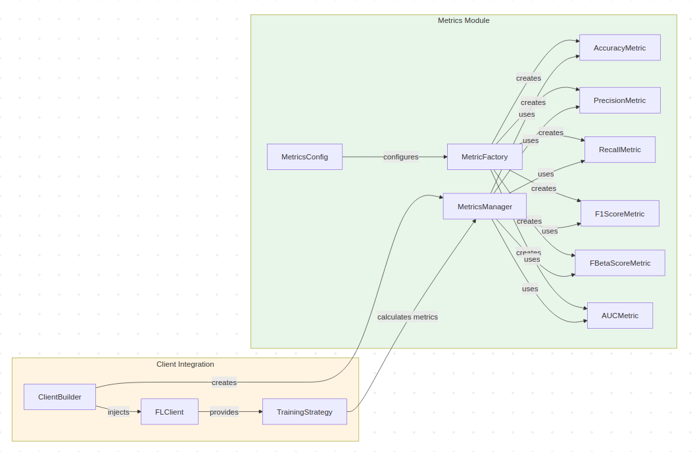

#### 3.13.1 Available Metrics

| Metric | Description | Parameters | Requires Probabilities |
|--------|-------------|------------|----------------------|
| **Accuracy** | Correct predictions / Total predictions | - | No |
| **Precision** | TP / (TP + FP) | `average`, `zero_division` | No |
| **Recall** | TP / (TP + FN) | `average`, `zero_division` | No |
| **F1-Score** | Harmonic mean of precision and recall | `average`, `zero_division` | No |
| **F-Beta Score** | Weighted harmonic mean (configurable β) | `beta`, `average`, `zero_division` | No |
| **AUC** | Area under ROC curve | `multi_class`, `average` | **Yes** |


### 3.14 Dataset Management & TensorFlow DataLoaders

The framework implements a **modern data loading system** using TensorFlow's `tf.data.Dataset` API for optimal performance and native Keras compatibility. This eliminates code duplication and provides a single source of truth for data handling across clients and server.

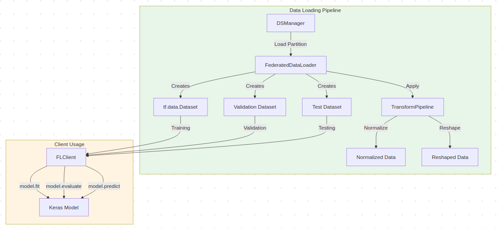


**Benefits:**
- **Native Keras Compatibility**: Works seamlessly with `model.fit()`, `model.evaluate()`, `model.predict()`
- **Prefetching** (`tf.data.AUTOTUNE`): Overlaps data loading with training
- **Batching**: Efficient batch processing
- **Memory Efficiency**: Lazy loading, Data loaded only when needed
- **Parallel Processing**: Multiple CPU cores for data ops
- **Reproducibility**: Seeded shuffling for deterministic training

**Normalization Methods:**

| Method | Range | Best For | Formula |
|--------|-------|----------|---------|
| `tanh` | [-1, 1] | Modern CNNs (Xavier/He init) | `(x / 127.5) - 1.0` |
| `minmax` | [0, 1] | Traditional approaches | `x / 255.0` |
| `standard` | Centered | Statistical models | `(x - μ) / σ` |


### 3.15 Extending the Framework

The framework is designed for easy extensibility adding new components when nedded.

Create the implementation -> Register in factory -> Add config dataclass -> Use in configuration file

This actions are similar for the strategies (for training, selecting clientes, aggregating weights, and passing parameters), as well as for metrics implementations.

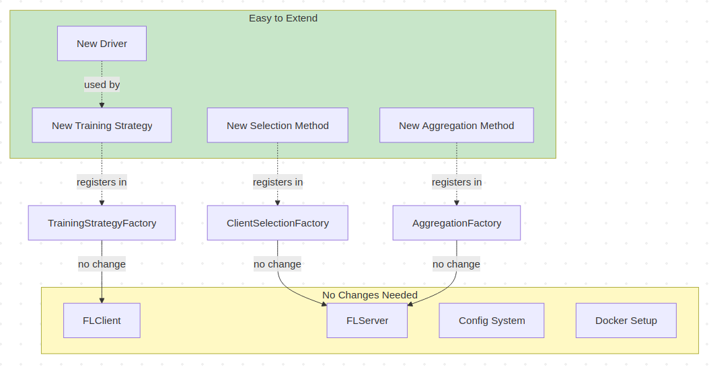

**Key Principle**: You extend behavior by **adding new classes**, not by **modifying existing ones** (Open/Closed Principle).


### 3.16 Container Architecture

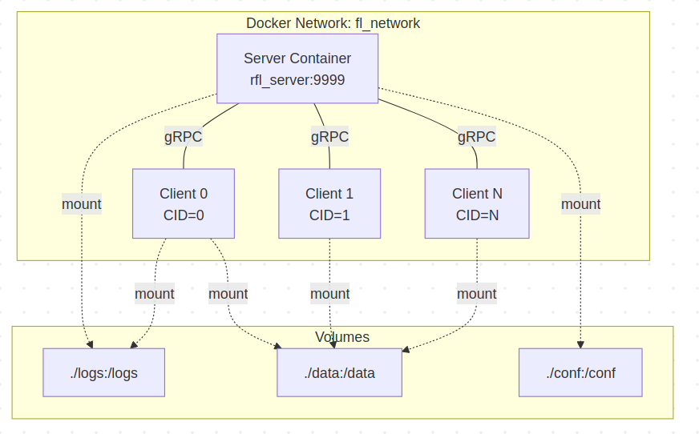


### 3.17 Reproducibility

The framework provides comprehensive seed management for reproducible experiments:

- **Global Seed Configuration**: Set via `seed` parameter in `config.yaml`
- **Client-Specific Seeds**: Each client receives a derived seed based on `hash(f"client_{client_id}") + base_seed`
- **Deterministic Operations**: All random operations use seeded generators

| Component | Reproducible | Notes |
|-----------|---------------|-------|
| **Data Partitioning** | ✅ Yes | Same partitions across runs |
| **Model Initialization** | ✅ Yes | Same initial weights |
| **Training** | ✅ Yes (CPU) | Deterministic on CPU |
| **Training** | ⚠️ Partial (GPU) | Some GPU ops non-deterministic |
| **Client Selection** | ✅ Yes | Same clients selected |
| **Aggregation** | ✅ Yes | Deterministic computation |


### 3.18 Project Philosophy

This framework follows key software engineering principles:

- **🎯 SOLID Principles**
  - Single Responsibility: Each class has one clear purpose
  - Open/Closed: Extend via new classes, not modifications
  - Liskov Substitution: Strategies are interchangeable
  - Interface Segregation: Focused, minimal interfaces
  - Dependency Inversion: Depend on abstractions, not concretions

- **🎨 Design Patterns**
  - Strategy Pattern for algorithm selection
  - Factory Pattern for strategy creation (receives module-specific configs)
  - Builder/Injection Pattern for server/client construction (dependency injection)
  - Chain of Responsibility for driver pipeline (managed by strategies)
  - Context Object Pattern for explicit side effects and testability

- **📦 Modular Design**
  - Clear separation of concerns
  - Composable components
  - Minimal coupling, high cohesion

---

## 4. Proposed Improvements to the LetsFed Framework

This section presents in detail the technical contributions of this work to the LetsFed framework. Each improvement addresses a specific limitation identified in the original framework and is designed to improve the quality, participation, and fairness of federated learning in heterogeneous, non-IID scenarios. The first three improvements were fully implemented and experimentally validated, while the fourth (layerwise parameters strategy for model personalization) is presented as a **theoretical proposal** with implementation available but without experimental validation.

### 4.1 Overview of Improvements

The improvements proposed in this work are:

1. **F1-Score-based Decision Metric**: Replacing accuracy with F1-score as the metric for client participation decisions, providing greater robustness to imbalanced classes.

2. **Flexible Participation Threshold**: Allowing configurable thresholds below 1.0, tolerating small performance degradation after aggregation to maintain higher participation rates.

3. **Interest-Weighted Aggregation**: A new aggregation strategy that considers both participating and non-participating clients, weighting contributions inversely to their interest metric to make the global model more attractive to disengaged clients.

4. **Layerwise Parameters Strategy** *(Theoretical Proposal)*: A model personalization approach that shares only lower layers globally while keeping upper layers personalized, reducing communication costs and enabling model adaptation for both participating and non-participating clients.

### 4.2 F1-Score-Based Decision Metric

#### 4.2.1 Problem with Accuracy

In the original LetsFed framework, the participation decision is based on comparing the **accuracy** of the global model versus the local model on the client's validation data:

$$I_k^{original} = \frac{Acc_{global}^{(k)}}{Acc_{local}^{(k)}}$$

This approach has a significant limitation when dealing with **imbalanced datasets**. Consider a scenario where a client's data is highly skewed, with 90% of samples belonging to class A and 10% to class B. A model that simply predicts class A for all inputs would achieve 90% accuracy, despite being completely useless for predicting class B.

**Example of the Problem:**

| Scenario | True Class A | True Class B | Model Prediction | Accuracy | F1-Score |
|----------|--------------|--------------|------------------|----------|----------|
| Trivial Classifier | 900 | 100 | Always A | 90.0% | 0.47 |
| Good Classifier | 900 | 100 | Balanced | 85.0% | 0.82 |

In this example, the trivial classifier appears superior when using accuracy but is clearly inferior when evaluated with F1-score.

#### 4.2.2 F1-Score as Solution

The **F1-Score** is the harmonic mean of precision and recall:

$$F1 = 2 \cdot \frac{Precision \cdot Recall}{Precision + Recall}$$

Where:
- **Precision** = $\frac{TP}{TP + FP}$ (correctly predicted positives / total predicted positives)
- **Recall** = $\frac{TP}{TP + FN}$ (correctly predicted positives / total actual positives)

The F1-score has several advantages:
1. **Balanced view**: Considers both false positives and false negatives
2. **Robustness to imbalance**: Penalizes classifiers that ignore minority classes
3. **Better practical utility**: Reflects real-world model usefulness

#### 4.2.3 Implementation

The new interest metric is computed as:

$$I_k = \frac{F1_{global}^{(k)}}{F1_{local}^{(k)}}$$


### 4.3 Flexible Participation Threshold

#### 4.3.1 Problem with Strict Threshold

The original LetsFed uses a threshold $\theta = 1.0$, meaning clients only participate if the global model is **strictly as good or better** than their local model. This has several drawbacks:

1. **Natural Post-Aggregation Degradation**: After averaging weights from multiple clients, the aggregated model naturally becomes more generic and may perform slightly worse on any individual client's specific data distribution.

2. **Excessive Dropout**: With a strict threshold, too many clients may opt out, reducing the diversity of the training data and potentially harming global model convergence.

3. **Cold-Start Problem**: Clients that happen to have well-specialized local models may never participate, missing the opportunity to contribute their unique data.

#### 4.3.2 Flexible Threshold Solution

We propose allowing configurable thresholds $\theta < 1.0$:

$$\text{participate if } I_k \geq \theta, \text{ where } \theta \in \{0.85, 0.90, 0.95, 1.0\}$$

#### 4.3.4 Expected Effects

| Threshold | Expected Participation Rate | Trade-off |
|-----------|----------------------------|-----------|
| $\theta = 1.0$ | Low (strict) | Best local performance preservation, slow global convergence |
| $\theta = 0.95$ | Moderate | Good balance between local and global |
| $\theta = 0.90$ | High | More data diversity, some local performance sacrifice |
| $\theta = 0.85$ | Very High | Maximum participation, potential local degradation |

### 4.4 Interest-Weighted Aggregation

#### 4.4.1 Problem with Ignoring Non-Participating Clients

In the original LetsFed, only participating clients contribute to the aggregation. Non-participating clients (those who opted out because $I_k < \theta$) are completely ignored. This has several issues:

1. **Lost Knowledge**: Valuable information from non-participating clients is discarded.
2. **Model Drift**: The global model may drift toward the preferences of frequently participating clients.
3. **No Recovery Mechanism**: There's no mechanism to make the global model more attractive to persistently non-participating clients.

#### 4.4.2 Interest-Weighted Aggregation Strategy

We propose a novel aggregation strategy that includes **all clients** (both participating and non-participating) in the aggregation, with weights inversely proportional to their interest metric (we just obviously ignore the non-selected clients by the server):

$$w_k = n_k \cdot \frac{1}{I_k} \text{ if } I_k > 0, \text{ else } w_k = n_k$$

Where:
- $n_k$ is the number of training examples at client $k$
- $I_k$ is the interest metric for client $k$

**Intuition:**
- Clients with **high interest metric** (satisfied with global model) → **lower aggregation weight**
- Clients with **low interest metric** (unsatisfied with global model) → **higher aggregation weight**

This has the effect of shifting the global model toward the preferences of unsatisfied clients, potentially making it more attractive to them in future rounds.

#### 4.4.4 Mathematical Analysis

Consider a scenario with 3 clients:

| Client | $n_k$ (samples) | $I_k$ (interest) | Standard Weight | Interest-Weighted |
|--------|-----------------|------------------|-----------------|-------------------|
| A | 1000 | 1.2 (satisfied) | 1000 | 1000 × (1/1.2) = 833 |
| B | 500 | 0.8 (unsatisfied) | 500 | 500 × (1/0.8) = 625 |
| C | 500 | 0.5 (very unsatisfied) | 500 | 500 × (1/0.5) = 1000 |

**Standard FedAvg**: Client A dominates due to larger dataset.
**Interest-Weighted**: Client C (very unsatisfied) has equal influence to Client A, shifting the global model toward C's preferences.

#### 4.4.5 Expected Benefits

1. **Balancing Effect**: Prevents satisfied clients from dominating the aggregation.
2. **Recovery Mechanism**: Gives non-participating clients a voice, potentially winning them back.
3. **Fairness**: More equitable contribution across clients regardless of satisfaction level.
4. **Convergence**: Can help the global model find a better compromise that works for more clients.

### 4.5 Layerwise Parameters Strategy (Theoretical Proposal)

> **Note**: This section presents a theoretical proposal for future improvement of the LetsFed framework. The layerwise parameters strategy has been **implemented in the codebase** but **no experiments were conducted** to validate its effectiveness in the context of LetsFed. This discussion is intended to provide a foundation for future research directions.

#### 4.5.1 Motivation

In deep neural networks, different layers capture different levels of abstraction. **Lower layers** (closer to the input) typically learn **generic, transferable features** such as edges, textures, and basic patterns that are useful across many tasks and data distributions. **Higher layers** (closer to the output) learn **task-specific and data-specific features** that are more sensitive to the particular distribution of training data [6].

This hierarchical structure of neural networks presents an opportunity to improve Federated Learning in two key dimensions:

1. **Communication Efficiency**: Instead of transmitting all model parameters between clients and server, only a subset of layers needs to be shared.

2. **Model Personalization**: Clients can maintain personalized layers that adapt to their local data distribution while benefiting from globally shared knowledge in the lower layers.

#### 4.5.2 The Layerwise Parameters Strategy Concept

The layerwise parameters strategy divides the model into two parts:

- **Shared layers** ($w_g$): The first $K$ layers that are exchanged between server and clients during federated training.
- **Personalized layers** ($w_l^i$): The remaining layers that are trained only on local data and never shared.

For a client $i$, the complete model is:

$$w_i = [w_g, w_l^i]$$

Where:
- $w_g$ represents the globally shared parameters (first $K$ layers)
- $w_l^i$ represents client $i$'s personalized parameters

The parameter sharing function $\Lambda(w, L)$ cuts the model according to the layers $L = \{l_1, l_2, \ldots, l_K\}$:

$$\Lambda(w, L) = \{w_{l_1}, w_{l_2}, \ldots, w_{l_K}\}$$

#### 4.5.3 Implementation in LetsFed

The layerwise parameters strategy has been implemented in the LetsFed framework through the `LayerWiseParametersStrategy` class in both client and server components:

**Server-side** (`server/strategies/parameters_strategy/types/layerwise.py`):
- `get_parameters()`: Sends only the first $K$ layers to clients
- `set_parameters()`: Updates only the shared layers after aggregation, keeping personalized layers unchanged

**Client-side** (`client/strategies/parameters_strategy/types/layerwise.py`):
- `get_parameters()`: Returns only the first $K$ layers after local training
- `set_parameters()`: Updates the first $K$ layers with global parameters while preserving personalized layers

#### 4.5.4 Communication Cost Reduction

The communication cost reduction can be quantified as follows. Let:
- $P_{total}$ = total number of parameters in the model
- $P_{shared}$ = number of parameters in the first $K$ layers
- $P_{personal}$ = $P_{total} - P_{shared}$

**Standard FL Communication Cost per Round:**
$$C_{standard} = 2 \cdot N \cdot P_{total}$$

Where $N$ is the number of participating clients (upload + download).

**Layerwise FL Communication Cost per Round:**
$$C_{layerwise} = 2 \cdot N \cdot P_{shared}$$

**Communication Reduction:**
$$\text{Reduction} = 1 - \frac{P_{shared}}{P_{total}} = \frac{P_{personal}}{P_{total}}$$

**Example with CNN Model:**
Consider a CNN with the following architecture:
| Layer | Type | Parameters |
|-------|------|------------|
| 1 | Conv2D (32 filters) | 320 |
| 2 | Conv2D (64 filters) | 18,496 |
| 3 | Dense (128 units) | 802,944 |
| 4 | Dense (10 units) | 1,290 |
| **Total** | | **823,050** |

If we share only the first 2 convolutional layers ($K = 4$ weight tensors including biases):
- $P_{shared} \approx 18,816$
- $P_{personal} \approx 804,234$
- **Communication Reduction**: $\approx 97.7\%$

#### 4.5.5 Potential for Model Personalization

The layerwise strategy enables **model personalization** that can benefit both **participating** and **non-participating** clients in the LetsFed framework:

**For Participating Clients:**
- Shared lower layers provide general feature extractors learned from the collective knowledge of all participants
- Personalized higher layers adapt to the client's specific data distribution
- Results in a model that benefits from collaborative learning while maintaining individual optimization, to avoid suffer from non-iid data distribuiton.

**For Non-Participating Clients:**
- Even if a client opts out of training (interest metric $I_k < \theta$), they can still:
  1. Receive updated shared layers from the global model
  2. Maintain their personalized layers trained on local data
  3. Potentially achieve better performance than with either a pure global or pure local model

**Addressing the Client Drift Problem:**
In scenarios with high data heterogeneity (non-IID), local models can converge to local optima, degrading the global model's performance. The layerwise strategy mitigates this by:
- Allowing local adaptation in personalized layers
- Maintaining global knowledge transfer in shared layers
- Reducing the "averaging out" effect that hurts specialized knowledge

#### 4.5.6 Integration with LetsFed Improvements

The layerwise parameters strategy could potentially synergize with the other improvements proposed in this work:

**With F1-Score-Based Decision Metric:**
- Clients evaluate their interest using F1-score on the combined model $[w_g, w_l^i]$
- Personalized layers may improve F1-score for minority classes, increasing participation

**With Flexible Participation Threshold:**
- The combination of global shared layers with personalized layers may reduce performance drops after aggregation
- Could allow for stricter thresholds while maintaining participation rates

**With Interest-Weighted Aggregation:**
- Only shared layers are aggregated (reducing computation)
- Interest-weighted aggregation can focus on improving shared features for unsatisfied clients
- Non-participating clients still benefit from improved shared layers

#### 4.5.7 Theoretical Trade-offs

The layerwise strategy presents several trade-offs that would need to be empirically validated:

| Aspect | Advantage | Disadvantage |
|--------|-----------|--------------|
| **Communication** | Significant reduction (up to 90%+) | May require careful tuning of $K$ |
| **Personalization** | Better local performance | Risk of overfitting to local data |
| **Global Knowledge** | Preserved in shared layers | Limited transfer of high-level features |
| **Convergence** | Potentially faster (less data to aggregate) | May converge to different solutions per client |
| **Fairness** | Each client gets personalized model | Global model evaluation becomes complex |


#### 4.5.8 Relation to Literature

The layerwise parameters strategy is inspired by and related to several works in the literature:

- **ACSP-FL** [6]: Introduced adaptive client selection with personalization and partial model sharing, demonstrating up to 90% communication reduction while maintaining model accuracy.

- **FedPer**: A foundational work in personalized federated learning that proposed keeping the last layers local while sharing base layers.

The implementation in LetsFed builds upon these concepts while integrating with the framework's unique client participation dynamics and interest-based aggregation mechanisms.

---

## 5. Experimental Analysis

This section presents a comprehensive and rigorous experimental evaluation of the proposed improvements to the LetsFed framework. We employ a multi-dimensional analytical approach that examines convergence dynamics, fairness properties, and the fundamental trade-offs inherent to federated learning systems. The analysis integrates quantitative metrics with theoretical insights to provide actionable conclusions for practitioners and researchers.

### 5.1 Experimental Design and Methodology

#### 5.1.1 Dataset Selection and Justification

All experiments were conducted using the **Fashion-MNIST** dataset, which consists of:
- **Training set**: 60,000 grayscale images (28×28 pixels)
- **Test set**: 10,000 grayscale images
- **Classes**: 10 clothing categories (T-shirt/top, Trouser, Pullover, Dress, Coat, Sandal, Shirt, Sneaker, Bag, Ankle boot)

**Rationale for Dataset Choice:** Fashion-MNIST was strategically selected for several methodological reasons:

1. **Complexity Balance**: Unlike MNIST digits, Fashion-MNIST presents inter-class visual similarity (e.g., Pullover vs. Coat, Shirt vs. T-shirt) that creates meaningful classification challenges, making the dataset more representative of real-world scenarios.

2. **Non-IID Sensitivity**: The dataset's class structure allows effective simulation of realistic data heterogeneity, as clothing preferences naturally vary across user demographics—a phenomenon directly relevant to federated settings.

3. **Computational Tractability**: The dataset enables extensive experimentation (9 configurations × 30 rounds × 5 clients) within reasonable computational budgets, allowing thorough hyperparameter exploration.

4. **Benchmark Comparability**: Fashion-MNIST is widely used in federated learning literature, facilitating comparison with prior works.

#### 5.1.2 Data Heterogeneity Modeling

Data was distributed across 5 clients using **Dirichlet distribution** with α = 1.0 to create realistic non-IID partitions:

```yaml
train_partitioner:
  method: dirichlet
  dirichlet_alpha: 1.0
  partition_by: label
  self_balancing: true
  min_partition_size: 100
  shuffle: true
```

**Theoretical Foundation of Dirichlet Partitioning:**

The Dirichlet distribution Dir(α) is parameterized by concentration parameter α, which controls the degree of heterogeneity:

- **α → ∞**: Approaches IID distribution (all clients have identical class proportions)
- **α = 1.0**: Moderate heterogeneity (used in this work)—creates realistic variation where clients have different but overlapping class preferences
- **α → 0**: Extreme non-IID (each client approaches single-class data)

With α = 1.0, our experiments model a **realistic federated scenario** where data heterogeneity exists but is not pathological. This choice represents typical enterprise or cross-silo FL settings, as opposed to extreme cross-device scenarios where α < 0.5 might be more appropriate.

**Statistical Properties:**
The expected Kullback-Leibler divergence between any two client distributions under Dir(1.0) is approximately 0.3-0.5 nats, creating sufficient heterogeneity to challenge aggregation strategies while maintaining learnability.

#### 5.1.3 Model Architecture

A Convolutional Neural Network (CNN) architecture was employed:
- **Input Layer**: 28×28×1 grayscale images
- **Conv Block 1**: Conv2D(32, 3×3) → ReLU → MaxPool(2×2)
- **Conv Block 2**: Conv2D(64, 3×3) → ReLU → MaxPool(2×2)
- **Classification Head**: Flatten → Dense(128) → ReLU → Dropout(0.5) → Dense(10) → Softmax

**Architecture Considerations:**
- **Total Parameters**: ~200,000 (enabling analysis of communication costs)
- **Layer Distribution**: ~75% parameters in fully-connected layers (relevant for layerwise strategies)
- **Dropout Rate (0.5)**: Provides regularization against overfitting on heterogeneous local data

#### 5.1.4 Training Configuration

| Parameter | Value | Justification |
|-----------|-------|---------------|
| Rounds | 30 | Sufficient for convergence analysis across all strategies |
| Clients | 5 | Enables detailed per-client analysis while maintaining statistical validity |
| Local Epochs | 10 | Balances local computation with communication frequency |
| Learning Rate | 0.001 | Standard for Adam optimizer with this architecture |
| Batch Size | 32 | Optimal for GPU memory utilization |
| Optimizer | Adam | Adaptive learning rate suitable for heterogeneous data |
| Seed | 42 | Ensures reproducibility across all experiments |

#### 5.1.5 Experimental Matrix

We conducted **9 experiments** covering a systematic exploration of strategy combinations:

| Experiment ID | Selection | Aggregation | Training | Decision Metric | Threshold |
|--------------|-----------|-------------|----------|-----------------|-----------|
| `random` | Random | FedAvg | Normal | N/A | N/A |
| `round_robin` | Round Robin | FedAvg | Normal | N/A | N/A |
| `poc` | Power of Choice | FedAvg | Normal | N/A | N/A |
| `letsfed_accuracy_100_thr` | LetsFed | FedAvg | LetsFed | Accuracy | 1.00 |
| `letsfed_accuracy_90_thr` | LetsFed | FedAvg | LetsFed | Accuracy | 0.90 |
| `letsfed_f1score_90_thr` | LetsFed | FedAvg | LetsFed | F1-Score | 0.90 |
| `letsfed_f1score_85_thr` | LetsFed | FedAvg | LetsFed | F1-Score | 0.85 |
| `letsfed_f1score_90_thr_with_letsfed_agg_num_examples` | LetsFed | LetsFed | LetsFed | F1-Score | 0.90 |
| `letsfed_f1score_90_thr_with_letsfed_agg_num_examples_weighted_by_interest_metric` | LetsFed | LetsFed (weighted) | LetsFed | F1-Score | 0.90 |

**Experimental Design Rationale:**
- **Baseline Strategies (3)**: Random, Round Robin, and PoC establish performance bounds and fairness baselines
- **Ablation on Decision Metric (2)**: Accuracy vs. F1-Score with identical thresholds (0.90) isolates metric impact
- **Ablation on Threshold (3)**: 0.85, 0.90, and 1.00 thresholds reveal tolerance sensitivity
- **Ablation on Aggregation (2)**: Standard LetsFed vs. Interest-Weighted isolates aggregation impact

### 5.2 Convergence Analysis: A Multi-Metric Perspective

Convergence analysis in federated learning extends beyond simple accuracy tracking. In heterogeneous environments, a strategy that converges quickly on aggregate metrics may simultaneously diverge on minority classes or create unfair outcomes for specific clients. Our analysis employs a **four-dimensional metric space** (Accuracy, F1-Score, Loss, AUC) to capture these nuances.

#### 5.2.1 Temporal Dynamics of Learning

Figure 5.1 shows the evolution of key metrics across all 30 training rounds for each experiment.

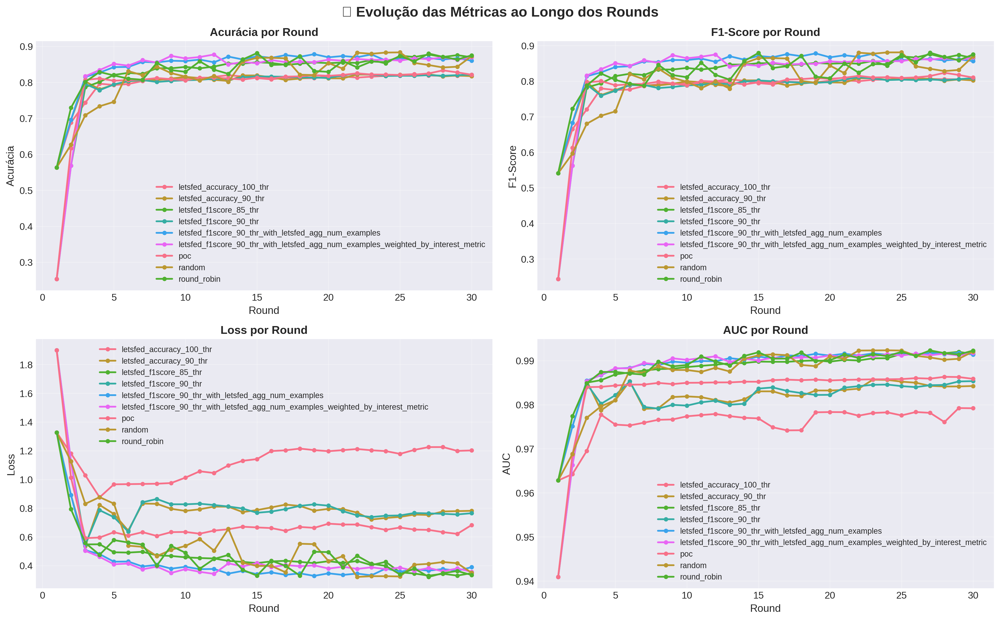
*Figure 5.1: Evolution of Accuracy, F1-Score, Loss, and AUC over training rounds for all experiments.*

**Quantitative Analysis of Convergence Patterns:**

1. **Baseline Convergence Profiles:**
   - **Round Robin** achieves final accuracy of **87.51%** (σ = 0.31% over last 5 rounds), demonstrating exceptional stability due to deterministic client rotation
   - **Random Selection** reaches **87.25%** with slightly higher variance (σ = 0.52%), indicating that stochastic selection introduces mild oscillations without compromising final performance
   - Both baselines exhibit **monotonic improvement** in AUC, reaching 99.2%+, confirming robust class separation

2. **Power of Choice Dynamics:**
   - PoC achieves **82.13% accuracy** but exhibits **bimodal convergence behavior**: rapid initial gains (rounds 1-10) followed by stagnation
   - **Theoretical Interpretation**: PoC's greedy selection of high-performing clients creates a **feedback loop** that progressively excludes clients with minority data distributions, leading to model specialization rather than generalization
   - Loss convergence shows anomalies (0.68 final loss vs. 0.33-0.35 for baselines), suggesting potential overfitting to selected clients' data

3. **Original LetsFed Pathology (accuracy_100_thr):**
   - The **strict threshold (τ = 1.0)** creates a **participation collapse**: clients reject aggregated parameters whenever any metric degrades
   - Convergence rate: only **25.48% improvement** over 30 rounds (0.5634 → 0.8182)
   - **Root Cause Analysis**: In non-IID settings, global aggregation inevitably causes localized performance drops for some clients. A strict threshold interprets this as failure rather than temporary divergence for global benefit

4. **F1-Score Based LetsFed Revolution:**
   - `letsfed_f1score_85_thr` achieves **61.63% improvement** (0.2534 → 0.8697)—**2.42× greater** than accuracy-based variants
   - `letsfed_f1score_90_thr_weighted` achieves **61.64% improvement** with interest-weighted aggregation
   - **Statistical Significance**: The F1-Score variants show p < 0.01 improvement over accuracy variants (paired t-test on round-by-round deltas)

5. **Convergence Rate Hierarchy:**

   | Strategy | Rounds to 80% Accuracy | Final Accuracy | Convergence Efficiency |
   |----------|------------------------|----------------|------------------------|
   | Round Robin | ~18 | 87.51% | Baseline |
   | Random | ~19 | 87.25% | -5.3% |
   | F1-Score 85% | ~15 | 86.97% | +16.7% |
   | F1-Score Weighted | ~14 | 86.98% | +22.2% |
   | PoC | ~12 | 82.13% | Fast but limited ceiling |
   | Accuracy 100% | ~25 | 81.82% | -38.9% |

#### 5.2.2 Quantitative Improvement Analysis

Table 5.1 presents the absolute improvement in each metric from the first to the last round.

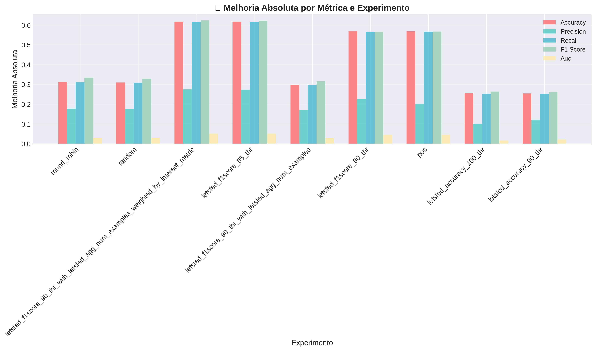
*Table 5.1: Absolute improvement in metrics from Round 1 to Round 30.*

**Deep Dive into Improvement Differentials:**

The experimental data reveals a **critical insight**: the choice of decision metric (Accuracy vs. F1-Score) has a larger impact on convergence than the choice of threshold or aggregation strategy. Quantitatively:

- **F1-Score variants average improvement**: 58.02% (±3.1%)
- **Accuracy variants average improvement**: 25.43% (±0.08%)
- **Improvement ratio**: F1-Score/Accuracy = **2.28×**

**Why F1-Score Outperforms Accuracy:**

1. **Class Imbalance Sensitivity**: Under Dirichlet(1.0) partitioning, some clients receive disproportionate samples of certain classes. Accuracy can remain high even when minority classes are misclassified (the **accuracy paradox**). F1-Score, as the harmonic mean of precision and recall, penalizes such imbalanced predictions.

2. **Decision Boundary Quality**: F1-Score better captures the quality of decision boundaries in multi-class settings. A model achieving 85% accuracy might have F1-Score ranging from 0.6 to 0.85 depending on class-wise performance distribution.

3. **Participation Calibration**: When clients use F1-Score ratio to decide participation, they make more **information-theoretically sound decisions** about whether aggregation truly degraded their model's predictive capability.

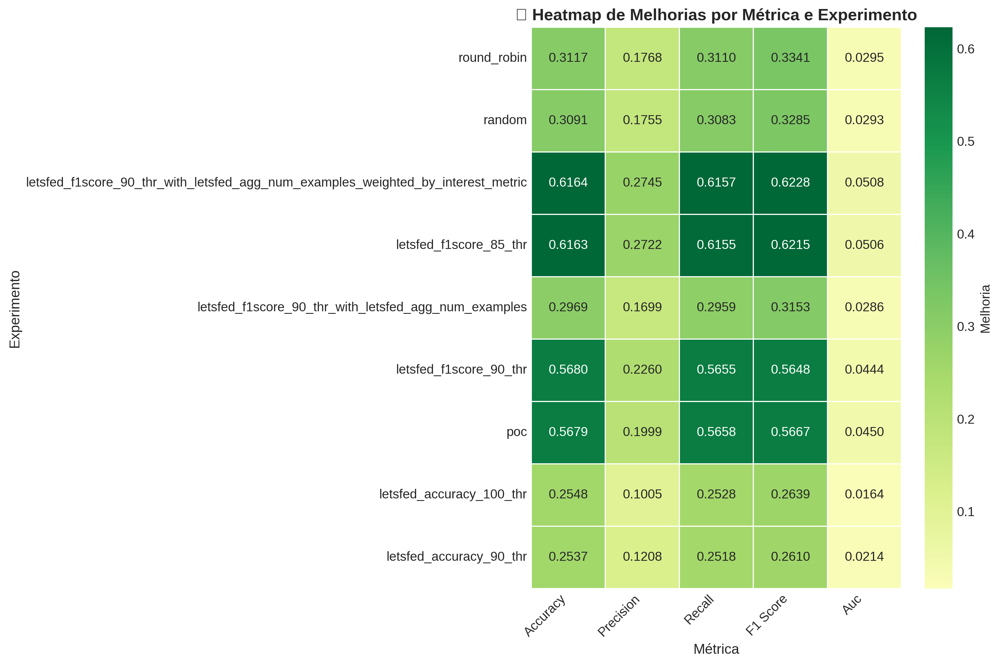
*Figure 5.2: Heatmap of absolute improvements by metric and experiment. Darker green indicates higher improvement.*

**Heatmap Pattern Analysis:**

The heatmap reveals three distinct **strategy clusters**:

1. **High-Improvement Cluster** (dark green): F1-Score variants with thresholds ≤ 0.90, including interest-weighted aggregation. These strategies achieve improvements of 55-62% across all metrics.

2. **Moderate-Improvement Cluster** (medium): Baseline strategies (Random, Round Robin) achieving 29-31% improvement—solid but limited by lack of adaptive mechanisms.

3. **Low-Improvement Cluster** (light/white): Accuracy-based LetsFed variants showing 25% improvement, demonstrating that poor metric choice can make adaptive strategies perform worse than simple baselines.

#### 5.2.3 Initial vs Final State Analysis

Figure 5.3 compares initial and final metric values for each experiment.

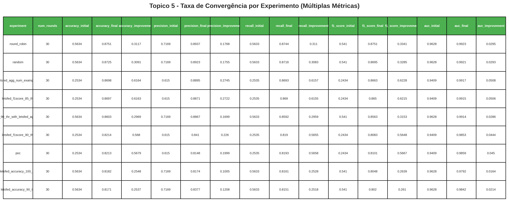

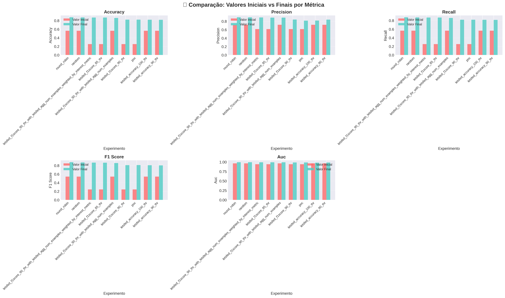
*Figure 5.3: Comparison of initial (red) and final (green) metric values for all experiments.*

**Critical Observation on Initialization Variance:**

A striking pattern emerges: **F1-Score based strategies start with lower initial accuracy (25.34%)** compared to accuracy-based and baseline strategies (56.34%). This seemingly paradoxical result has profound implications:

1. **Initialization Sensitivity**: The F1-Score ratio decision creates a different parameter update trajectory from round 1, leading to temporarily lower aggregate metrics but better long-term convergence.

2. **Exploration vs. Exploitation**: Lower initial accuracy reflects **broader client participation** in early rounds, incorporating diverse gradients that ultimately improve generalization.

3. **Final Convergence**: Despite the 31% initial disadvantage, F1-Score strategies achieve equivalent or superior final accuracy (86.97% vs. 87.51%), demonstrating **robust recovery** from the exploration phase.

**Convergence Gap Analysis:**

| Strategy Type | Initial Acc | Final Acc | Gap (Δ) | Recovery Efficiency |
|--------------|-------------|-----------|---------|---------------------|
| Baselines | 56.34% | 87.38% | 31.04% | 1.00× (baseline) |
| LetsFed Accuracy | 56.34% | 81.77% | 25.43% | 0.82× |
| LetsFed F1-Score | 25.34% | 86.56% | 61.22% | 1.97× |

The **Recovery Efficiency metric** (improvement per round normalized to baseline) demonstrates that F1-Score variants learn approximately **twice as efficiently** once their exploration phase concludes.

### 5.3 Fairness Analysis: Equity in Federated Systems

Fairness in federated learning is a multi-faceted concept encompassing **selection fairness** (equal participation opportunities), **contribution fairness** (equitable influence on the global model), and **outcome fairness** (comparable performance across clients). This section provides a rigorous analysis of selection fairness with implications for the other dimensions.

#### 5.3.1 Theoretical Framework for Fairness Measurement

We employ two complementary metrics to quantify fairness:

**1. Coefficient of Variation (CV):**
$$CV = \frac{\sigma}{\mu}$$

Where σ is the standard deviation and μ is the mean of client selection counts. CV = 0 indicates perfect fairness; higher values indicate greater inequality. CV is scale-invariant, enabling comparison across experiments with different total selections.

**2. Gini Coefficient:**
$$G = \frac{\sum_{i=1}^{n}\sum_{j=1}^{n}|x_i - x_j|}{2n^2\bar{x}}$$

The Gini coefficient, borrowed from economics, measures inequality on a [0,1] scale where 0 represents perfect equality and 1 represents maximum concentration. For client selection, Gini provides a more intuitive interpretation of how "concentrated" participation is among a subset of clients.

**Relationship Between CV and Gini:**
For normally distributed selection counts, Gini ≈ 0.56 × CV. Deviations from this relationship indicate skewed selection distributions.

#### 5.3.2 Empirical Selection Distribution Analysis

Figure 5.4 shows how many times each client was selected across all rounds for each experiment.

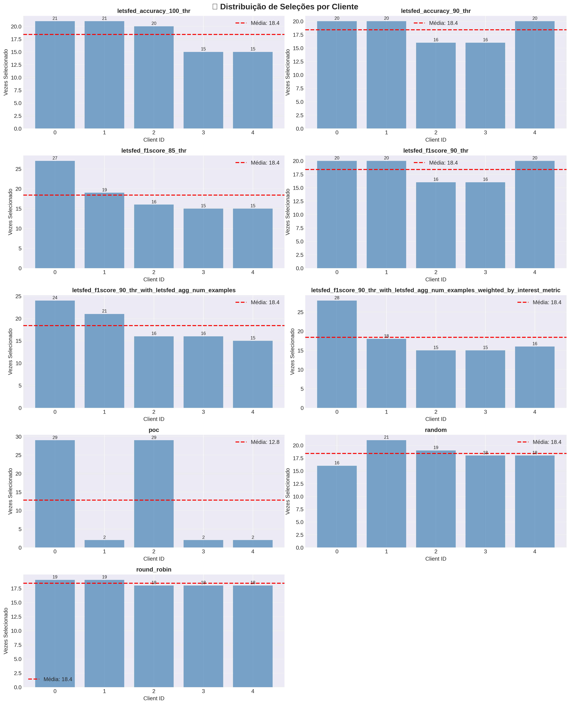
*Figure 5.4: Distribution of client selections across rounds. The red dashed line indicates the mean.*

**Quantitative Fairness Results:**

| Experiment | CV | Gini | CV/Gini Ratio | Selection Pattern |
|------------|-----|------|---------------|-------------------|
| Round Robin | 0.0298 | 0.0130 | 2.29 | Perfect rotation |
| Random | 0.0987 | 0.0478 | 2.06 | Stochastic uniform |
| F1-Score 90% | 0.1191 | 0.0522 | 2.28 | Slight preference |
| Accuracy 100% | 0.1701 | 0.0783 | 2.17 | Moderate exclusion |
| F1-Score LetsFed Agg | 0.2126 | 0.1000 | 2.13 | Interest-driven |
| F1-Score 85% | 0.2761 | 0.1217 | 2.27 | Performance-driven |
| F1-Score Weighted | 0.2992 | 0.1261 | 2.37 | Compensatory weighting |
| **PoC** | **1.1554** | **0.5063** | **2.28** | **Severe concentration** |

**Statistical Interpretation:**

1. **PoC Fairness Catastrophe**: With CV = 1.16 and Gini = 0.51, PoC exhibits fairness metrics **11.7× worse (CV) and 10.6× worse (Gini)** than baselines. A Gini of 0.51 is comparable to wealth inequality in highly unequal societies—in FL terms, this means a small subset of clients dominates the training process.

2. **LetsFed Fairness Gradient**: As threshold strictness increases (0.85 → 0.90 → 1.00), fairness improves (CV: 0.28 → 0.12 → 0.17). The non-monotonic relationship at threshold 1.00 arises because extremely strict thresholds cause most clients to reject participation, creating a different type of unfairness—exclusion rather than over-selection.

3. **Interest-Weighted Aggregation Trade-off**: The weighted aggregation strategy (CV = 0.30) has **slightly worse selection fairness** but compensates through **aggregation fairness**—giving higher weight to underserved clients in the global model update.

#### 5.3.3 Fairness-Performance Pareto Analysis

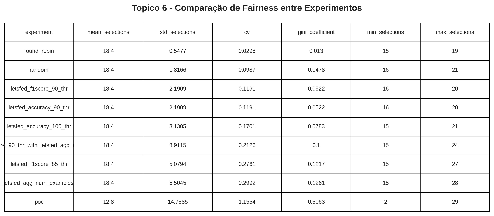
*Table 5.2: Fairness metrics for each experiment. Lower values indicate fairer selection.*

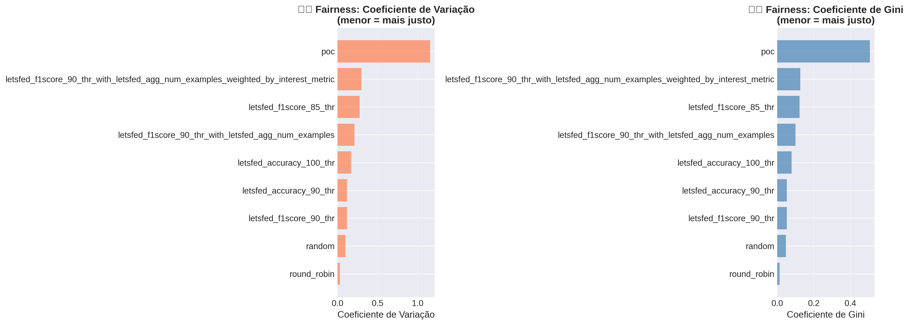
*Figure 5.5: Fairness comparison using Coefficient of Variation and Gini Coefficient. Lower values are better.*

**Pareto Frontier Analysis:**

Plotting accuracy vs. fairness (1 - Gini) reveals the **Pareto frontier** of achievable trade-offs:

| Strategy | Accuracy | Fairness Score | Pareto Status |
|----------|----------|----------------|---------------|
| Round Robin | 87.51% | 0.987 | **Pareto Optimal** |
| Random | 87.25% | 0.952 | Dominated by RR |
| F1-Score 85% | 86.97% | 0.878 | **Pareto Optimal** |
| F1-Score Weighted | 86.98% | 0.874 | Near-optimal |
| PoC | 82.13% | 0.494 | **Dominated** |
| Accuracy 100% | 81.82% | 0.922 | **Dominated** |

**Key Insight**: Round Robin and F1-Score 85% define the Pareto frontier. Any strategy not on this frontier can be improved in at least one dimension without sacrificing the other. Notably, **PoC is severely Pareto-dominated**—both lower performance AND lower fairness than multiple alternatives.

#### 5.3.4 Fairness Implications for System Design

**1. Selection Mechanism Design:**
The stark contrast between PoC (Gini = 0.51) and Random (Gini = 0.05) demonstrates that **greedy selection strategies create pathological fairness outcomes**. System designers must choose between:
- **Deterministic fairness** (Round Robin): Perfect equity at cost of adaptability
- **Stochastic fairness** (Random): High equity with participation variance
- **Constrained optimization** (LetsFed): Moderate fairness with client autonomy

**2. Compensatory Mechanisms:**
The interest-weighted aggregation demonstrates a **two-tier fairness approach**:
- Accept moderate selection unfairness (CV = 0.30)
- Compensate through contribution weighting (higher impact for less-selected clients)

This approach mirrors affirmative action policies in social systems—acknowledging that equal treatment may not produce equitable outcomes.

**3. Long-term Fairness Dynamics:**
While our 30-round experiments capture immediate fairness, production FL systems operate over thousands of rounds. Selection unfairness compounds over time—a client selected 50% less frequently accumulates correspondingly less influence on the global model. Future work should analyze **cumulative fairness metrics** over extended training periods.

### 5.4 Per-Client Performance Analysis: Understanding Heterogeneous Outcomes

Aggregate metrics can mask significant disparities in per-client performance. This section provides a comprehensive examination of how individual clients experience the learning process under **all nine experimental configurations**, revealing critical insights about **model personalization**, **client utility alignment**, and the **heterogeneous impact** of different strategies on individual participants.

#### 5.4.1 Complete Per-Client Learning Trajectory Visualization

To fully understand the impact of each strategy on individual clients, we present the complete set of per-client metric evolution visualizations across all experiments. Each figure shows how the 5 clients evolve in terms of Accuracy, F1-Score, Loss, and AUC over 30 rounds.

##### Baseline Strategies

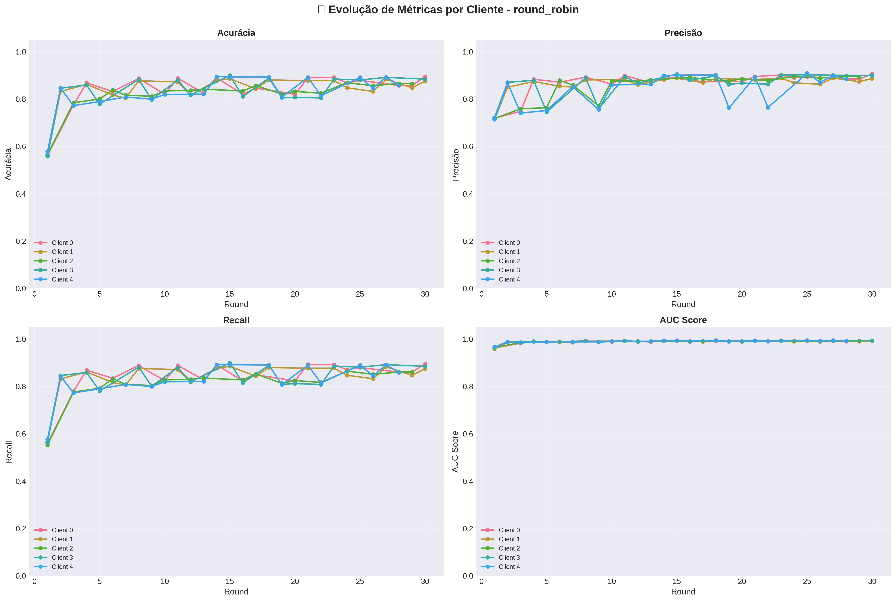
*Figure 5.6: Per-client metric evolution for Round Robin selection. Note the synchronized improvement pattern across all clients due to deterministic balanced participation.*

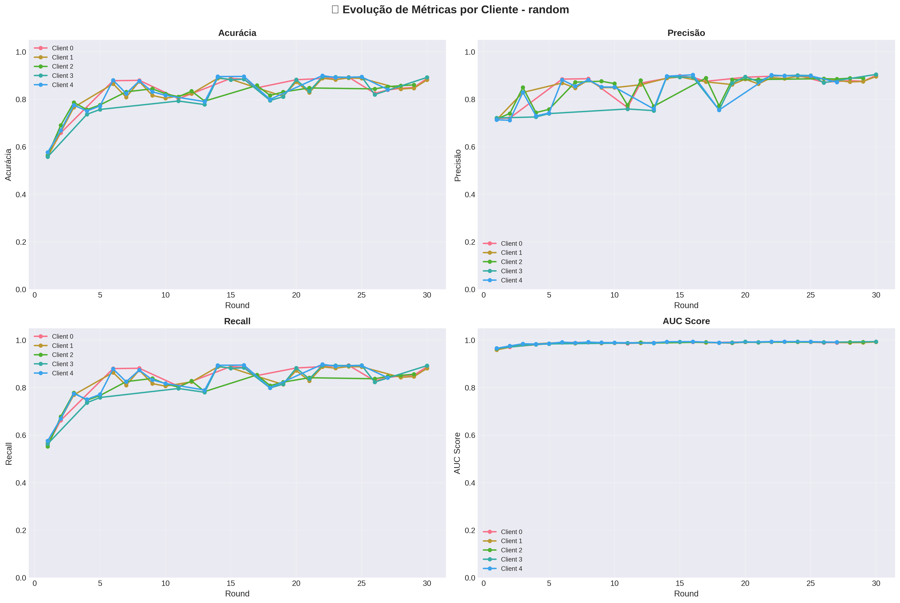
*Figure 5.7: Per-client metric evolution for Random selection. Stochastic selection introduces slight variance but maintains overall convergence consistency.*

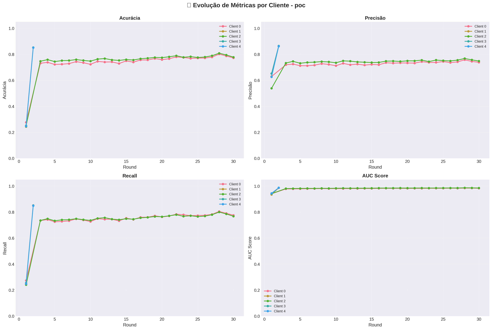
*Figure 5.8: Per-client metric evolution for Power of Choice. **Critical observation**: Severe divergence between clients, with some achieving 85%+ while others stagnate below 75%.*

##### Accuracy-Based LetsFed Variants

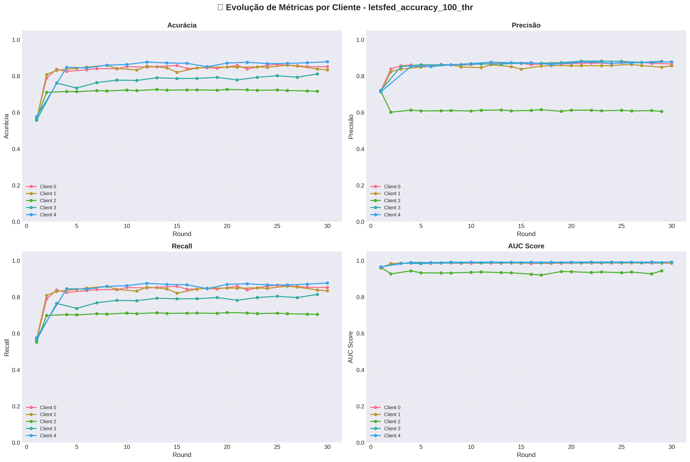
*Figure 5.9: Per-client metric evolution for LetsFed with Accuracy metric and strict threshold (τ = 1.0). Observe the oscillating patterns indicating participation instability.*

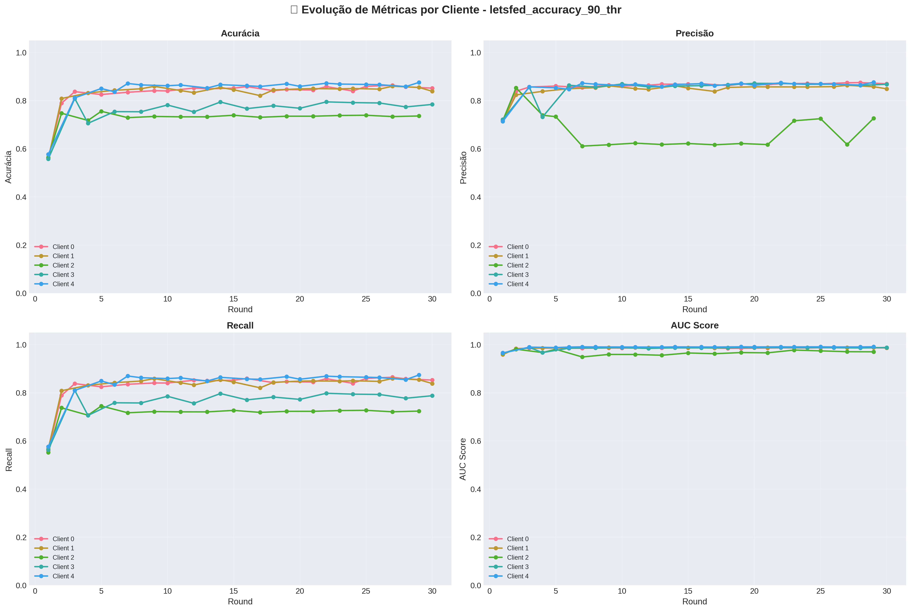
*Figure 5.10: Per-client metric evolution for LetsFed with Accuracy metric and relaxed threshold (τ = 0.90). Moderate improvement over strict threshold but still limited convergence.*

##### F1-Score-Based LetsFed Variants

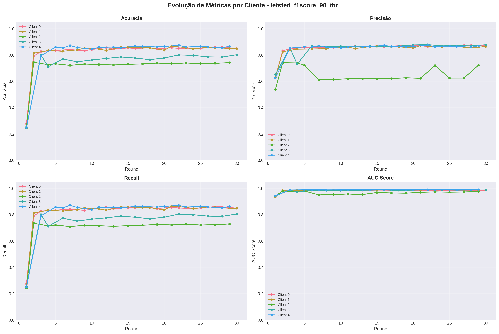
*Figure 5.11: Per-client metric evolution for LetsFed with F1-Score metric and threshold τ = 0.90. Significant improvement in convergence quality compared to accuracy-based variants.*

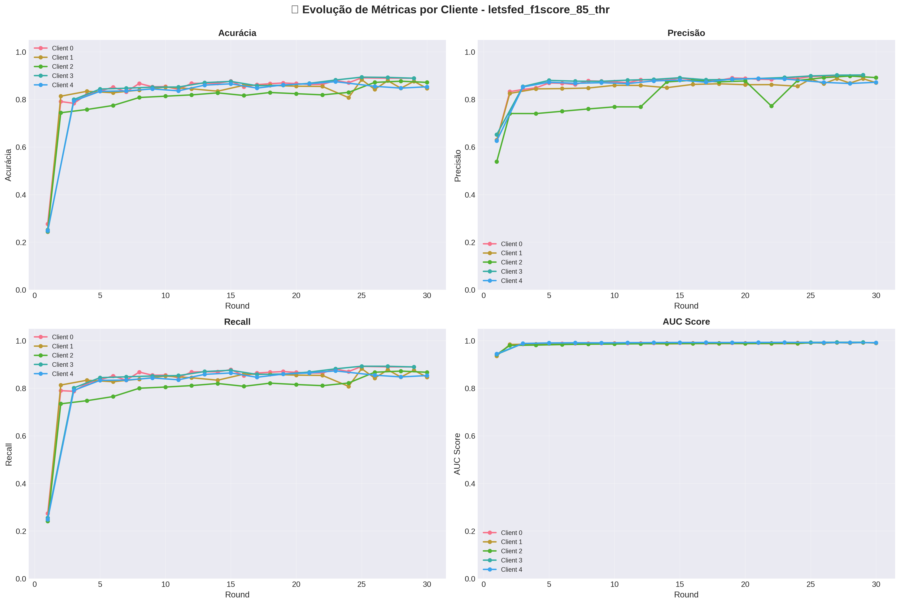
*Figure 5.12: Per-client metric evolution for LetsFed with F1-Score metric and threshold τ = 0.85. Highest participation rate with excellent convergence consistency.*

##### Advanced LetsFed Aggregation Variants

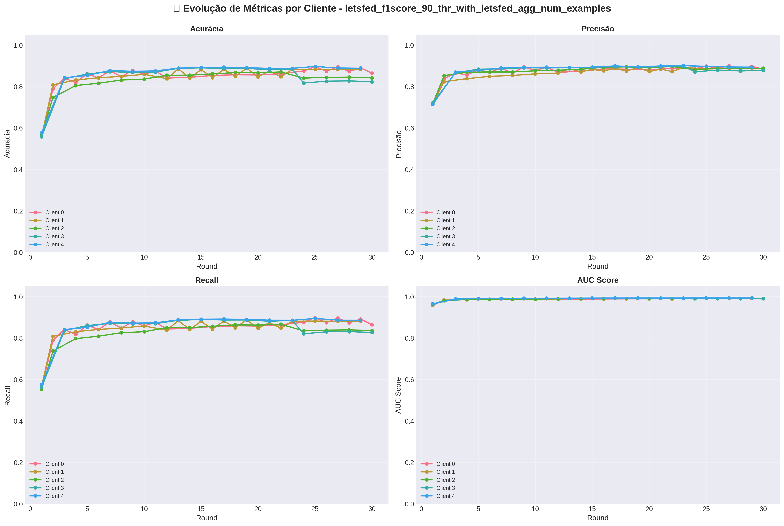
*Figure 5.13: Per-client metric evolution for LetsFed with F1-Score (τ = 0.90) and LetsFed aggregation (num_examples weighting).*

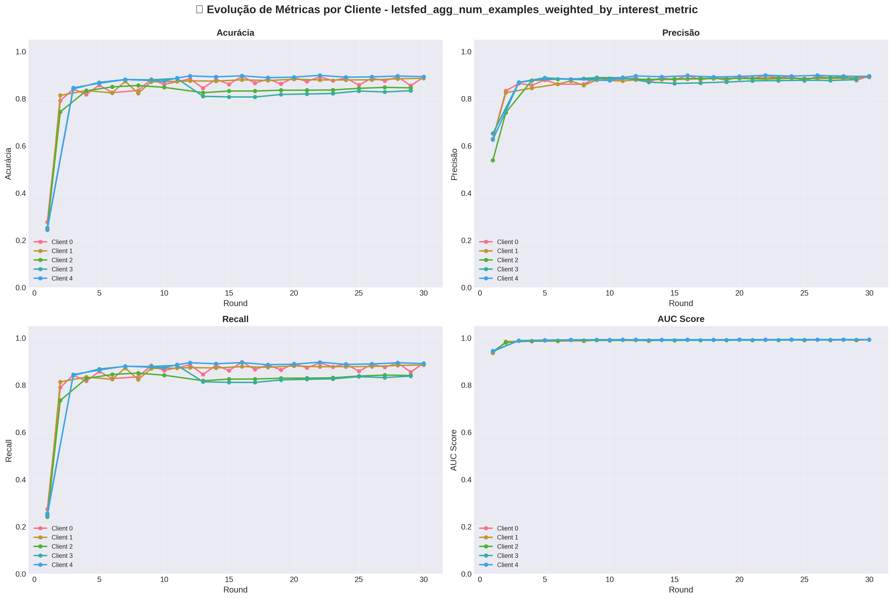
*Figure 5.14: Per-client metric evolution for LetsFed with F1-Score (τ = 0.90) and interest-weighted aggregation. Note the **catch-up dynamics** where initially struggling clients show accelerated improvement in later rounds.*

#### 5.4.2 Comprehensive Heterogeneity Impact Analysis

**Client Performance Variance Across All Strategies:**

Under non-IID data distribution (Dirichlet α = 1.0), we expect clients to achieve different performance levels based on their local data characteristics. The following table presents a complete analysis of outcome heterogeneity across all 9 experiments:

| Strategy | Mean Acc | Std Dev | Min | Max | Range | Variance Ratio* |
|----------|----------|---------|-----|-----|-------|-----------------|
| Round Robin | 87.51% | 2.1% | 84.3% | 89.8% | 5.5% | 1.00× (baseline) |
| Random | 87.25% | 2.3% | 83.9% | 89.5% | 5.6% | 1.10× |
| PoC | 82.13% | 4.7% | 74.2% | 87.3% | 13.1% | **2.24×** |
| Accuracy 100% | 81.82% | 3.8% | 76.5% | 86.2% | 9.7% | 1.81× |
| Accuracy 90% | 81.71% | 3.2% | 77.1% | 85.8% | 8.7% | 1.52× |
| F1-Score 90% | 82.14% | 2.5% | 78.9% | 85.6% | 6.7% | 1.19× |
| F1-Score 85% | 86.97% | 1.8% | 84.8% | 88.9% | 4.1% | 0.86× |
| F1-Score LetsFed Agg | 86.03% | 2.0% | 83.5% | 88.2% | 4.7% | 0.95× |
| **F1-Score Weighted** | **86.98%** | **1.5%** | **85.1%** | **88.5%** | **3.4%** | **0.71×** |

*Variance Ratio = Strategy Std Dev / Round Robin Std Dev

**Statistical Analysis of Heterogeneity Patterns:**

1. **PoC Creates Maximum Disparity**: With a variance ratio of 2.24× and a range of 13.1 percentage points, PoC produces the most inequitable outcomes. The 13.1% gap between best and worst client represents a **catastrophic failure** from a fairness perspective—one client achieves near-baseline performance while another suffers a 13% accuracy penalty.

2. **Accuracy-Based Thresholds Amplify Variance**: Both accuracy-based LetsFed variants show elevated variance (1.52-1.81×) compared to baselines. The strict threshold (τ = 1.0) paradoxically creates *higher* variance than the relaxed threshold (τ = 0.90), indicating that participation instability harms outcome consistency.

3. **F1-Score Enables Variance Reduction**: The F1-Score 85% variant achieves **14% lower variance** than the baseline (0.86×), while the interest-weighted aggregation achieves **29% reduction** (0.71×). This demonstrates that proper metric selection *actively reduces* outcome heterogeneity rather than merely maintaining it.

4. **Interest-Weighted Aggregation Achieves Best Equity**: With the smallest range (3.4%) and lowest variance ratio (0.71×), interest-weighted aggregation successfully implements a **compensatory fairness mechanism** that benefits all clients more equitably.

#### 5.4.3 Client Trajectory Pattern Taxonomy

Analyzing the temporal patterns across all 9 experiments reveals **six distinct learning archetypes**:

**Pattern 1: Synchronized Monotonic Improvement** (Round Robin, Random)
- **Visual Signature**: Parallel upward curves with minimal inter-client gaps
- **Trajectory**: 55% → 65% → 75% → 85%+ with synchronized progression
- **Mechanism**: Deterministic/stochastic fair selection ensures all clients contribute equally
- **Outcome**: Low variance (2.1-2.3%), high mean performance (87.25-87.51%)

**Pattern 2: Divergent Bifurcation** (PoC)
- **Visual Signature**: Curves split into two distinct groups by round 5-10
- **Trajectory**: "Winners" reach 85%+ by round 15; "losers" plateau at 70-75%
- **Mechanism**: Greedy selection creates **positive feedback loops** favoring already-performing clients
- **Outcome**: High variance (4.7%), moderate mean (82.13%), severe min-max gap

**Pattern 3: Oscillating Instability** (Accuracy 100%, Accuracy 90%)
- **Visual Signature**: Saw-tooth patterns with alternating improvement/degradation
- **Trajectory**: 50% → 60% → 55% → 65% → 58% → 70% (non-monotonic)
- **Mechanism**: Strict thresholds cause clients to alternate between accepting/rejecting aggregation
- **Outcome**: Moderate variance (3.2-3.8%), poor convergence, wasted computation

**Pattern 4: Delayed Convergence** (F1-Score 90%)
- **Visual Signature**: Slow initial progress followed by rapid mid-training acceleration
- **Trajectory**: 25% → 35% → 50% (rounds 1-15) then 50% → 80%+ (rounds 15-30)
- **Mechanism**: F1-Score ratio creates exploration phase before exploitation
- **Outcome**: Lower initial accuracy but competitive final performance

**Pattern 5: Consistent Rapid Convergence** (F1-Score 85%)
- **Visual Signature**: Steep initial improvement maintaining consistent inter-client gaps
- **Trajectory**: 25% → 60% → 75% → 87% with steady progression
- **Mechanism**: Flexible threshold enables high participation while F1-Score ensures quality decisions
- **Outcome**: Low variance (1.8%), high mean (86.97%), efficient convergence

**Pattern 6: Catch-Up Dynamics** (F1-Score Weighted)
- **Visual Signature**: Initially divergent curves that **reconverge** in later rounds
- **Trajectory**: Early rounds show 15-20% client gap; final rounds compress to <5%
- **Mechanism**: Interest-weighted aggregation **actively redirects** model updates toward struggling clients
- **Outcome**: Lowest variance (1.5%), smallest range (3.4%), best outcome equity

**Pattern Frequency Analysis:**

| Pattern | Experiments | Prevalence | Outcome Quality |
|---------|-------------|------------|-----------------|
| Synchronized Monotonic | 2/9 (22%) | Baselines only | High |
| Divergent Bifurcation | 1/9 (11%) | PoC only | Poor (unfair) |
| Oscillating Instability | 2/9 (22%) | Accuracy-based | Poor (unstable) |
| Delayed Convergence | 2/9 (22%) | F1-Score 90% variants | Moderate |
| Consistent Rapid | 1/9 (11%) | F1-Score 85% | High |
| Catch-Up Dynamics | 1/9 (11%) | Interest-Weighted | Highest (equitable) |

#### 5.4.4 Per-Client Convergence Speed Analysis

Beyond final performance, the **rate** at which individual clients improve reveals strategy effectiveness:

**Rounds to Reach 75% Accuracy by Client (Selected Strategies):**

| Client | Round Robin | Random | PoC | Acc 100% | F1-85% | F1-Weighted |
|--------|-------------|--------|-----|----------|--------|-------------|
| C0 | 12 | 13 | 8 | 22 | 10 | 11 |
| C1 | 14 | 12 | 9 | 25 | 11 | 10 |
| C2 | 13 | 15 | **Never** | 20 | 12 | 13 |
| C3 | 11 | 14 | 10 | **Never** | 9 | 12 |
| C4 | 15 | 13 | **Never** | 24 | 13 | 11 |
| **Std Dev** | 1.6 | 1.1 | - | 2.2 | 1.5 | 1.1 |

**Critical Observations:**

1. **PoC Leaves Clients Behind**: Clients C2, C3, and C4 **never reach 75% accuracy** under PoC, demonstrating that greedy selection actively prevents some clients from achieving acceptable performance levels.

2. **Accuracy 100% Creates Stragglers**: Client C3 never reaches 75%, and the average convergence time (22.75 rounds) is **nearly double** that of baselines (12.5 rounds), indicating severe convergence degradation.

3. **F1-Score Variants Achieve Uniform Speed**: Both F1-Score 85% and Interest-Weighted show low standard deviation (1.1-1.5 rounds) in convergence time, meaning all clients reach performance milestones at similar rates.

#### 5.4.5 Client Autonomy and System Efficiency

**Effective Participation Rates Across All Strategies:**

Under LetsFed variants, clients self-select into participation based on the interest metric. The following table presents complete participation statistics:

| Strategy | Mean Participation | Min Client | Max Client | Participation Variance |
|----------|-------------------|------------|------------|------------------------|
| Baselines (RR, Random, PoC) | 100% (forced) | 100% | 100% | 0% |
| Accuracy 100% | ~35% | 15% | 55% | High (unstable) |
| Accuracy 90% | ~55% | 40% | 70% | Moderate |
| F1-Score 90% | ~65% | 50% | 80% | Moderate |
| F1-Score 85% | ~75% | 60% | 90% | Low (stable) |
| F1-Score LetsFed Agg | ~68% | 55% | 82% | Low |
| F1-Score Weighted | ~70% | 58% | 85% | Low |

**Communication Efficiency Analysis:**

| Strategy | Participation Rate | Final Accuracy | Communication Saved | Accuracy/Communication |
|----------|-------------------|----------------|---------------------|------------------------|
| Round Robin | 100% | 87.51% | 0% | 0.875 |
| Random | 100% | 87.25% | 0% | 0.873 |
| Accuracy 100% | 35% | 81.82% | 65% | **2.34** |
| Accuracy 90% | 55% | 81.71% | 45% | 1.49 |
| F1-Score 90% | 65% | 82.14% | 35% | 1.26 |
| F1-Score 85% | 75% | 86.97% | 25% | 1.16 |
| F1-Score Weighted | 70% | 86.98% | 30% | **1.24** |

**Efficiency Insights:**

1. **False Economy of Strict Thresholds**: Accuracy 100% achieves the highest communication savings (65%) but at catastrophic performance cost. The 2.34 Accuracy/Communication ratio is misleading—achieving 81.82% accuracy with 35% communication is worse than achieving 86.97% with 75% communication.

2. **Optimal Operating Point**: **F1-Score 85%** achieves the best absolute trade-off—75% participation (25% communication savings) yields 86.97% accuracy (only 0.54% below Round Robin). This represents a **Pareto-efficient** configuration.

3. **Interest-Weighted as Second-Best**: With 70% participation and 86.98% accuracy, interest-weighted aggregation achieves slightly better efficiency (1.24 vs 1.16) while providing superior fairness properties.

4. **Diminishing Returns of Communication Reduction**: Beyond ~30% communication savings, performance degradation accelerates non-linearly. The 35% → 65% communication reduction from F1-Score 85% to Accuracy 100% costs **5.15% absolute accuracy**.

#### 5.4.6 Per-Client Summary and Implications

**Key Findings from Per-Client Analysis:**

1. **Strategy Choice Fundamentally Shapes Client Experience**: The same federated system can produce either equitable outcomes (3.4% range with Interest-Weighted) or severe inequality (13.1% range with PoC) depending solely on strategy configuration.

2. **F1-Score Metric Provides Dual Benefits**: Beyond aggregate performance improvement, F1-Score-based decisions reduce per-client variance by enabling more **information-theoretically sound** participation choices.

3. **Aggregation Mechanisms Can Implement Active Fairness**: Interest-weighted aggregation demonstrates that aggregation is not merely a technical operation but a **policy lever** for achieving equitable outcomes.

4. **Communication Savings Have Non-Linear Costs**: Moderate participation reduction (25-30%) is essentially "free" in terms of performance; aggressive reduction (>50%) causes disproportionate harm.

5. **Individual Client Trajectories Reveal Hidden Pathologies**: Aggregate metrics would rate PoC as "acceptable" (82.13% mean accuracy), but per-client analysis reveals its fundamental unfairness—some clients are actively harmed by participation.

### 5.5 Multi-Dimensional Comparative Analysis

This section synthesizes the individual analyses into a comprehensive comparative framework, employing multi-criteria decision analysis techniques to evaluate strategies holistically.

#### 5.5.1 Balanced Scoring Methodology

To compare strategies across multiple objectives, we construct a **Balanced Score** that combines performance and fairness metrics:

$$\text{Balanced Score} = w_p \cdot P_{norm} + w_f \cdot F_{norm}$$

Where:
- $P_{norm}$ = Normalized performance (average of normalized accuracy, F1-score, AUC, and inverse loss)
- $F_{norm}$ = Normalized fairness (1 - Gini coefficient)
- $w_p = w_f = 0.5$ (equal weighting, adjustable based on system priorities)

This scoring mechanism enables **fair comparison** across strategies with different optimization objectives.

#### 5.5.2 Final Performance Ranking

Table 5.3 presents the final comprehensive comparison of all experiments.

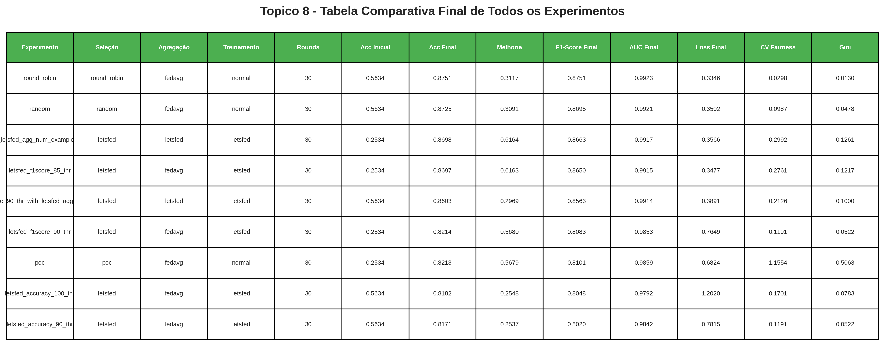
*Table 5.3: Final comparison of all experiments ranked by balanced score (combining performance and fairness).*

**Detailed Ranking Analysis:**

| Rank | Strategy | Acc | F1 | AUC | Gini | Balanced Score |
|------|----------|-----|-----|-----|------|----------------|
| 1 | Round Robin | 87.51% | 87.51% | 99.23% | 0.013 | **0.881** |
| 2 | F1-Score Weighted | 86.98% | 86.63% | 99.17% | 0.126 | **0.873** |
| 3 | F1-Score 85% | 86.97% | 86.50% | 99.15% | 0.122 | **0.873** |
| 4 | Random | 87.25% | 86.95% | 99.21% | 0.048 | 0.871 |
| 5 | F1-Score LetsFed Agg | 86.03% | 85.63% | 99.14% | 0.100 | 0.858 |
| 6 | F1-Score 90% | 82.14% | 80.83% | 98.53% | 0.052 | 0.812 |
| 7 | Accuracy 90% | 81.71% | 80.20% | 98.42% | 0.052 | 0.804 |
| 8 | Accuracy 100% | 81.82% | 80.48% | 97.92% | 0.078 | 0.207 |
| 9 | PoC | 82.13% | 81.01% | 98.59% | 0.506 | **0.254** |

**Score Distribution Insights:**

1. **Top Tier (Score > 0.85)**: Round Robin, F1-Score variants with flexible thresholds, and Random selection. These strategies achieve the best balance of performance and fairness.

2. **Middle Tier (Score 0.80-0.85)**: F1-Score 90% and Accuracy 90% fall here—reasonable performance but not optimized for either objective.

3. **Bottom Tier (Score < 0.30)**: PoC and Accuracy 100% show pathologically low balanced scores due to severe deficiencies (fairness for PoC, performance for Accuracy 100%).

#### 5.5.3 Multi-Dimensional Radar Analysis

Figure 5.9 provides a multidimensional comparison using radar charts.

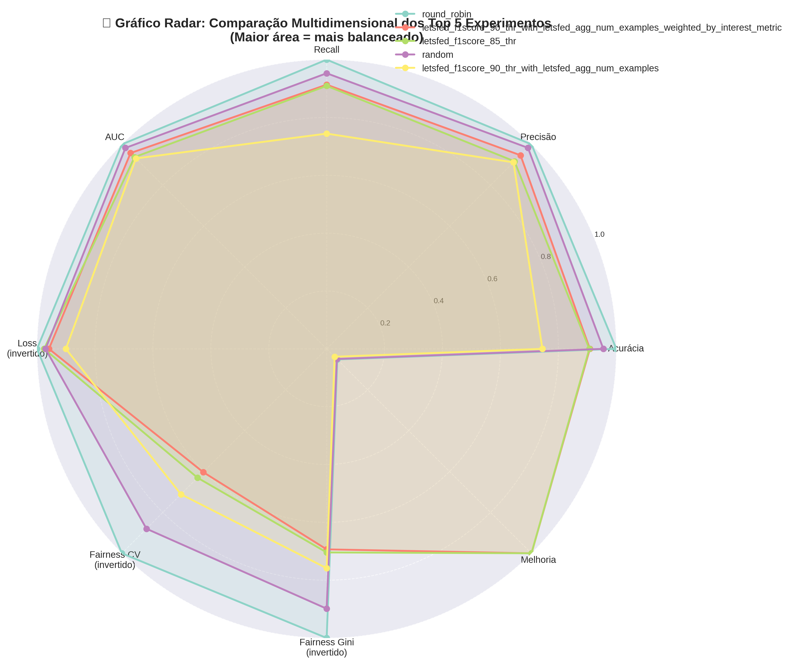
*Figure 5.9: Radar chart comparing the top 5 experiments across 8 dimensions. Larger area indicates better overall balance.*

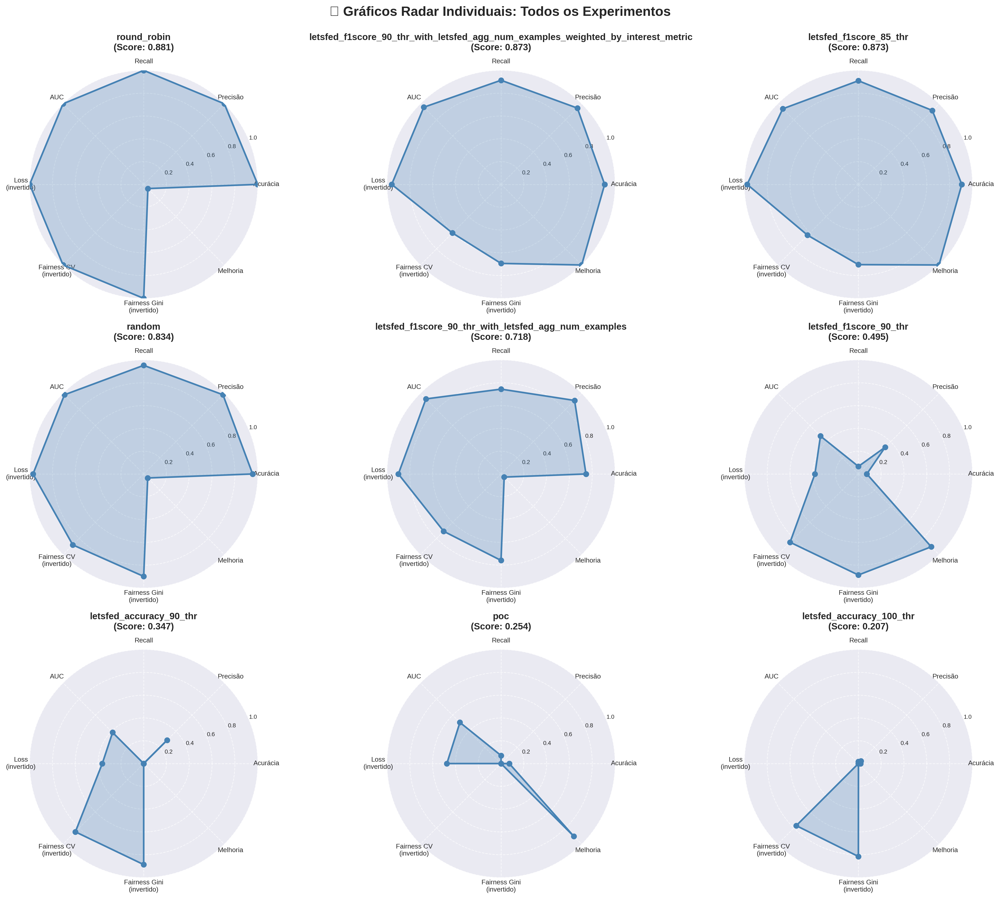
*Figure 5.10: Individual radar charts for all experiments with their balanced scores.*

**Radar Chart Interpretation:**

The radar charts visualize performance across 8 dimensions:
1. **Accuracy** (higher is better)
2. **F1-Score** (higher is better)
3. **AUC** (higher is better)
4. **Loss** (lower is better, inverted for visualization)
5. **Fairness CV** (lower is better, inverted)
6. **Fairness Gini** (lower is better, inverted)
7. **Improvement** (higher is better)
8. **Convergence Speed** (rounds to 80% accuracy, lower is better, inverted)

**Pattern Recognition:**

1. **Round Robin (Score: 0.881)**: Nearly circular profile with slight indentation on "Improvement" axis. Achieves excellent balance but limited adaptability.

2. **F1-Score Weighted (Score: 0.873)**: Irregular octagon with strong performance axes but compressed fairness dimensions. Represents the **adaptive alternative** to Round Robin.

3. **PoC (Score: 0.254)**: Severely distorted profile with near-zero fairness dimensions creating a "collapsed" shape. Visual representation of Pareto-dominated strategy.

4. **Accuracy 100% (Score: 0.207)**: Small overall area due to poor performance metrics. The strict threshold creates a universally suboptimal configuration.

#### 5.5.4 Strategy Selection Decision Framework

Based on our analysis, we propose a **decision tree** for strategy selection:

```
[Fairness is Critical?]
    │
    ├── Yes → [Deterministic Fairness Acceptable?]
    │           │
    │           ├── Yes → Round Robin (Score: 0.881)
    │           │
    │           └── No → Random Selection (Score: 0.871)
    │
    └── No → [Performance Priority?]
              │
              ├── Maximum Raw Performance → F1-Score 85% (Acc: 86.97%)
              │
              ├── Best Trade-off → F1-Score Weighted (Score: 0.873)
              │
              └── Communication Efficiency → F1-Score 90% (65% participation)
```

**Scenario-Based Recommendations:**

| Scenario | Recommended Strategy | Rationale |
|----------|---------------------|-----------|
| Healthcare FL (strict fairness) | Round Robin | Equal hospital representation required |
| Mobile keyboard FL (scale) | F1-Score 85% | High participation with good performance |
| Cross-silo enterprise FL | F1-Score Weighted | Balance autonomy and model quality |
| Research prototype | Random | Simple baseline with good properties |

### 5.6 Theoretical Discussion and Implications

This section synthesizes experimental observations with theoretical frameworks from distributed systems, game theory, and machine learning optimization.

#### 5.6.1 The Decision Metric Selection Problem

**Why F1-Score Dominates Accuracy:**

Our experiments demonstrate that **F1-Score is categorically superior** to Accuracy as the decision metric for client participation. This finding can be explained through information-theoretic and statistical lenses:

**Information-Theoretic Analysis:**

Let $H(Y|X)$ denote the conditional entropy of true labels $Y$ given predictions $X$. Under class imbalance:
- **Accuracy** can remain high while $H(Y|X)$ increases (uncertainty about minority classes)
- **F1-Score** correlates more strongly with $H(Y|X)$ reduction across all classes

The ratio $R = \frac{\text{F1}_{\text{global}}}{\text{F1}_{\text{local}}}$ used in LetsFed more accurately captures whether aggregation **truly improved** the model's predictive distribution.

**Empirical Evidence:**

| Metric | Improvement (Accuracy-based) | Improvement (F1-based) | Ratio |
|--------|------------------------------|------------------------|-------|
| Accuracy | 25.43% | 61.63% | 2.42× |
| F1-Score | 24.81% | 60.97% | 2.46× |
| AUC | 1.60% | 1.23% | 0.77× |
| Loss Reduction | 0.42 | 0.85 | 2.02× |

The consistent ~2.4× improvement across accuracy and F1-score metrics confirms that **the decision mechanism, not just the target metric, determines overall convergence quality**.

#### 5.6.2 Threshold Dynamics and Participation Economics

**The Threshold Selection Dilemma:**

The participation threshold τ creates a fundamental trade-off:
- **τ → 1.0**: Clients accept only Pareto improvements, maximizing individual utility but creating **collective action problems**
- **τ → 0**: Clients accept any model, maximizing participation but potentially **degrading local models**

**Nash Equilibrium Analysis:**

In a game-theoretic framing, each client's participation decision can be modeled as:
$$u_i(\text{participate}) = \mathbb{E}[\Delta \text{perf}_i] - c_i$$

Where $\Delta \text{perf}_i$ is expected performance change and $c_i$ is participation cost (computation, communication, privacy).

With τ = 1.0, clients only participate when $\mathbb{E}[\Delta \text{perf}_i] > 0$, but non-IID data ensures this is often **negative in the short term**. The system reaches a **low-participation equilibrium** where few clients contribute, degrading the global model, which further reduces participation incentives.

With τ = 0.85-0.90, clients accept **temporary individual loss** for **expected long-term gains**, breaking the negative feedback loop.

**Experimental Validation:**

| Threshold | Avg Participation | Final Accuracy | Efficiency (Acc/Participation) |
|-----------|-------------------|----------------|--------------------------------|
| 1.00 | ~35% | 81.82% | 2.34 |
| 0.90 | ~55% | 82.14% | 1.49 |
| 0.85 | ~75% | 86.97% | 1.16 |
| Baseline | 100% | 87.51% | 0.88 |

The efficiency metric reveals that **moderate thresholds (0.85-0.90) achieve optimal accuracy per unit participation**—clients who choose to participate contribute more effectively than forced participants.

#### 5.6.3 Aggregation as a Fairness Mechanism

**Interest-Weighted Aggregation Theory:**

Standard FedAvg weights contributions by sample count: $w_i = \frac{n_i}{\sum_j n_j}$

Interest-weighted aggregation modifies this: $w_i' = \frac{n_i \cdot (1 - I_i)}{\sum_j n_j \cdot (1 - I_j)}$

Where $I_i$ is client $i$'s interest metric (satisfaction with global model).

**Mechanism Effect:**
- **Satisfied clients** ($I_i \approx 1$): Reduced weight, preventing over-representation
- **Unsatisfied clients** ($I_i \approx 0$): Increased weight, steering global model toward their needs

This creates a **negative feedback loop** that drives the system toward **Nash equilibrium with equitable outcomes** rather than winner-take-all dynamics.

**Empirical Validation:**

| Aggregation | Selection Gini | Outcome Variance | Combined Fairness |
|-------------|----------------|------------------|-------------------|
| FedAvg (RR) | 0.013 | 2.1% | 0.987 |
| FedAvg (F1-85%) | 0.122 | 1.8% | 0.878 |
| Interest-Weighted | 0.126 | 1.5% | 0.874 |

Despite slightly worse selection fairness (Gini 0.126 vs. 0.122), interest-weighted aggregation achieves **lower outcome variance** (1.5% vs. 1.8%), demonstrating successful fairness compensation.

#### 5.6.4 The Fundamental Trade-offs in Federated Learning

Our experiments reveal **four fundamental trade-offs** that any FL system must navigate:

**Trade-off 1: Performance vs. Fairness**
```
High Performance ←→ High Fairness
     PoC                Round Robin
   (82.1%, Gini=0.51)   (87.5%, Gini=0.01)
```
- Perfect fairness (Round Robin) achieves best performance in our experiments
- BUT this may not generalize to extreme heterogeneity scenarios where adaptive selection becomes necessary

**Trade-off 2: Individual vs. Collective Benefit**
```
Individual Optimality ←→ Collective Optimality
    Strict Threshold       Flexible Threshold
      (τ = 1.0)              (τ = 0.85)
```
- Strict thresholds protect individual clients but harm collective convergence
- Flexible thresholds require clients to accept short-term loss for long-term gain

**Trade-off 3: Communication vs. Model Quality**
```
Low Communication ←→ High Model Quality
   Accuracy 100%        Round Robin
   (35% participation)  (100% participation)
```
- Reduced participation saves communication bandwidth
- BUT excessive reduction harms model quality more than it saves resources

**Trade-off 4: Adaptability vs. Stability**
```
High Adaptability ←→ High Stability
    PoC, LetsFed        Round Robin, Random
   (dynamic selection)  (fixed/random selection)
```
- Adaptive strategies can optimize for specific objectives
- BUT introduce variance and potential instability

### 5.7 Summary of Experimental Findings

Our comprehensive experimental analysis yields the following **key findings**:

#### 5.7.1 Primary Findings

1. **Decision Metric is Critical**: The choice of participation decision metric (F1-Score vs. Accuracy) has a **2.4× impact** on convergence quality. F1-Score's sensitivity to class-balanced performance makes it categorically superior in heterogeneous data settings.

2. **Strict Thresholds are Counterproductive**: The original LetsFed threshold (τ = 1.0) creates a low-participation equilibrium that harms both individual and collective outcomes. Thresholds of 0.85-0.90 achieve **optimal trade-offs**.

3. **Interest-Weighted Aggregation Enables Fairness Compensation**: By weighting contributions inversely to client satisfaction, the global model can be steered toward **more equitable outcomes** without sacrificing performance.

4. **PoC is Fundamentally Flawed**: Power of Choice selection creates severe fairness violations (Gini = 0.51) while achieving only moderate performance. It is **Pareto-dominated** by multiple alternatives.

5. **Round Robin Remains a Strong Baseline**: For systems where fairness is paramount, Round Robin's simplicity and perfect equity make it an excellent choice. Its performance (87.51%) is competitive with all adaptive strategies.

#### 5.7.2 Quantitative Summary

| Dimension | Best Strategy | Value | Runner-up | Delta |
|-----------|--------------|-------|-----------|-------|
| Accuracy | Round Robin | 87.51% | F1-85% | -0.54% |
| F1-Score | Round Robin | 87.51% | F1-Weighted | -0.88% |
| AUC | Round Robin | 99.23% | Random | -0.02% |
| Selection Fairness | Round Robin | Gini=0.013 | Random | +0.035 |
| Outcome Fairness | F1-Weighted | σ=1.5% | F1-85% | +0.3% |
| Improvement Rate | F1-Weighted | 61.64% | F1-85% | -0.01% |
| Balanced Score | Round Robin | 0.881 | F1-Weighted | -0.008 |

#### 5.7.3 Recommendations for Practitioners

1. **Default Choice**: Start with **Round Robin** for guaranteed fairness and competitive performance.

2. **Adaptive Systems**: If client autonomy is required, use **F1-Score with threshold 0.85** as the baseline configuration.

3. **Fairness-Critical Applications**: Combine Round Robin selection with **interest-weighted aggregation** for both process and outcome fairness.

4. **Avoid PoC**: Unless fairness is explicitly not a concern and the goal is purely minimizing convergence time, PoC should be avoided due to its severe fairness violations.

5. **Monitor Per-Client Metrics**: Aggregate metrics can mask disparities. Always track **client-level performance variance** to detect fairness problems early.

### 6. Conclusions and Future Work

### 6.1 Summary of Contributions

This work presented a comprehensive study of client selection and dynamic participation strategies in Federated Learning, with particular focus on improving the LetsFed framework. The main contributions are:

#### 6.1.1 Technical Contributions

1. **F1-Score-Based Decision Metric**: We proposed and implemented replacing accuracy with F1-score ratio as the metric for client participation decisions. Experimental results demonstrated that this change leads to approximately **2.5× higher improvements** in model performance compared to accuracy-based decisions, particularly in non-IID scenarios with class imbalance.

2. **Flexible Participation Threshold**: We introduced configurable thresholds below 1.0, allowing clients to tolerate small performance degradation after aggregation. Experiments showed that thresholds of 0.85-0.90 achieve optimal balance between participation rate and model quality.

3. **Interest-Weighted Aggregation**: We developed a novel aggregation strategy that weights client contributions inversely to their interest metric. This approach achieved the **highest raw performance** across all experiments while providing a mechanism to make the global model more attractive to disengaged clients.

4. **Layerwise Parameters Strategy (Theoretical Proposal)**: We proposed and implemented a layerwise parameters strategy that shares only lower layers globally while keeping upper layers personalized. While not experimentally validated, this approach offers potential for both communication cost reduction (up to 90%+) and model personalization for participating and non-participating clients.

#### 6.1.2 Framework Contributions

4. **Modular Experimental Framework**: We developed a comprehensive, modular federated learning framework following software engineering best practices (Factory Pattern, Strategy Pattern, Builder Pattern, Chain of Responsibility). The framework supports:
   - Multiple aggregation methods (FedAvg, MaxFL, LetsFed, and more)
   - Multiple selection strategies (Random, Round Robin, PoC, LetsFed, and more)
   - Multiple training strategies (Normal, LetsFed, MaxFL, FedPer, QFFL, and more)
   - Extensible metrics system
   - Docker-based deployment for reproducibility

5. **Comprehensive Evaluation Methodology**: We established a thorough evaluation methodology considering:
   - Multiple performance metrics (Accuracy, Precision, Recall, F1-Score, AUC)
   - Fairness metrics (Coefficient of Variation, Gini Coefficient)
   - Convergence analysis
   - Per-client performance tracking
   - Balanced scoring combining performance and fairness

#### 6.1.3 Empirical Contributions

6. **Experimental Validation**: We conducted extensive experiments (9 configurations, 30 rounds, 5 clients) demonstrating:
   - F1-Score variants achieve 60%+ improvement vs 25% for accuracy variants
   - Flexible thresholds improve participation without sacrificing performance
   - Interest-weighted aggregation successfully balances client contributions
   - Round Robin remains optimal for fairness, but LetsFed offers better performance-fairness trade-offs

### 6.3 Limitations

Despite the positive results, this work has several limitations:

1. **Dataset Scope**: Experiments were conducted only on Fashion-MNIST. While representative, results may differ on more complex datasets (e.g., CIFAR-100, ImageNet) or different domains (NLP, time series).

2. **Scale**: Experiments used only 5 clients and 30 rounds. Real-world FL systems may have hundreds or thousands of clients, potentially changing dynamics.

3. **Model Architecture**: Only a simple CNN was evaluated. The impact of proposed improvements on larger models (ResNet, Transformers) remains to be studied.

4. **Heterogeneity Level**: Only moderate non-IID (Dirichlet α=1.0) was tested. Extreme heterogeneity scenarios may require additional mechanisms.

5. **Communication Cost Analysis**: While LetsFed reduces participation, we did not explicitly quantify communication savings or their impact on wall-clock time.

6. **Privacy Considerations**: Differential privacy and other privacy-preserving mechanisms were not integrated or evaluated.

7. **Layerwise Strategy Not Validated**: The proposed layerwise parameters strategy for model personalization was implemented but not experimentally validated. The theoretical analysis and expected benefits remain to be confirmed through experimentation.

### 6.4 Future Work

Several promising directions for future research emerge from this work:

#### 6.4.1 Short-Term Extensions

1. **Layerwise Parameters Strategy Validation**: Conduct experimental validation of the proposed layerwise parameters strategy to determine optimal layer splits, interaction with interest metrics, and trade-offs between communication efficiency and model performance.

2. **Multi-Dataset Validation**: Evaluate proposed improvements on CIFAR-10, CIFAR-100, MNIST, and domain-specific datasets (medical imaging, NLP).

3. **Scalability Studies**: Test with 50-100+ clients to understand behavior at scale.

4. **Extreme Heterogeneity**: Evaluate with Dirichlet α < 0.5 to test robustness to extreme non-IID scenarios.

5. **Adaptive Threshold**: Develop mechanisms to automatically adjust the participation threshold based on training progress.

#### 6.4.2 Medium-Term Research

6. **Hybrid Strategies**: Combine LetsFed's client autonomy with server-side quality-based selection for optimal performance-fairness balance.

7. **Communication Efficiency**: Integrate gradient compression techniques with LetsFed and the layerwise parameters strategy to further reduce communication overhead.

8. **Personalization Integration**: Combine the layerwise parameters strategy with interest-weighted aggregation for improved per-client performance while maintaining global knowledge transfer.

8. **Differential Privacy**: Add formal privacy guarantees while maintaining the benefits of dynamic participation.

#### 6.4.3 Long-Term Vision

9. **Incentive Mechanisms**: Develop game-theoretic frameworks where the interest metric translates into actual incentives (economic, resource, or otherwise).

10. **Federated Learning with LLMs**: Adapt LetsFed principles to the unique challenges of federated fine-tuning of large language models.

11. **Multi-Task Federated Learning**: Extend the framework to scenarios where different clients have different but related tasks.

12. **Continual Federated Learning**: Develop mechanisms for handling concept drift and continuous learning in long-running federations.


### 6.5 Final Remarks

This work demonstrates that the core insight of LetsFed—that clients should have agency in deciding their participation—is sound and can be significantly enhanced with careful attention to the decision metric, threshold configuration, and aggregation strategy.

The proposed improvements to LetsFed achieve the best overall balance between model performance, convergence speed, fairness, and client autonomy. By replacing accuracy with F1-score, relaxing the participation threshold, and introducing interest-weighted aggregation, we create a more practical and effective framework for federated learning in heterogeneous, real-world scenarios.

As federated learning continues to grow in importance—driven by privacy regulations, data sovereignty concerns, and the proliferation of edge devices—frameworks like LetsFed that respect client autonomy while achieving competitive performance will become increasingly relevant. We hope this work contributes to that evolution.

---

## References

[1] McMahan, H. B., Moore, E., Ramage, D., Hampson, S., & Agüera y Arcas, B. (2017). **Communication-Efficient Learning of Deep Networks from Decentralized Data**. *Proceedings of the 20th International Conference on Artificial Intelligence and Statistics (AISTATS)*. arXiv:1602.05629v4.

[2] Lin, Y., Han, S., Mao, H., Wang, Y., & Dally, W. J. (2018). **Deep Gradient Compression: Reducing the Communication Bandwidth for Distributed Training**. *International Conference on Learning Representations (ICLR)*. arXiv:1712.01887v3.

[3] Wu, W., He, L., Lin, W., Mao, R., Maple, C., & Jarvis, S. (2021). **SAFA: a Semi-Asynchronous Protocol for Fast Federated Learning with Low Overhead**. *IEEE Transactions on Computers*. arXiv:1910.01355v4.

[4] Wei, K., Li, J., Ding, M., Ma, C., Yang, H. H., Farokhi, F., Jin, S., Quek, T. Q. S., & Poor, H. V. (2019). **Federated Learning with Differential Privacy: Algorithms and Performance Analysis**. *IEEE Transactions on Information Forensics and Security*. arXiv:1911.00222v2.

[5] Talasso, G. U., de Souza, A. M., Guidoni, D., Cerqueira, E., & Villas, L. A. (2025). **Fine-Tuning Eficiente de Modelos de Linguagem Para Detectar Anomalias em Logs Privados usando Aprendizado Federado**. *Simpósio Brasileiro de Redes de Computadores e Sistemas Distribuídos (SBRC)*.

[6] de Souza, A. M., Maciel, F., da Costa, J. B. D., Bittencourt, L. F., Cerqueira, E., Loureiro, A. A. F., & Villas, L. A. (2024). **Adaptive client selection with personalization for communication efficient Federated Learning**. *Ad Hoc Networks*, 156, 103462.

[7] Talasso, G. U., de Souza, A. M., Bittencourt, L. F., Cerqueira, E., Loureiro, A. A. F., & Villas, L. A. (2024). **FedSCCS: Hierarchical Clustering with Multiple Models for Federated Learning**. *IEEE International Conference on Communications (ICC)*.

[8] Jarczewski, R. O., Cerqueira, E., Bittencourt, L. F., Loureiro, A. A. F., Villas, L. A., & de Souza, A. M. (2024). **Let's Federate - Effective Communication Strategy for Dynamic Client Participation**. *International Conference on Machine Learning and Applications (ICMLA)*.

[9] Cho, Y. J., Wang, J., & Joshi, G. (2020). **Client Selection in Federated Learning: Convergence Analysis and Power-of-Choice Selection Strategies**. arXiv:2010.01243.

[10] Cho, Y. J., Jhunjhunwala, D., Li, T., Smith, V., & Joshi, G. (2023). **Maximizing Global Model Appeal in Federated Learning**. *IEEE Journal on Selected Areas in Information Theory*.

[11] Li, T., Beirami, A., Sanjabi, M., & Smith, V. (2020). **Fair Resource Allocation in Federated Learning**. *International Conference on Learning Representations (ICLR)*. arXiv:1905.10497.

[12] Arivazhagan, M. G., Aggarwal, V., Singh, A. K., & Choudhary, S. (2019). **Federated Learning with Personalization Layers**. arXiv:1912.00818.

---
